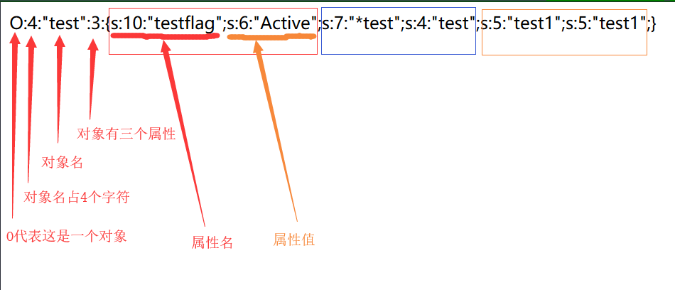

PHP 的所谓的序列化也是一个将各种类型的数据，压缩并按照一定格式存储的过程，他所使用的函数是serialize() ,我们来看下面的实例

```javascript
<?php
class test{
    private $flag="flag";
    protected $test='test';
    public $test1='test1';
    public function set_flag($flag){
        $this->flag=$flag;
    }

    public function get_flag(){
        return $this->flag;
    }
}

$object=new test();
$object->set_flag('siofaonf');
$data=serialize($object);
echo $data;
```

输出：

O:4:"test":3:{s:10:"testflag";s:8:"siofaonf";s:7:"*test";s:4:"test";s:5:"test1";s:5:"test1";}

具体含义：



