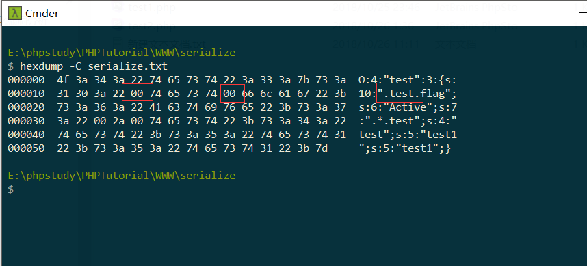

序列化格式

O:4:"test":3:{s:10:"testflag";s:8:"siofaonf";s:7:"*test";s:4:"test";s:5:"test1";s:5:"test1";}

的源代码为：

```javascript
<?php
class test{
    private $flag="flag";
    protected $test='test';
    public $test1='test1';
    public function set_flag($flag){
        $this->flag=$flag;
    }

    public function get_flag(){
        return $this->flag;
    }
}

$object=new test();
$object->set_flag('siofaonf');
$data=serialize($object);
echo $data;
```

序列化为了把这个类的信息完全压缩，自然把属性的权限考虑了进去。

将序列化的内容输入到txt文件里，hexdump打开内容如下：



可以看到三个权限表示的方式是不一个样的。

flag作为私有属性，在其前面加了.类名.。

test作为保护属性，在其前面加了.*.。

而test1公有属性则，按照常规理解的方式。

所以总结如下：

在序列化的过程中：

私有属性：.类名.属性名

如：s:10:" test flag";

保护属性：.*.属性名

如:s:7:" * test";

私有属性s:5:"test1";