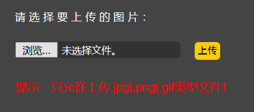
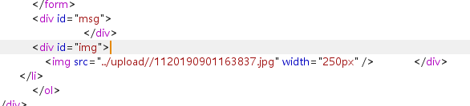
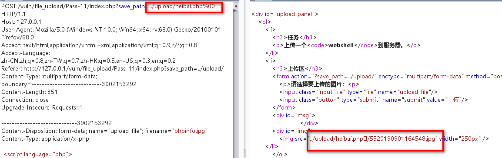
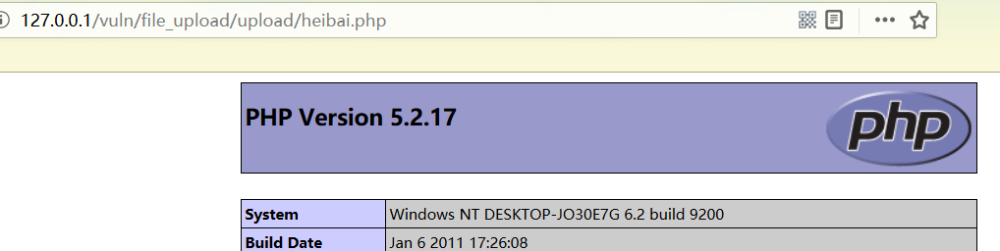

直接上传phpinfo.php,提示只能上传jpg,png,gif文件。



修改文件后缀为jpg。上传成功。查看上传文件路径，发现更改了文件名，且文件名后缀只能为图形格式，无法利用。




查看提示没有发现，查看源码：

## 关键代码：

```javascript
$img_path = $_GET['save_path']."/".rand(10, 99).date("YmdHis").".".$file_ext;
```

save_path为url中获取到的路径。

图片路径=url中的路径+随机数+时间戳+文件名后缀

其中从url中获取的文件后缀可以利用。采用%00截断。





文件上传成功，但是heibai.php后面的参数都已被截断。直接访问heibai,php。漏洞利用成功。




## 注意：

实验环境php_ini文件需设置：

magic_quotes_gpc = Off