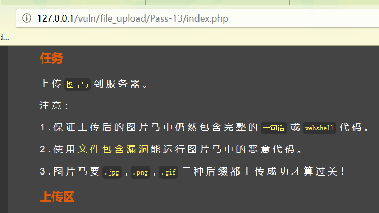
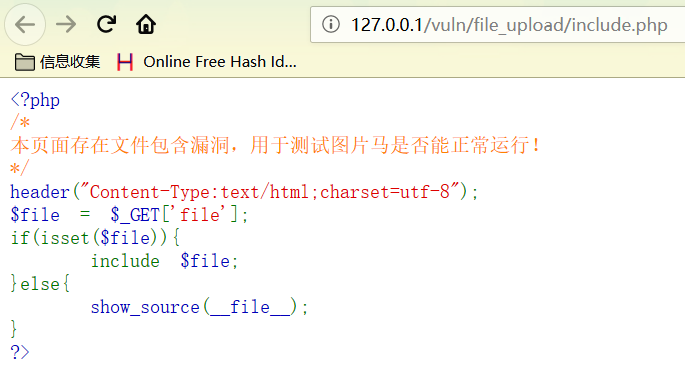
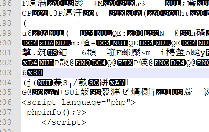
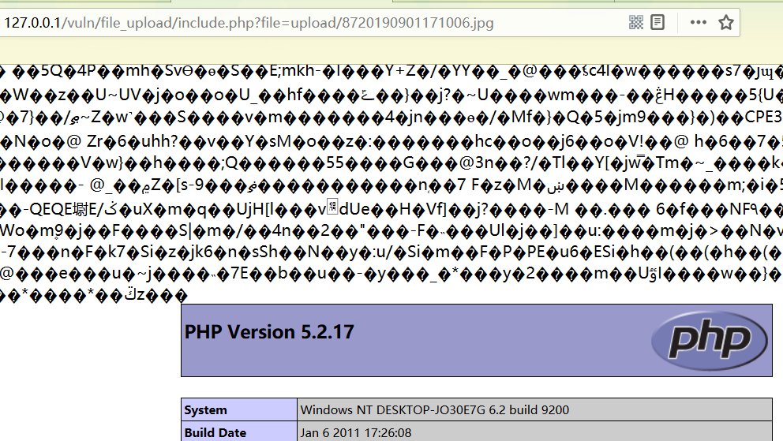

# 文件包含漏洞利用图片马

发现题目变了，需要配合文件包含漏洞来利用漏洞：

点击文件包含漏洞，发现源代码。

构造图片马：

最简单的图片马构造方法：

copy /b C:\Users\microsoft\Desktop\文件上传\1.jpg+C:\Users\microsoft\Desktop\文件上 传\phpinfo.php phpinfo.jpg

使用notepad++打开图片文件，文件最后有我们构造的恶意代码。

上传图片马，使用文件包含漏洞访问：

成功执行图片马中的php代码。

