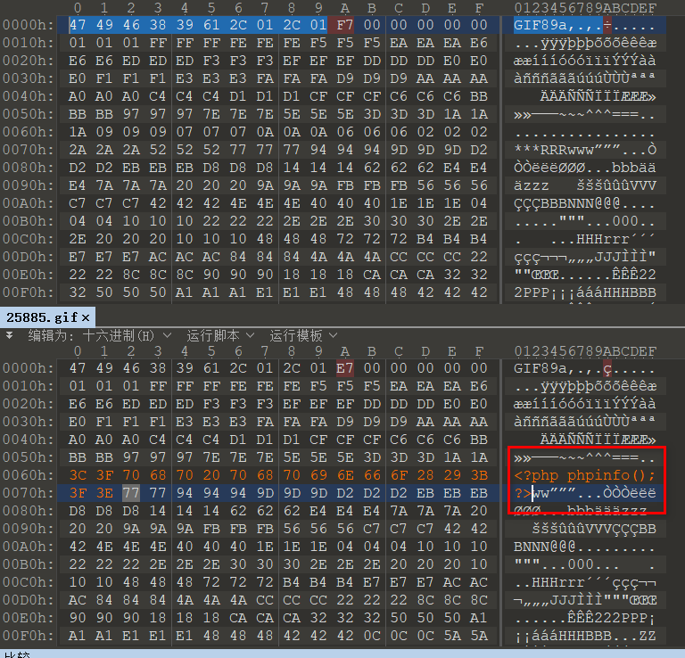
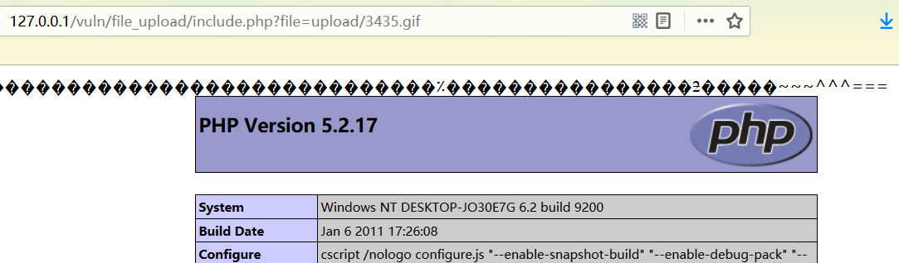
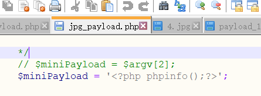

# 二次渲染绕过方式：

# 1.gif图片绕过方式

将原始图片的二进制编码和二次渲染后的二进制编码进行对比，在二进制编码没有改变的地方插入恶意代码可绕过，二次渲染。

首先上传gif图片，然后将上传后的文件保存下来。使用010editer打开，原始gif图片和二次渲染后的gif图片。比较两张图片二进制内容，找到二次渲染过后还相同的地方（此处表明gif图片在二次渲染的过程中，没有渲染该处），插入恶意代码。




上传含有恶意代码的图片，访问：




# 2.jpg

使用国外大神的jpg图片马生成工具。

进入jpg_paload使用命令行:

```javascript
php jpg_payload.php 1.jpg
```

生成1_payload.jpg文件。（生成的文件有可能不成功，多换几张jpg图片试试）


制作文件的恶意代码可在jpg_payload中更改。




# 3.png

使用国外大神的jpg图片马生成工具。

进入jpg_paload使用命令行:

```javascript
php png_payload.php 1.png
```

生成1_payload.png文件。