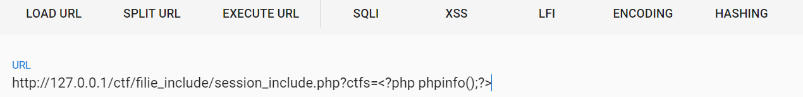
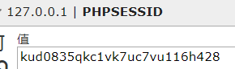
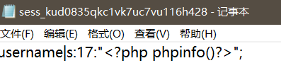
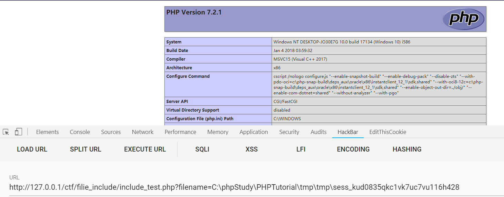

1.通过phpinfo,获取session文件保存地址


2.session中的内容我们可以控制

代码实列：

```javascript
<?php
session_start();
$ctfs=$_GET['ctfs'];
$_SESSION['username']=$ctfs;
?>
```

通过get方法传入任意代码：



3.去到刚才获取到的session文件目录下找到session文件

session文件命名格式：sess+PHPSESSOID

PHPSESSID:



打开该文件，里面有我们通过get方法传入的恶意代码。



4.通过刚才的文件包含漏洞执行该文件



成功利用该文件里面的恶意代码。