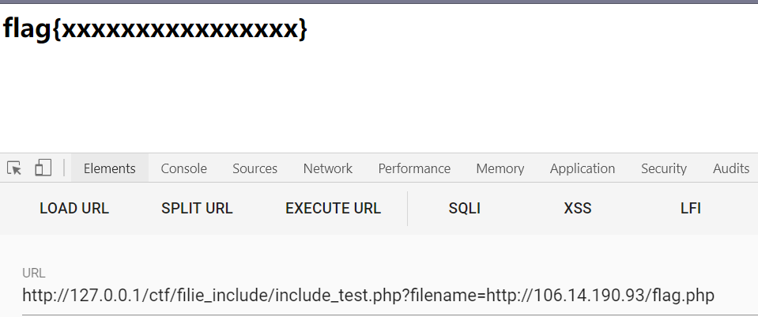
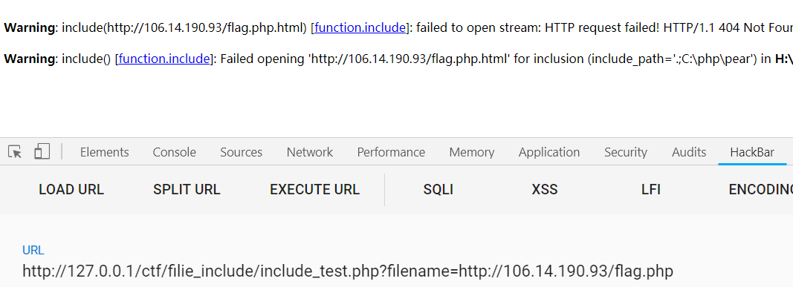
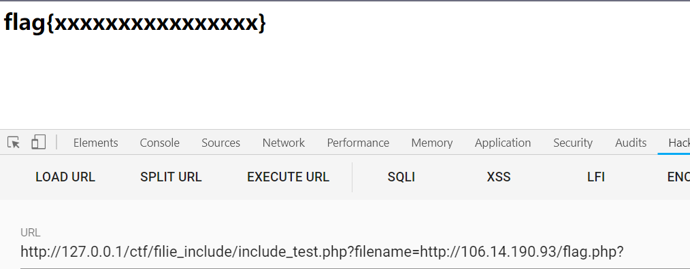
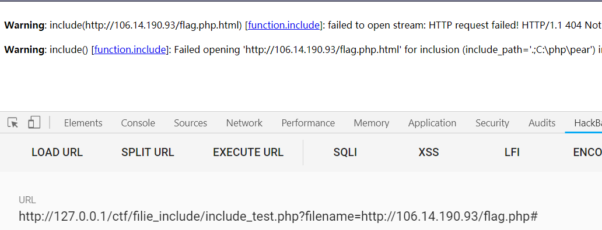

漏洞利用条件：

allow_url_fopen=On;（默认打开）

allow_url_include=On;（默认关闭）

## 1.没有对输入参数没有任何过滤的代码

```javascript
<?php
$filename=$_GET['filename'];
include($filename);
```




## 2.为文件末尾添加.html限制的任意文件执行

```javascript
<?php
$filename=$_GET['filename'];
include($filename . ".html");
```




## 2.1.问号绕过



## 2.2.#号和空格在php5.3.29没有绕过成功



