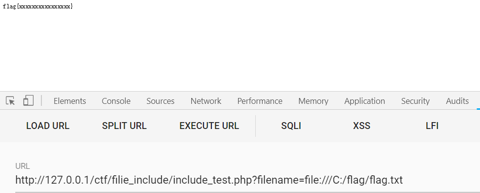
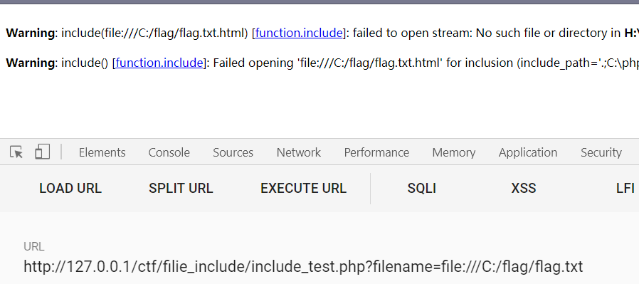
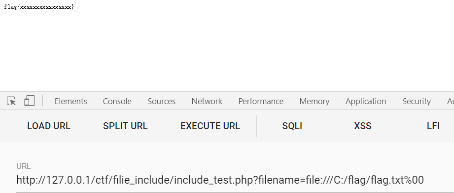

## 通过file://协议可以读取系统的任何文件

使用方法：

file:[文件的绝对路径和文件名]

## 例如：?filename=file:///C:/flag/flag.txt

## file//协议在双off的情况下以可以使用

```javascript
allow_url_fopen=off;
allow_url_include+off;
```


# 1.对包含的文件没有任何限制

```javascript
<?php
$filename=$_GET['filename'];
include($filename);
```




# 2.对文件有限制

```javascript
<?php
$filename=$_GET['filename'];
include($filename . ".html");
```




## 此时可以考虑，%00截断

php<5.3.4

maginc_quotes_gpc=off;



文件路径长度截断，在此时不能使用。