把这三种归位一类是因为这三种方法在本质上都是逐个尝试，只不过待选密码的集合不同

1. 爆破：顾名思义，逐个尝试选定集合中可以组成的所有密码，知道遇到正确密码

2. 字典：字典攻击的效率比爆破稍高，因为字典中存储了常用的密码，因此就避免了爆破时把时间浪费在脸滚键盘类的密码上

3. 掩码攻击：如果已知密码的某几位，如已知6位密码的第3位是a，那么可以构造 ??a??? 进行掩码攻击，掩码攻击的原理相当于构造了第3位为a的字典，因此掩码攻击的效率也比爆破高出不少

对这一类的zip问题，推荐windows下的神器AZPR

举例如下：

1. 对爆破，以ISCC 2017 Basic-08为例，选定暴力攻击、字符集和长度后进行爆破

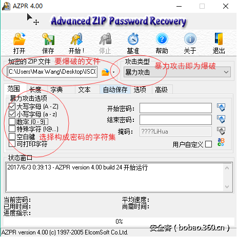

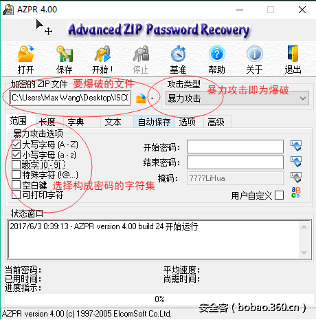

点击开始，进行爆破，如下图，在4ms内就找到了密码为BIT

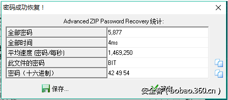

另：此题后续为简单的base64解密；爆破在密码长度小于6位时较快，因此如果在7位之内没有爆破出结果时，基本就可以考虑换个方法了；此题的正规解法是培根密码的转换

2. 字典，还以之前的ISCC 2017 Basic-07举例，从图片中分离出一个加密的zip压缩包，爆破无果后考虑字典攻击（可从网上下载字典，但大多数题目需要自己构造字典，文末的网盘连接里提供了常见的字典）

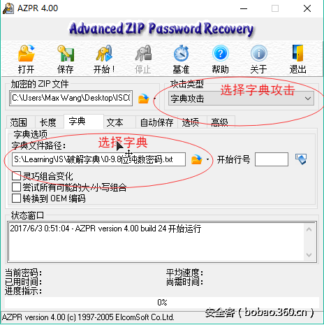

字典攻击的结果如下图，在字典选择合适的情况下，用很短的时间就能找到密码

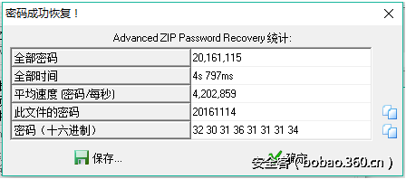

继续以此题为例，解压后的压缩包有一个txt文档和一个握手包，txt内容如下：

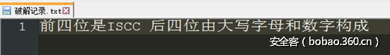

因此可知握手包的密码为ISCC****的形式（*代表大写字母或数字），自己写程序构造字典

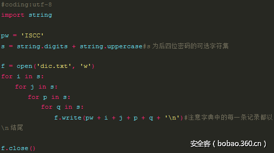

运行此程序得到字典如下：

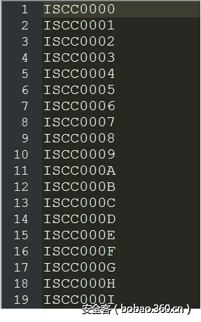

之后用aircrack-ng来选中字典跑除握手包的密码如下图，不再详述

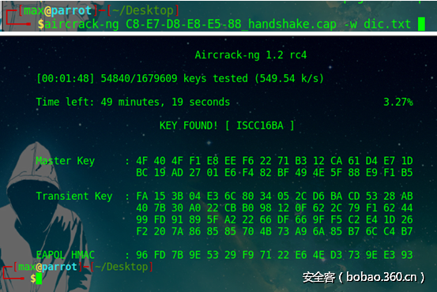

3. 掩码攻击，以ISCC 2017 Misc-06为例，题目给了一个jpg图片，用0x02中的方法分离出加密的压缩包，根据题目提示：注意署名， 构造????LiHua的掩码（?可在自己定义的字符集中任意选择）进行掩码攻击，如下图：

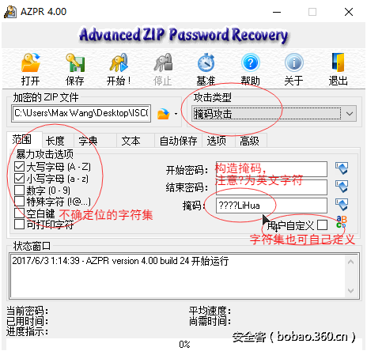

攻击结果如下，只耗费了很少的时间就找到了密码

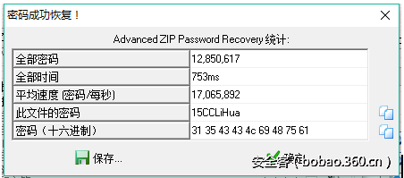

0x05. 明文攻击

明文攻击是一种较为高效的攻击手段，大致原理是当你不知道一个zip的密码，但是你有zip中的一个已知文件（文件大小要大于12Byte）时，因为同一个zip压缩包里的所有文件都是使用同一个加密密钥来加密的，所以可以用已知文件来找加密密钥，利用密钥来解锁其他加密文件，更详细的原理请读者自行谷歌

举个例子，已知 明文攻击.zip 中存在的文件 明文.txt，

因此将 明文.txt 压缩，这里需要判断明文压缩后的CRC32是否与加密文件中的一致，若不一致可以换一个压缩工具。

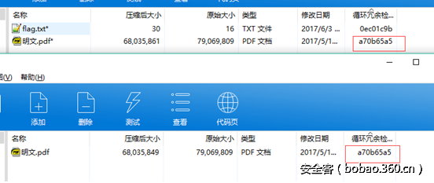

攻击过程如下：

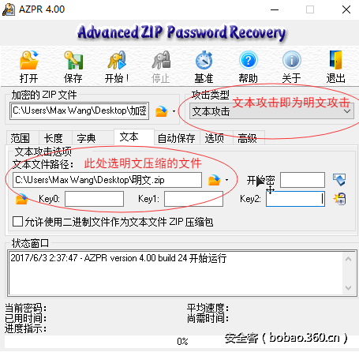

点击开始，很快就恢复了密码

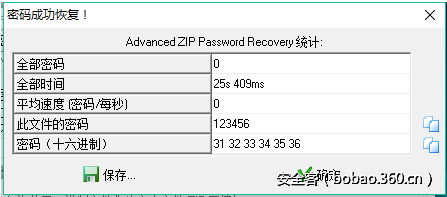

另：当明文的大小比较小时，攻击速度会比较慢；即使有时没有恢复密码，也可以使用明文攻击，最后点保存还是能得到压缩包里内容的。