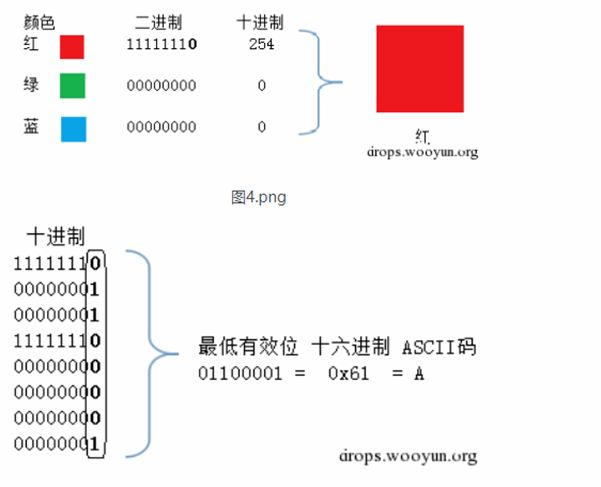

LSB在隐写中比较常见，LSB也就是最低有效位


原理：图片中的像素一般由三种颜色组成，及三原色，由这三种原色可以组成其它各种颜色，例如在png图片的储存中，每个颜色会有8bit，LSB隐写就是修改了像素中的最低的1bit，在人眼中是看不出区别的，也把信息隐藏了。

譬如：

我们想把‘A'隐藏进来的话，如下图，就可以把A转换为16进制的0x61再转成二进制01100001，再修改为红色通道的最低位为这些二进制串。



可以使用stegsolve来帮助分析

打开之后，使用steglove--analyse--frame browser这个可以浏览三个颜色颜色通道中的每一位。


使用工具提取：

analyse-->data extract-->选中最低有效位-->save bin 即可将提取出来的二进制保存。


使用脚本提取图片中的信息：

```javascript
from PIL import Image

im = Image.open("extracted.bmp")
pix = im.load()
width, height = im.size

extracted_bits = []
for y in range(height):
    for x in range(width):
        r, g, b = pix[(x,y)]
        extracted_bits.append(r & 1)
        extracted_bits.append(g & 1)
        extracted_bits.append(b & 1)

extracted_byte_bits = [extracted_bits[i:i+8] for i in range(0, len(extracted_bits), 8)]
with open("extracted2.bmp", "wb") as out:
    for byte_bits in extracted_byte_bits
        byte_str = ''.join(str(x) for x in byte_bits)
        byte = chr(int(byte_str, 2))
        out.write(byte)
```

