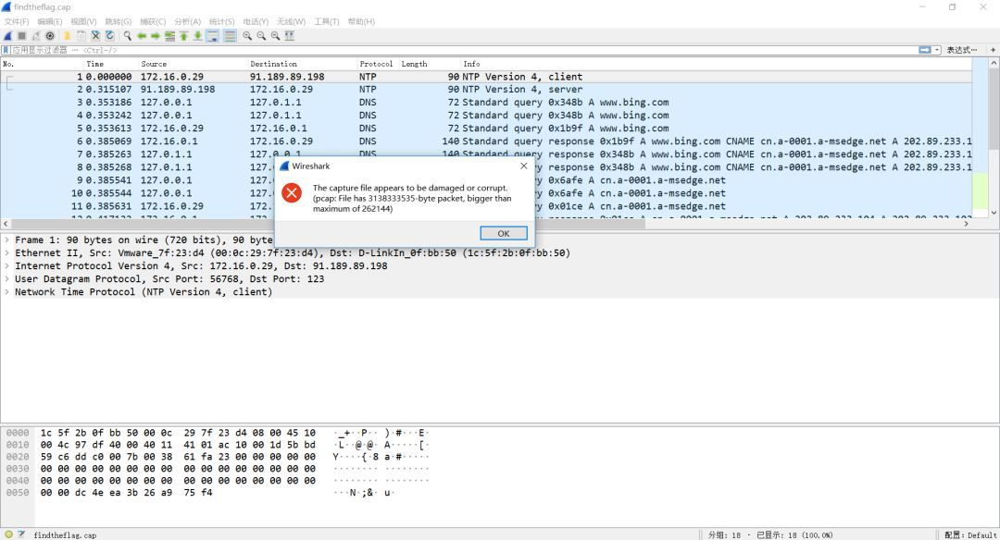
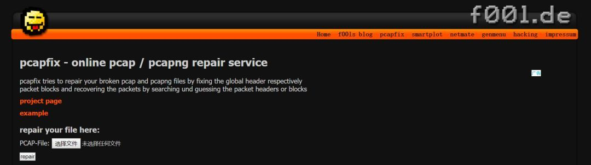
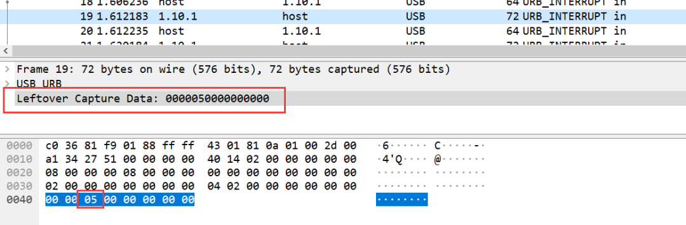
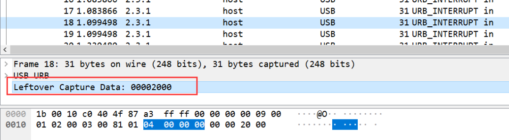

CTF流量分析之题型深度解析

来源：

https://cloud.tencent.com/developer/article/1419465

漏斗社区发表于漏斗社区

338

- ■ WEB扫描分析

- ■ 后台目录爆破分析

- ■ 后台账号爆破

- ■ WEBSHELL上传

0x01 介绍

在CTF比赛中，对于流量包的分析取证是一种十分重要的题型。通常这类题目都是会提供一个包含流量数据的pcap文件，参赛选手通过该文件筛选和过滤其中无关的流量信息，根据关键流量信息找出flag或者相关线索。

pcap流量包的分析通常都是通过图形化的网络嗅探器——wireshark进行的，这款嗅探器经过众多开发者的不断完善，现在已经成为使用最为广泛的安全工具之一。在之前的文章中，斗哥已经为大家介绍了wireshark的基本使用。接下来，斗哥将为大家介绍目前CTF流量分析中的经典题型和解题思路。

0x02 经典题型

CTF题型主要分为流量包修复、WEB流量包分析、USB流量包分析和其他流量包分析。

■ 流量包修复

比赛过程中有可能会出现通过wireshark打开题目给的流量包后提示包异常的情况，如下图所示：

解题思路：

通过在线pacp包修复工具进行修复：

http://f00l.de/hacking/pcapfix.php

练练手

第一届 “百度杯” 信息安全攻防总决赛 线上选拔赛：find the flag

pacp文件地址：https://static2.ichunqiu.com/icq/resources/fileupload/CTF/BSRC/2017/BSRC3-1/findtheflag.cap

■ WEB流量包分析

WEB数据包分析的题目主要出现WEB攻击行为的分析上， 典型的WEB攻击行为有：WEB扫描、后台目录爆破、后台账号爆破、WEBSHELL上传、SQL注入等等。

■ WEB扫描分析

题型：

通过给出的流量包获取攻击者使用的WEB扫描工具。

解题思路：

常见的WEB扫描器有Awvs，Netsparker，Appscan，Webinspect，Rsas（绿盟极光），Nessus，WebReaver，Sqlmap等。要识别攻击者使用的是哪一种扫描器，可通过wireshark筛选扫描器特征来得知。

相关命令：http contains “扫描器特征值”。

常见的扫描器特征参考：https://www.freebuf.com/column/156291.htm 

练练手

安恒八月月赛流量分析：黑客使用的是什么扫描器？

pacp文件地址：

链接：https://pan.baidu.com/s/1bGEIPeXDCbhybmWOyGr8Og 提取码：q6ro

■ 后台目录爆破分析

题型：

已知攻击者通过目录爆破的手段获取了网站的后台地址，请通过给出的流量包获取后台地址。

解题思路：

要获取流量包中记录的后台地址，可通过wireshark筛选后台url特征来得知。

相关命令：http contains “后台url特征”。

常见后台url特征参考：https://www.freebuf.com/column/156291.html 

练练手

安恒八月月赛流量分析：黑客扫描到的后台登录地址是什么？

pacp文件地址：

链接：https://pan.baidu.com/s/1bGEIPeXDCbhybmWOyGr8Og 提取码：q6ro

■ 后台账号爆破

题型：

已知攻击者通过暴力破解的手段获取了网站的后台登陆账号，请通过给出的流量包获取正确的账号信息。

解题思路：

WEB账号登陆页面通常采用post方法请求，要获取流量包中记录的账号信息可通过wireshark筛选出POST请求和账号中的关键字如‘admin’。

相关命令：http.request.method=="POST" && http contains == "关键字"。

练练手

安恒八月月赛流量分析：黑客使用了什么账号密码登录了web后台？

pacp文件地址：

链接：https://pan.baidu.com/s/1bGEIPeXDCbhybmWOyGr8Og 提取码：q6ro

■ WEBSHELL上传

题型：

已知攻击者上传了恶意webshell文件，请通过给出的流量包还原出攻击者上传的webshll内容。

解题思路：

Webshell文件上传常采用post方法请求，文件内容常见关键字eval，system，assert要。获取流量包中记录的webshell可通过wireshark筛选出POST请求和关键字.

相关命令：http.request.method=="POST" && http contains == "关键字"

练练手

安恒八月月赛流量分析：黑客上传的webshell文件名是？内容是什么？

pacp文件地址：

链接：https://pan.baidu.com/s/1bGEIPeXDCbhybmWOyGr8Og 提取码：q6ro

■ USB流量包分析

USB流量指的是USB设备接口的流量，攻击者能够通过监听usb接口流量获取键盘敲击键、鼠标移动与点击、存储设备的铭文传输通信、USB无线网卡网络传输内容等等。在CTF中，USB流量分析主要以键盘和鼠标流量为主。

■ 键盘流量

USB协议数据部分在Leftover Capture Data域中，数据长度为八个字节。其中键盘击键信息集中在第三个字节中。数据如下图所示：

如上图所示击键信息为0x05，对应的按键为“B“。

具体的键位映射关系可参考：《USB键盘协议中键码》中的HID Usage ID，链接：https://wenku.baidu.com/view/9050c3c3af45b307e971971e.html 

题型：

Flag藏于usb流量中，通过USB协议数据中的键盘键码转换成键位。

解题思路：

1.使用kali linux中的tshark 命令把cap data提取出来：tshark -r usb.pcap -T fields -e usb.capdata > usbdata.txt，并去除空行。

2. 根据《USB键盘协议中键码》中的HID Usage ID将数据还原成键位。

练练手

安全评测人员在对某银行卡密码输入系统进行渗透测试，截获了一段通过USB键盘输入6位数字密码的流量，其中也包含了一些其他无关的USB设备的流量，你能从中恢复出6位数字密码吗？最终提交的flag格式为flag。

pacp文件地址：

链接：https://pan.baidu.com/s/1bGEIPeXDCbhybmWOyGr8Og 

提取码：q6ro

python键盘键码转换脚本：同上

■ 鼠标流量

USB协议鼠标数据部分在Leftover Capture Data域中，数据长度为四个字节。

其中第一个字节代表按键，当取0x00时，代表没有按键、为0x01时，代表按左键，为0x02时，代表当前按键为右键。第二个字节可以看成是一个signed byte类型，其最高位为符号位，当这个值为正时，代表鼠标水平右移多少像素，为负时，代表水平左移多少像素。第三个字节与第二字节类似，代表垂直上下移动的偏移。数据如下图所示：

如上图所示数据信息为0x00002000，表示鼠标垂直向上移动20。

题型：

Flag藏于usb流量中，通过USB协议数据中的鼠标移动轨迹转换成Flag。

解题思路：

1. 使用kali linux中的tshark 命令把cap data提取出来：tshark -r usb.pcap -T fields -e usb.capdata > usbdata.txt，并去除空行。

2. 根据usb协议鼠标数据还原鼠标移动轨迹。

练练手

这是一道鼠标流量分析题。

pacp文件地址：

链接：https://pan.baidu.com/s/1bGEIPeXDCbhybmWOyGr8Og 提取码：q6ro

python鼠标数据转换脚本：同上

■ 其他流量包分析

除了常规的WEB和USB流量外，可能还存在诸如SMTP,Telnet等流量，均与WEB流量分析类似，不再赘述。

0x03 总结

以上为斗哥了解的流量分析在CTF比赛中的基本题型，欢迎大家补充。

参考：

《记一道USB流量分析CTF题》，https://blog.csdn.net/qq_36609913/article/details/78578406

CTF Wiki，https://ctf-wiki.github.io/ctf-wiki/introduction/resources/