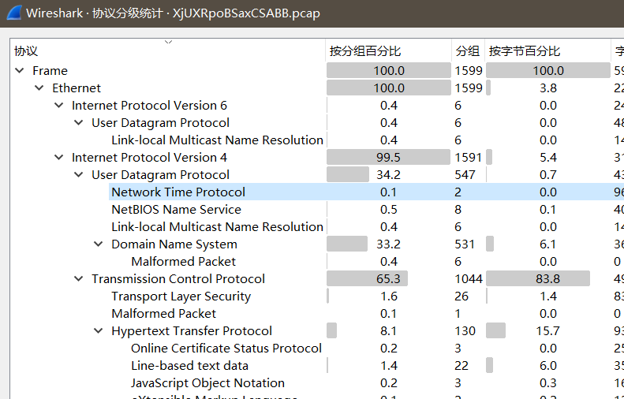
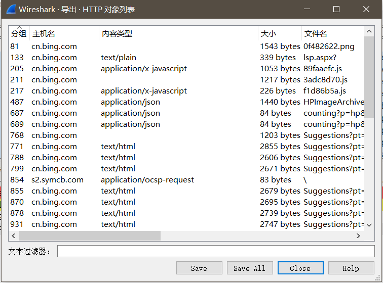

1.仔细审题，从题目分析需要什么操作。

2.打开数据包（不能正常打开，则可能是数据包修复）

数据包修复网站：http://f00l.de/hacking/pcapfix.php

3.查看数据协议分布

统计-->协议分级

查看数据包协议分布。

4.全局搜索flag，字符串。

5.导出数据包中含有的文件

文件-->导出对象-->http

可选择全部导出或部分导出文件，查看文件是否存在flag。

