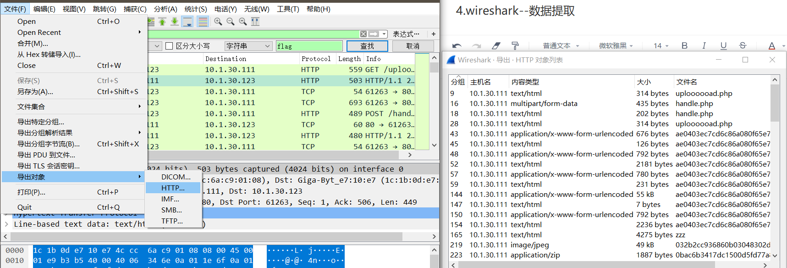
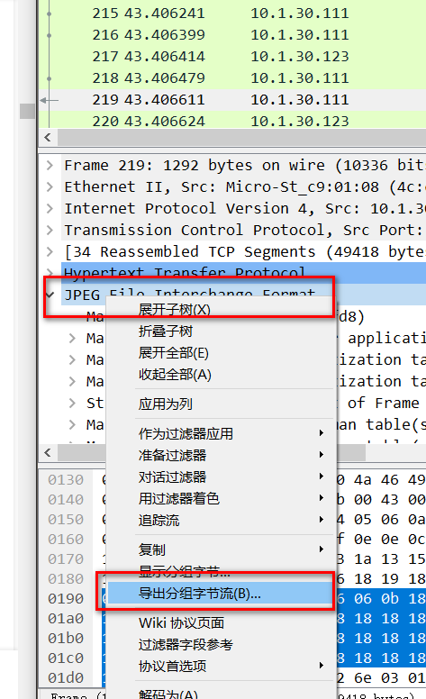
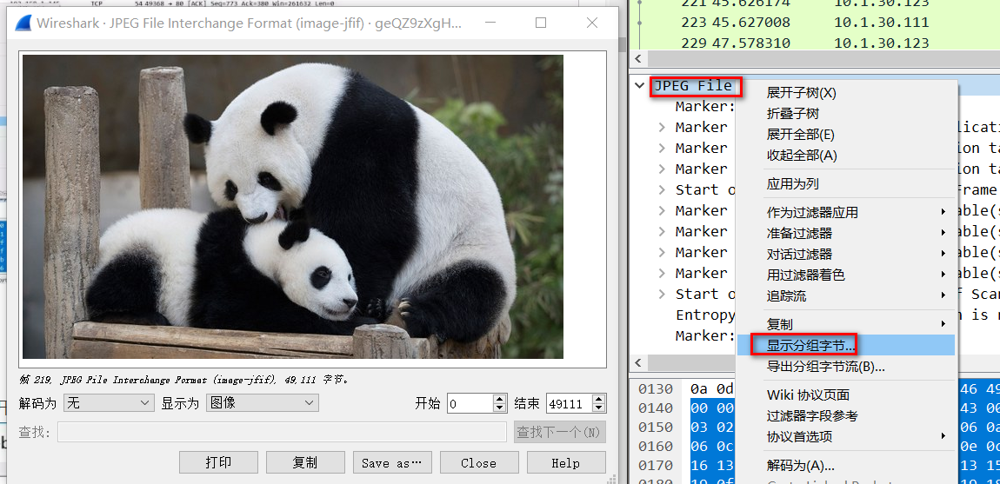

wiresahrk支持提取通过http传输（上传/下载）的文件内容，方法如下：

# 4.1自动提取通过http传输的文件内容

### 文件-->导出对象-->http

在导出对象列表中：

可以选择save或者save all，将文件单独保存出来，或者全部保存。

# 4.2手动提取通过http传输的文件内容

选中jpg/png/zip，鼠标右键点击-->选中 导出分组字节流

注意如果是：菜刀下载文件的流量，需要删除分组字节流前开头和结尾的X@Y字符，否则下载的文件会出错。鼠标右键点击-->选中 显示分组字节

