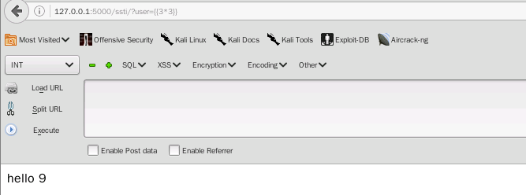

# 1. 快速启动一个web服务


index.pt

```javascript
import flask import Flask
import flask import render_template

app=Flask(__name__)

# 申明一个路由
@app.route('/')
def index():
    # 该路由渲染hello.html模板
    return render_template('hello.html')
    
if __name__='__mian__':
    app.run()
    
```


hello.html

```javascript
<html>
<head>
<title>hello world</title>
</head>

<body>
<h1> hello world</h1>
</body>
</html>
```


注意，需要将模板放到templates目录下

python index.py 

访问127.0.0.1：5000即可访问web服务


# 2. 渲染动态模板

index_every.py

```javascript
import flask import Flask
import flask import request
import flask import render_template

app=Flask(__name__)

# 申明一个路由
@app.route('/')
def index():
    # 该路由渲染hello.html模板
    name=request.args.get('user','')
    return render_template('helloEvery.html',name=name)
    
if __name__='__mian__':
    app.run()
```


helloEvery.html

```javascript
<html>
<head>
<title>hello</title>

    <h1> hello {{ name }}</h1>

    <h1>hello world</h1>


</html>
```


python index_every.py

访问127.0.0.1：5000?user=admin


即可将参数传递到模板


# 3. 产生ssti漏洞的写法


ssti.py

```javascript
import flask import Flask
import flask import request
import flask import render_template_string

app=Flask(__name__)

# 申明一个路由
@app.route('/')
def index():
    return 'hello world'
    
@app.route('/ssti/')
def flask_ssti():
    name=request.args.get('user','world')
    template="hello %s " % name
    #渲染模板字符串 
    return render_template_string(template)
    
if __name__='__mian__':
    app.run()
```


python ssti.py


访问127.0.0.1:5000/ssti/?user={{3*3}}



产生模板注入


