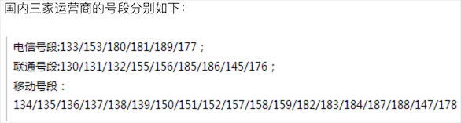

# 1. 一些常见的匹配符号：

. : 匹配任意字符       

\w : 匹配字母，数字，下划线

\s ：匹配空白字符

\d : 匹配数字

\b : 匹配单词边界

^ : 匹配字符串开头

$ : 匹配字符串结尾


\W : 匹配非字母，数字，下划线

\S : 匹配非空白字符

\D : 匹配非数字

\B : 匹配非单词边界


[] : 匹配来自字符集的任意单一字符

[^] : 匹配不在字符集中的任意单一字符

* ： 匹配0次到n次

+ ：匹配1次到n次

？: 匹配0次到1次


{N} : 匹配n次

{N,} ：匹配至少n次

{N,M}：匹配N到M次


| :分支

# 2. re模块的核心函数：

| 函数 | 说明 |
| - | - |
| compile(pattern, flags=0) | 编译正则表达式返回正则表达式对象 |
| match(pattern, string, flags=0) | 用正则表达式匹配字符串 成功返回匹配对象 否则返回None |
| search(pattern, string, flags=0) | 搜索字符串中第一次出现正则表达式的模式 成功返回匹配对象 否则返回None |
| split(pattern, string, maxsplit=0, flags=0) | 用正则表达式指定的模式分隔符拆分字符串 返回列表 |
| sub(pattern, repl, string, count=0, flags=0) | 用指定的字符串替换原字符串中与正则表达式匹配的模式 可以用count指定替换的次数 |
| fullmatch(pattern, string, flags=0) | match函数的完全匹配（从字符串开头到结尾）版本 |
| findall(pattern, string, flags=0) | 查找字符串所有与正则表达式匹配的模式 返回字符串的列表 |
| finditer(pattern, string, flags=0) | 查找字符串所有与正则表达式匹配的模式 返回一个迭代器 |
| purge() | 清除隐式编译的正则表达式的缓存 |
| re.I / re.IGNORECASE | 忽略大小写匹配标记 |
| re.M / re.MULTILINE | 多行匹配标记 |


# 3. 例子

3.1 匹配以以数字，字母下划线开头的name，和由数字组成的qq号

```javascript
import re

"""
匹配，输入的name和qq号，name只能以数字，字母，下划线开头，6-12位
qq号只能是数字，4-10位
"""

def main():
    username=input('请输入你的姓名：')
    qq=input('请输入你的qq:')

    """
    ^匹配开头^[0-9a-zA-Z_]表示匹配以数字字母下划线开头
    $匹配结尾{6,12}表示最终匹配{6，12}次
    """

    tmp1=re.match(r'^\w{6,12}$',username)
    tmp2=re.match(r'^\b{4,10}',qq)

    if not tmp1:
        print('请输入有效的用户名')
    if not tmp2:
        print('请输入有效的qq')

    if tmp2 and tmp1:
        print('username:' + username + '\n' + 'qq:' + qq)


if __name__ == '__main__':
    main()
```


# 3.2 匹配国内手机号码




```javascript
import re

obj=re.compile(r'(?<=\D)13[0-13-9]\d{8}|15[0-35-9]\d{8}(?=\D)')

def main():
    sentence = '''
        重要的事情说8130123456789遍，我的手机号是13512346789这个靓号，
        不是15600998765，也是110或119，王大锤的手机号才是15600998765。
        '''
    my_list=re.findall(obj,sentence)

    print(my_list)

    # 通过迭代器返回找到的内容
    for tmp in obj.finditer(sentence):
        print(tmp.group())

    # 通过search函数找出匹配位置
    m=obj.search(sentence)
    while m:
        print(m.group())
        m=obj.search(sentence,m.end())

if __name__ == '__main__':
    main()
```


# 3.3 替换字符串中的不良内容

```javascript
import re

def main():
    sentence = '你丫是傻叉吗? 我操你大爷的. Fuck you.'
    purified = re.sub('[操肏艹]|fuck|shit|傻[比屄逼叉缺吊屌]|煞笔',
                      '*', sentence, flags=re.IGNORECASE)
    print(purified)  # 你丫是*吗? 我*你大爷的. * you.


if __name__ == '__main__':
    main()
```

说明： re模块的正则表达式相关函数中都有一个flags参数，它代表了正则表达式的匹配标记，可以通过该标记来指定匹配时是否忽略大小写、是否进行多行匹配、是否显示调试信息等。如果需要为flags参数指定多个值，可以使用按位或运算符进行叠加，如flags=re.I | re.M。


# 3.4 拆分长字符串

```javascript
import re

def main():
    poem = '窗前明月光，疑是地上霜。举头望明月，低头思故乡。'
    poem=re.split(r'[，,.。]',poem)
    print(poem)

    while '' in poem:
        poem.remove('')

    print(poem)

main()
```

