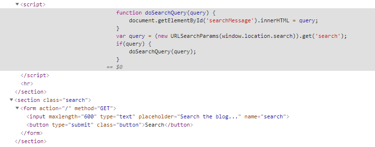

dom元素对象innerHTML属性，更改页面显示元素


实际用例：

```javascript
<!DOCTYPE html>
<html>
<head>
<meta charset="utf-8">
<title>菜鸟教程(runoob.com)</title>
<script>
function changeLink(){
	document.getElementById('myAnchor').innerHTML="RUNOOB";
	document.getElementById('myAnchor').href="//www.runoob.com";
	document.getElementById('myAnchor').target="_blank";
}
</script>
</head>
<body>
 
<a id="myAnchor" href="//www.microsoft.com">Microsoft</a>
<input type="button" onclick="changeLink()" value="修改链接">
 
</body>
</html>
```




js代码会将url中的search参数交给innerHTML属性去执行


payload:

```javascript

```

这里无法使用<script>alert(1)</script>

因为innerHTML接收器不接受script任何现代的浏览器元素，也不会对svg onload事件触发。这意味着您将需要使用替代元素，例如img或iframe。事件处理程序（例如onload和）onerror可以与这些元素结合使用。例如：

element.innerHTML='...  ...'