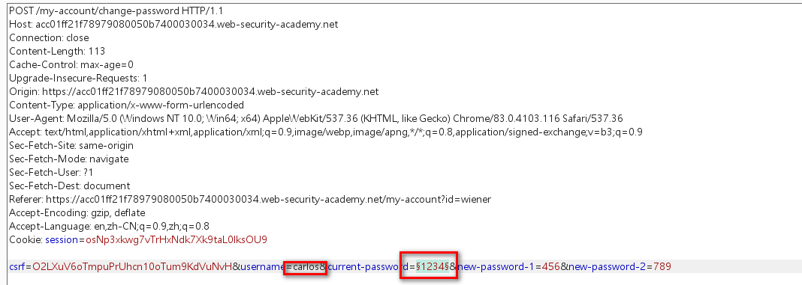
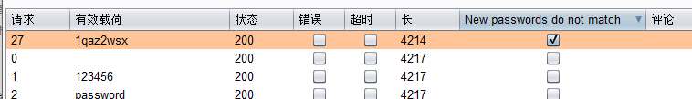

1. 登陆wiener账户，进入密码修改界面。测试发现，

当输入密码错误时会将账户锁定一分钟

当输入错误密码，两个新密码不匹配时，提示Current password is incorrect

当输入正确密码，两个新密码不匹配时，提示：New passwords do not match

2. 根据有缺陷的错误信息提示可实现密码爆破

抓取wienei更改密码的数据包，修改username，爆破原始密码

3. 当爆破结果中含有：New passwords do not match时说明密码爆破成功

