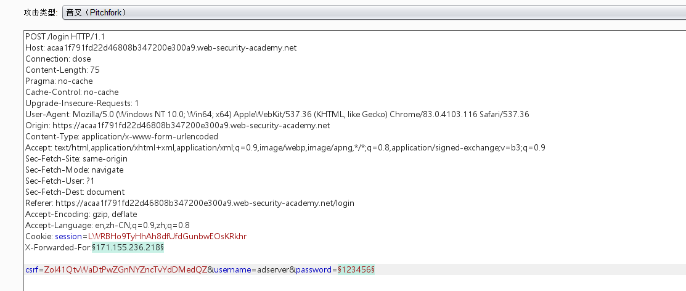
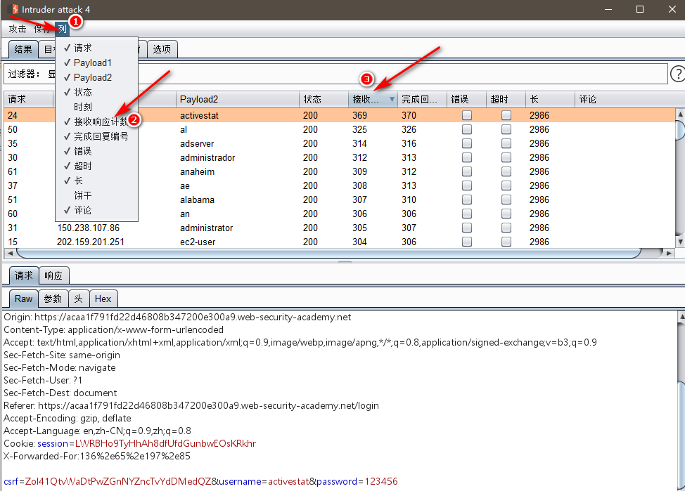
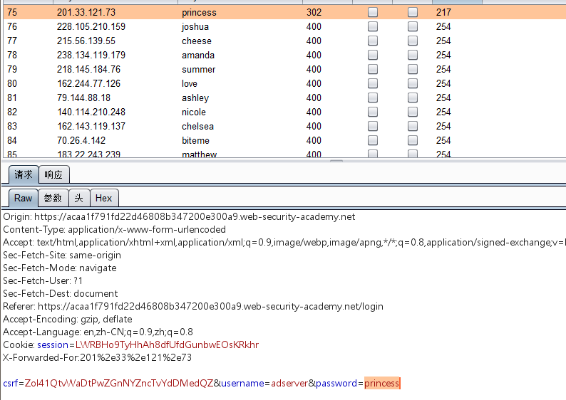

该网站会对多次请求的ip进行拦截。这个可以使用添加X-Forwarded-For标头或者fakeip插件绕过

fakeip插件地址：

https://github.com/TheKingOfDuck/burpFakeIP

插件安装方式：

https://blog.csdn.net/sinat_25449961/article/details/77374407

1. 尝试枚举用户名

发现每个用户名返回值都是相同的，查看wp发现是返回时间不同

2. 查看返回时间枚举用户名

因外网访问延迟原因，所以多尝试几次。发现每次尝试adserver这个用户名，返回时间都比较长。所以对其进行密码爆破

3. 密码爆破结果

