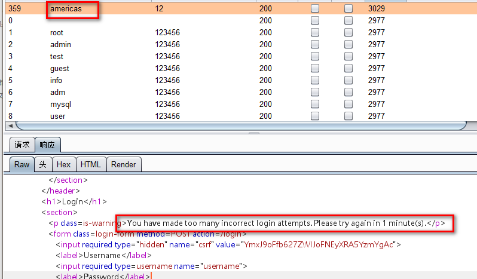

1.该系统多次输入错误密码后会锁定账户。利用该特点可以进行用户枚举

选择clusterbomb模块。

第一个有效负载集填入用户名字典。第二个有效负载集填入四个错误密码

2. 响应包中检查是否存在：You have made too many incorrect login attempts 字符串。如果有则说明该账户被拦截。此时就可以确定该账户存在。

说明存在americas用户

3. 爆破密码，发现该系统多次输入错误密码会提示：You have made too many incorrect login attempts。但是当输入正确密码时不提示。所以此时可以爆破

