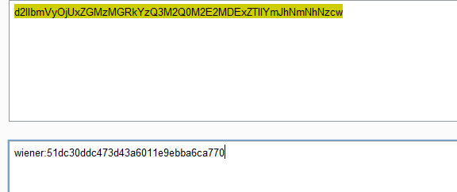
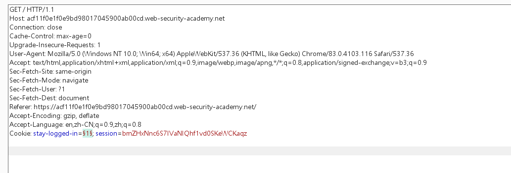
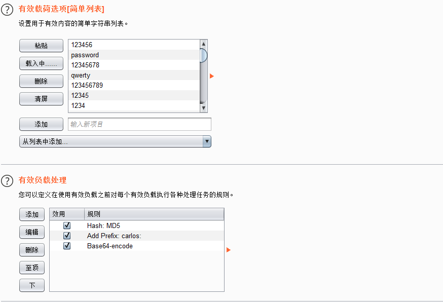

使用wiener:peter账户登陆。发现其cookie可以预测

base64接吗.然后由用户名+一段hash组成

该hash经检测发现是wiener用户密码的md5值

所以此时尝试对carlos用户cookie进行爆破。

1. 注销wiener用户，访问首页时抓包，将数据包发送到intruder

2. 添加密码payload。使用payload模块对payload进行处理

3. 开始攻击，返回值中含有hello的。说明登陆成功

右键选择在浏览器中显示即可