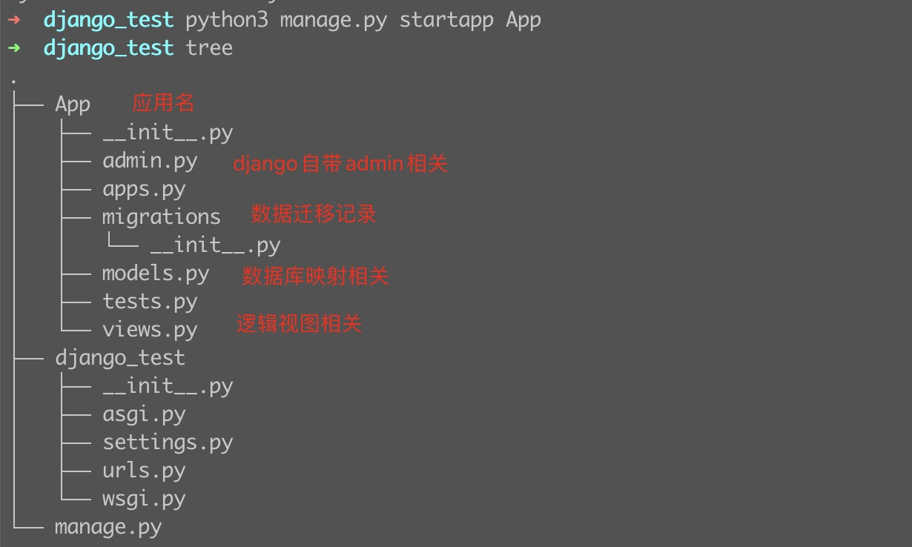
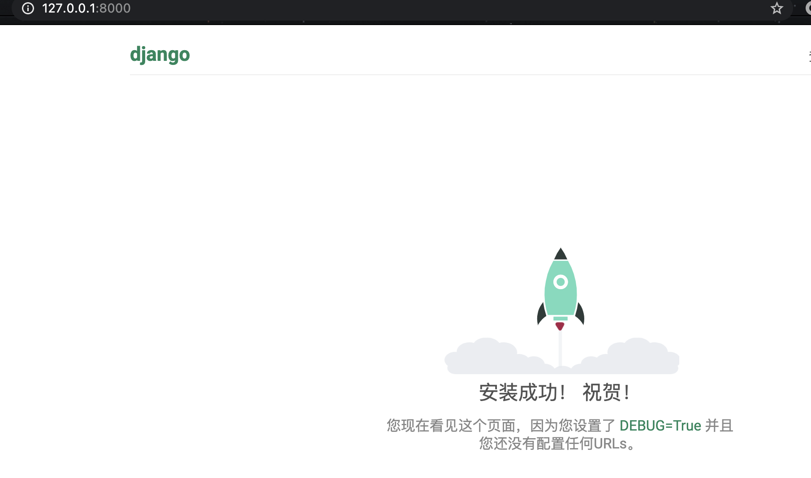
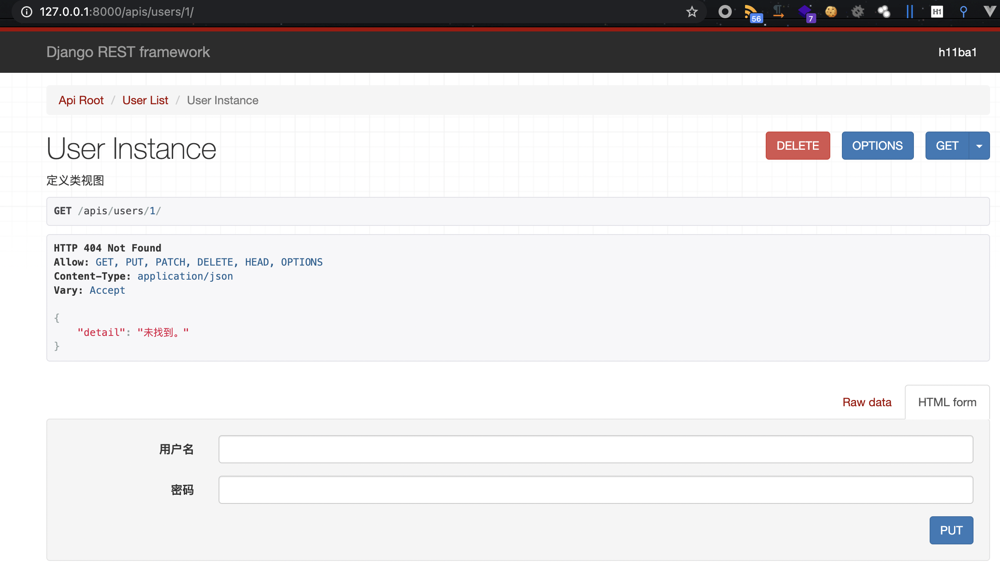

最近做毕设用到了django，这里简单记录一下开发过程。项目使用前后端分离，使用django的restframework框架写接口非常的便捷。这里简单记录一下学习过程。

# 0x01 django基本操作

## 安装django：

```
pip3 install django==3.1.7-i https://pypi.tuna.tsinghua.edu.cn/simple
```

## 创建一个项目：

```shell
django-admin startproject 项目名称
```


## 创建一个应用：

```shell
python3 manage.py startapp App
```

## 项目配置文件注册应用：

```python
django_test/django_test/settings.py

INSTALLED_APPS = [
    'django.contrib.admin',
    'django.contrib.auth',
    'django.contrib.contenttypes',
    'django.contrib.sessions',
    'django.contrib.messages',
    'django.contrib.staticfiles',
    'App',      # 注册新添加的应用
]
```



## 汉化及时区配置

```python
LANGUAGE_CODE = 'zh-hans'

TIME_ZONE = 'Asia/Shanghai'
```

## django启动

```shell
python manage.py runserver 默认启动只允许本地访问

python manage.py runserver 0.0.0.0:8080  如果在docker容器中使用则要采用此启动方法
```




# 0x02 django 模型字段

官方文档：https://docs.djangoproject.com/zh-hans/3.1/ref/models/fields/#django.db.models.Field

https://www.liujiangblog.com/course/django/95

| 类型                      | 说明                                                         |
| ------------------------- | ------------------------------------------------------------ |
| AutoField                 | 一个自动增加的整数类型字段。通常你不需要自己编写它，Django会自动帮你添加字段：`id = models.AutoField(primary_key=True)`，这是一个自增字段，从1开始计数。如果你非要自己设置主键，那么请务必将字段设置为`primary_key=True`。Django在一个模型中只允许有一个自增字段，并且该字段必须为主键！ |
| BigAutoField              | 64位整数类型自增字段，数字范围更大，从1到9223372036854775807 |
| BigIntegerField           | 64位整数字段（看清楚，非自增），类似IntegerField ，-9223372036854775808 到9223372036854775807。在Django的模板表单里体现为一个`NumberInput`标签。 |
| BinaryField               | 二进制数据类型。较少使用。                                   |
| **BooleanField**          | 布尔值类型。默认值是None。在HTML表单中体现为CheckboxInput标签。如果设置了参数null=True，则表现为NullBooleanSelect选择框。可以提供default参数值，设置默认值。 |
| **CharField**             | 最常用的类型，字符串类型。必须接收一个max_length参数，表示字符串长度不能超过该值。默认的表单标签是text input。 |
| **DateField**             | `class DateField(auto_now=False, auto_now_add=False, **options)` , 日期类型。一个Python中的datetime.date的实例。在HTML中表现为DateInput标签。在admin后台中，Django会帮你自动添加一个JS日历表和一个“Today”快捷方式，以及附加的日期合法性验证。两个重要参数：（参数互斥，不能共存） `auto_now`:每当对象被保存时将字段设为当前日期，常用于保存最后修改时间。`auto_now_add`：每当对象被创建时，设为当前日期，常用于保存创建日期(注意，它是不可修改的)。设置上面两个参数就相当于给field添加了`editable=False`和`blank=True`属性。如果想具有修改属性，请用default参数。例子：`pub_time = models.DateField(auto_now_add=True)`，自动添加发布时间。 |
| DateTimeField             | 日期时间类型。Python的datetime.datetime的实例。与DateField相比就是多了小时、分和秒的显示，其它功能、参数、用法、默认值等等都一样。 |
| DecimalField              | 固定精度的十进制小数。相当于Python的Decimal实例，必须提供两个指定的参数！参数`max_digits`：最大的位数，必须大于或等于小数点位数 。`decimal_places`：小数点位数，精度。 当`localize=False`时，它在HTML表现为NumberInput标签，否则是textInput类型。例子：储存最大不超过999，带有2位小数位精度的数，定义如下：`models.DecimalField(..., max_digits=5, decimal_places=2)`。 |
| DurationField             | 持续时间类型。存储一定期间的时间长度。类似Python中的timedelta。在不同的数据库实现中有不同的表示方法。常用于进行时间之间的加减运算。但是小心了，这里有坑，PostgreSQL等数据库之间有兼容性问题！ |
| **EmailField**            | 邮箱类型，默认max_length最大长度254位。使用这个字段的好处是，可以使用Django内置的EmailValidator进行邮箱格式合法性验证。 |
| **FileField**             | `class FileField(upload_to=None, max_length=100, **options)`上传文件类型，后面单独介绍。 |
| FilePathField             | 文件路径类型，后面单独介绍                                   |
| FloatField                | 浮点数类型，对应Python的float。参考整数类型字段。            |
| **ImageField**            | 图像类型，后面单独介绍。                                     |
| **IntegerField**          | 整数类型，最常用的字段之一。取值范围-2147483648到2147483647。在HTML中表现为NumberInput或者TextInput标签。 |
| **GenericIPAddressField** | `class GenericIPAddressField(protocol='both', unpack_ipv4=False, **options)`,IPV4或者IPV6地址，字符串形式，例如`192.0.2.30`或者`2a02:42fe::4`。在HTML中表现为TextInput标签。参数`protocol`默认值为‘both’，可选‘IPv4’或者‘IPv6’，表示你的IP地址类型。 |
| JSONField                 | JSON类型字段。Django3.1新增。签名为`class JSONField(encoder=None,decoder=None,**options)`。其中的encoder和decoder为可选的编码器和解码器，用于自定义编码和解码方式。如果为该字段提供default值，请务必保证该值是个不可变的对象，比如字符串对象。 |
| PositiveBigIntegerField   | 正的大整数，0到9223372036854775807                           |
| PositiveIntegerField      | 正整数，从0到2147483647                                      |
| PositiveSmallIntegerField | 较小的正整数，从0到32767                                     |
| SlugField                 | slug是一个新闻行业的术语。一个slug就是一个某种东西的简短标签，包含字母、数字、下划线或者连接线，通常用于URLs中。可以设置max_length参数，默认为50。 |
| SmallAutoField            | Django3.0新增。类似AutoField，但是只允许1到32767。           |
| SmallIntegerField         | 小整数，包含-32768到32767。                                  |
| **TextField**             | 用于储存大量的文本内容，在HTML中表现为Textarea标签，最常用的字段类型之一！如果你为它设置一个max_length参数，那么在前端页面中会受到输入字符数量限制，然而在模型和数据库层面却不受影响。只有CharField才能同时作用于两者。 |
| TimeField                 | 时间字段，Python中datetime.time的实例。接收同DateField一样的参数，只作用于小时、分和秒。 |
| **URLField**              | 一个用于保存URL地址的字符串类型，默认最大长度200。           |
| **UUIDField**             | 用于保存通用唯一识别码（Universally Unique Identifier）的字段。使用Python的UUID类。在PostgreSQL数据库中保存为uuid类型，其它数据库中为char(32)。这个字段是自增主键的最佳替代品，后面有例子展示。 |

# 0x03 django QuerySetAPI 

官方文档：https://docs.djangoproject.com/zh-hans/3.1/ref/models/querysets/#field-lookups

QuerySetAPI 函数：https://www.liujiangblog.com/course/django/130

| 方法名                | 解释                                         |
| --------------------- | -------------------------------------------- |
| **filter()**          | 过滤查询对象。                               |
| **exclude()**         | 排除满足条件的对象                           |
| **annotate()**        | 为查询集添加注解或者聚合内容                 |
| **order_by()**        | 对查询集进行排序                             |
| **reverse()**         | 反向排序                                     |
| **distinct()**        | 对查询集去重                                 |
| **values()**          | 返回包含对象具体值的字典的QuerySet           |
| **values_list()**     | 与values()类似，只是返回的是元组而不是字典。 |
| dates()               | 根据日期获取查询集                           |
| datetimes()           | 根据时间获取查询集                           |
| **none()**            | 创建空的查询集                               |
| **all()**             | 获取所有的对象                               |
| union()               | 并集                                         |
| intersection()        | 交集                                         |
| difference()          | 差集                                         |
| **select_related()**  | 附带查询关联对象，利用缓存提高效率           |
| `prefetch_related()`  | 预先查询，提高效率                           |
| extra()               | 将被废弃的方法                               |
| defer()               | 不加载指定字段，也就是排除一些列的数据       |
| only()                | 只加载指定的字段，仅选择需要的字段           |
| using()               | 选择数据库                                   |
| `select_for_update()` | 锁住选择的对象，直到事务结束。               |
| raw()                 | 接收一个原始的SQL查询                        |

# 0x04 django rest framework

drf提供了强大的封装，可以快速编写符合restful风格api。

## restful api：

一篇不错的解释文章：https://juejin.cn/post/6844904071640383502

在接口的定义中引入了请求方法，使api接口跟简洁。例如：


同样的接口通过请求方式的不同，具有不同的操作效果。

## django restframework安装：

```shell
pip install djangorestframework
```

注册到配置文件：

```python
INSTALLED_APPS = [
    'django.contrib.admin',
    'django.contrib.auth',
    'django.contrib.contenttypes',
    'django.contrib.sessions',
    'django.contrib.messages',
    'django.contrib.staticfiles',
    'rest_framework',  #注册restframework框架
]
```


## 编写实例：

### 注册模型：

User/models.py

```python
from django.db import models


# Create your models here.

class User(models.Model):
    username = models.CharField(max_length=100, unique=True, default='test', verbose_name='用户名')
    password = models.CharField(max_length=100, default='test', verbose_name='密码')

    class Meta:
        db_table = 'User'
        verbose_name = '用户信息'
        verbose_name_plural = verbose_name
```

迁移申请：

```shell
 python manage.py makemigrations
```

创建表结构：

```shell
python manage.py migrate
```

### 注册序列化器：

User/serializers.py

```python
from rest_framework import serializers
from .models import User

class UserSerialize(serializers.ModelSerializer):
    """定义序列化器"""

    class Meta:
        model = User
        fields = '__all__'
```

### 注册视图：

User/views.py

```python
from .models import User
# drf
from rest_framework.viewsets import ModelViewSet
from .serializers import UserSerialize

class UserViewSet(ModelViewSet):
    """定义类视图"""
    # 指定查询集
    queryset = User.objects.all()
    # 指定序列化器
    serializer_class = UserSerialize
```

### 注册路由：

User/urls.py

```python
from . import views

from rest_framework import routers

urlpatterns = [
]
router = routers.DefaultRouter()  # 创建路由器
router.register(r'users', views.UserViewSet)  # 注册路由
urlpatterns += router.urls  # 把生成好的路由拼接到urlpatterns里去
```

### 查看视图接口：



# 0x05 生成接口文档

使用drf接口编写非常快速。为了更加详细的查看和测试接口可以引入swagger接口文档。

## 安装drf_yasg2：

```shell
pip install drf_yasg2
```

## 注册应用：

```python
INSTALLED_APPS = [
    'django.contrib.admin',
    'django.contrib.auth',
    'django.contrib.contenttypes',
    'django.contrib.sessions',
    'django.contrib.messages',
    'django.contrib.staticfiles',
    'User',
    'drf_yasg2',     #swagger接口文档
    'rest_framework',
]
```

## 注册路由：

项目/Urls.py

```python
urlpatterns = [
    path('admin/', admin.site.urls),
    # user 路由
    path('apis/', include('User.urls')),

    # swagger
    re_path(r'^doc(?P<format>\.json|\.yaml)$',schema_view.without_ui(cache_timeout=0), name='schema-json'),  #<-- 这里
    path('doc/', schema_view.with_ui('swagger', cache_timeout=0), name='schema-swagger-ui'),  #<-- 这里
    path('redoc/', schema_view.with_ui('redoc', cache_timeout=0), name='schema-redoc'),  #<-- 这里
]
```


# 0x06 参考：

https://www.liujiangblog.com/course/django/130

https://www.runoob.com/django/django-tutorial.html

https://www.django-rest-framework.org/

https://docs.djangoproject.com/zh-hans/3.1/


