在拿到一个域名资产的时候首先要做的就是信息收集。信息收集分为被动信息收集和主动信息收集。

被动信息收集：

# 1. whois查询

whois查询在对中小网站进行测试时很有用。通过whois查询可以知道域名注册人信息和注册邮箱。

对自己域名查询一下：

### 1.1 在线查询

这里使用爱站在线查询：http://whois.chinaz.com/

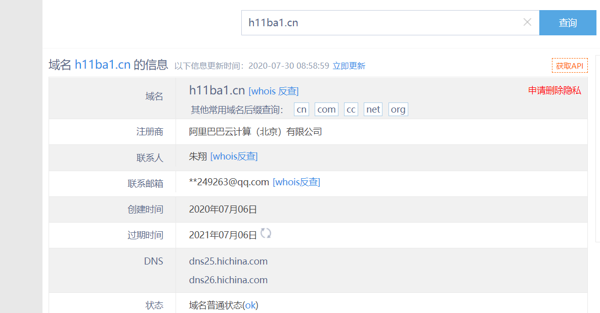


淦！真实姓名和部分邮箱都暴露了


whois在线查询网站：

http://whois.chinaz.com/

（下面五个网站，连我完整qq都查出来了，恐怖如斯）

http://whois.nawang.cn/

https://www.zzy.cn/domain/whois.html

http://www.dns.com.cn/show/domain/whois/index.do

https://whois.cndns.com/

https://whois.ename.net/

更多在线查询网站：

西部数码域名WHOIS信息查询地址：https://whois.west.cn/

新网域名WHOIS信息查询地址：http://whois.xinnet.com/domain/whois/index.jsp

中资源域名WHOIS信息查询地址：https://www.zzy.cn/domain/whois.html

三五互联域名WHOIS信息查询地址：https://cp.35.com/chinese/whois.php

爱名网域名WHOIS信息查询地址：https://www.22.cn/domain/


一个网站查不出来的时候，多试几个总没坏处，万一呢


### 1.2 工具查询

工具查询可以使用kali自带的whois查询工具

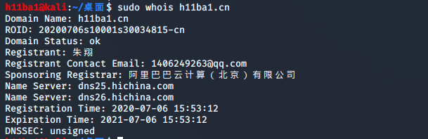


### 1.3 收集信息的利用

讲了这么多，最终还是要把收集的信息利用起来。根据whois对域名的查询。现在我们已经知道了以下信息

* 域名注册者（一般就是站长）姓名
* 域名注册者邮箱
* 域名注册商
* 域名注册时间


知道域名注册者姓名，注册者邮箱和域名注册时间。我们就可以根据这些信息制作用户名，密码爆破字典。

特别是这里还使用了qq邮箱，那么可以直接添加qq好友，进行社会工程学攻击。


**这里简单演示一下密码爆破字典的制作：**

为了获取更多信息，可以直接添加qq，套出更多信息。这里只简单添加好友获取一下受害者的出生日期。

很多人的密码组合都是用户名+出生日期。

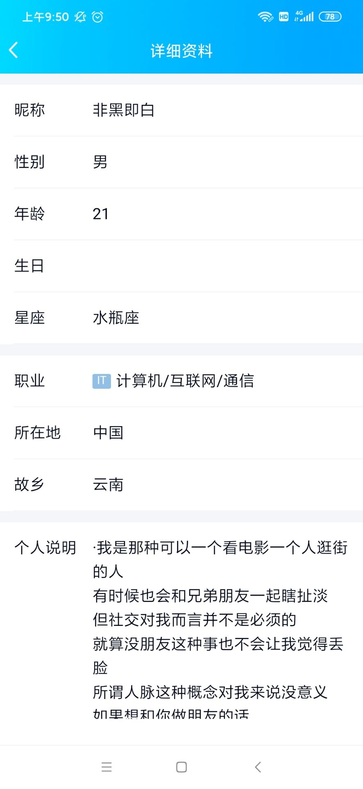

那么现在我们已经知道了受害者的，姓名，邮箱，出生日期。这是就可以使用社工工具生成密码字典

这里使用pydictor （这个工具除了，生成密码字典，还有很多实用的功能，如合并去重，批量添加指定前缀...等等)

github地址：https://github.com/LandGrey/pydictor/blob/master/README_CN.md


python3运行：

```shell
python pydictor --sedb

set cname zhuxiang
set sname xiang zhu
set birth 19990312
set nickname h11ba1
set email 1406249263@qq.com
run
```

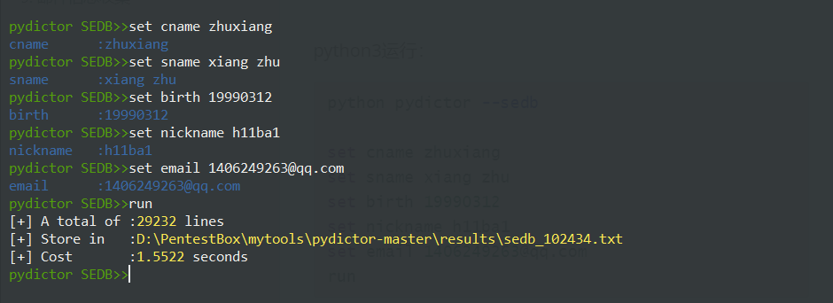

密码生成到了results文件夹里面

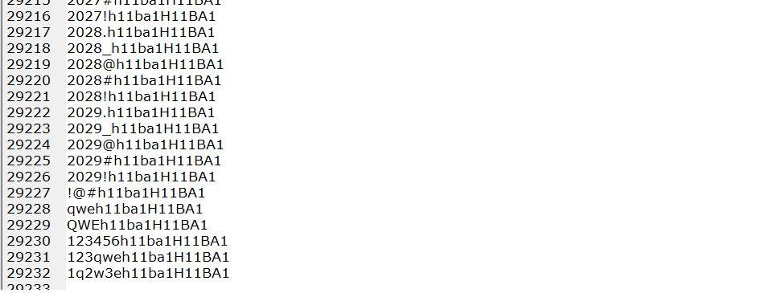

最终在其中找到了以前用的密码.....


# 2.子域名收集

子域名的收集可以在主站(www开头，如www.baidu.com) 难以攻破的情况下，找寻更多的攻击面

子域名常用收集方法：

* 工具收集
* google语法收集
* fofa收集


### 2.1工具收集

比较常用的收集工具是：

oneforall : https://github.com/shmilylty/OneForAll

subDomain : https://github.com/lijiejie/subDomainsBrute

layer子域名挖掘机：这个网上搜索一下有，或者找我要（总感觉小网站下载的东西都有后门）


**oneforall：**

个人比较习惯使用搭建在服务器上面的dokcer版

```she
// 拉去docker 镜像
docker pull shmilylty/oneforall

//使用时启动镜像
docker run -it shmilylty/oneforall

//收集子域名
python oneforall.py --target baidu.com
```

在自己电脑上安装使用也很不错，个人习惯问题~


**subDomain：**

```she
python2 subDomainsBrute.py baidu.com
```

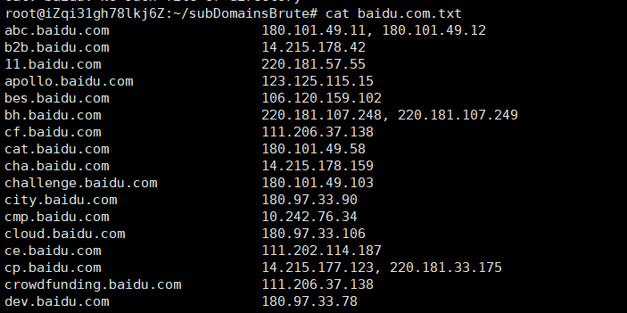


### 2.2 搜索引擎语法搜索子域名

google 语法：

```shell
site:"baidu.com" -www
```


百度语法：

```shell
site:bilibili.com link:bilibili.com
```


必应语法：

```shell
site:baidu.com
```


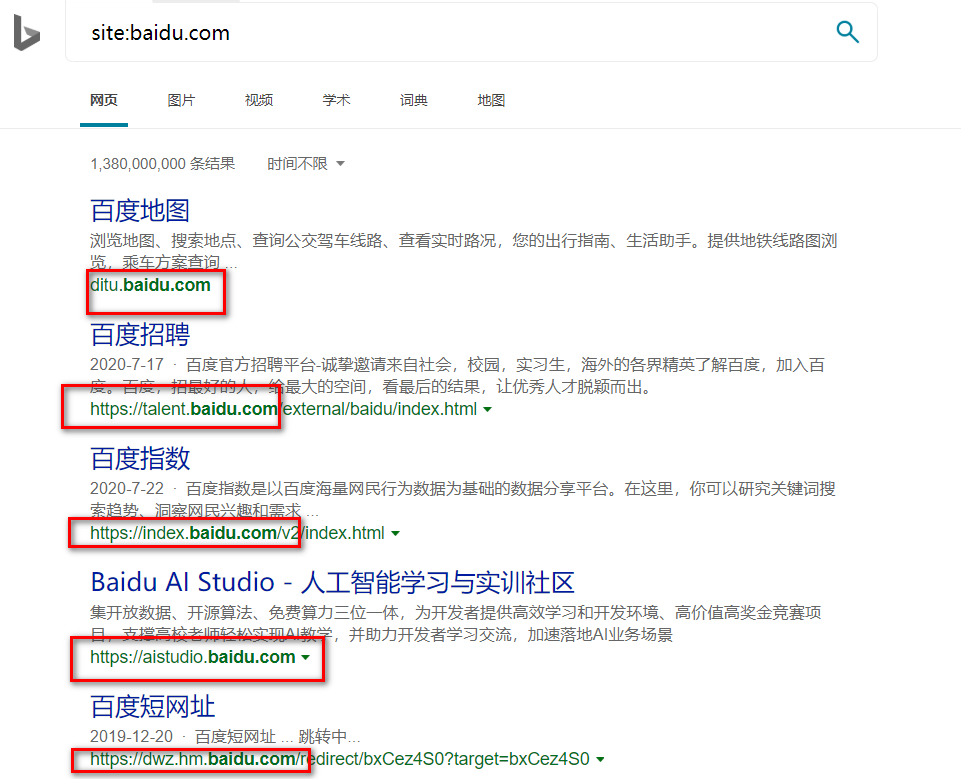


### 2.3 空间搜索引擎搜索

fofa搜索子域名：

```she
domain="qq.com" 
```


添加`&&header=200`可以过滤404子域网站。


其他的空间搜索引擎还有shodan,zoomeye，和安恒的sumap


### 2.4 收集子域名的利用

**子域名去重：**

因为我们使用了多个工具收集子域名，收集的信息肯定会有很多重复之处，此时可以使用pydictor这个工具去重

将所有需要合并去重的txt文件放到test目录下，执行

```shell
 python pydictor.py -tool uniqbiner .\test\
```


最终在results目录下即可找到合并去重的文件内容。输出位置也可以使用 -o 指定


**子域名批量识别：**

收集到的子域名，在大型站点中通常会很多，一个一个检测太过麻烦，比较优雅的方法是，使用工具批量识别title头，或者根据子域名名称来判断站点重要性。如（vpn，login，email等子域名一眼看过去就感觉很有价值）


批量识别工具：https://github.com/TheKingOfDuck/domain_screen

工具有点问题，后面修一下。

### TODO


批量识别title信息：

http://www.link114.cn/title

批量识别ip及运营商：

https://zh.infobyip.com/ipbulklookup.php


# 3. 真实ip发现

目前很多大型网站都使用了cdn服务，这就导致直接ping域名得到的ip可能不是真实ip。

cdn本身不是为了安全防御，但在一定程度上能够抵御安全攻击。因为直接访问的是cdn服务器，sql注入，命令执行之类的漏洞都是在cdn服务器上面执行，但是cdn服务器只是缓存了静态资源，并没有漏洞程序，所以在对具有cdn的服务器进行攻击时，漏洞可能无法利用成功。（个人理解，这方面一直不太熟，后面研究研究）

### TODO


[**最后的Bypass CDN 查找网站真实IP**](https://mp.weixin.qq.com/s/BKR8mpxMSOwPhkkdB8Cqsg)

这篇文章说的 很不错，推荐看一下


# 4. cms，中间件信息收集

在渗透测试时，如果能够快速识别出cms和中间件信息，能够直接秒杀。

常规cms识别的方法：

* 云悉识别 
* wappalyzer 插件
* 佩恩平台识别
* 潮汐指纹识别
* kali whatweb


### 4.1.云悉指纹识别

最好用的应该是云悉平台的指纹识别，但是云悉平台需要邀请码....邀请码有点难弄到

https://www.yunsee.cn/

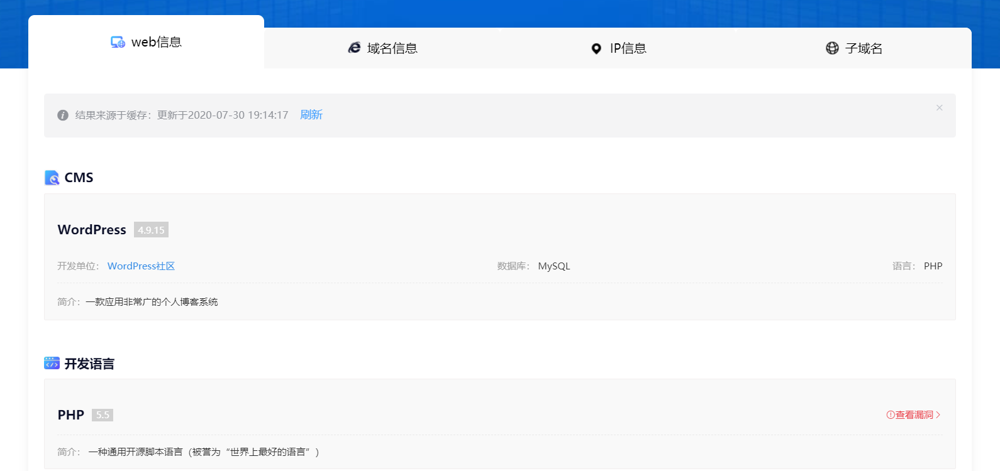


### 4.2.wappalyzer 插件

https://chrome.google.com/webstore/detail/wappalyzer/gppongmhjkpfnbhagpmjfkannfbllamg?utm_source=chrome-ntp-icon


像我老师网站，信息直接全部暴露~（主要是他的博客是我见过wappalyzer 识别信息最全的....wappalyzer 插件针对国内cms有点水土不服)

顺便给他项目打个广告：

https://github.com/zhblue/hustoj


### 4.3 佩恩平台识别

需要投稿四篇才有初级使用权限....

不足四篇也可以搜索别人搜索过的资产，例如baidu.com。这个信息收集绝对是最全的......

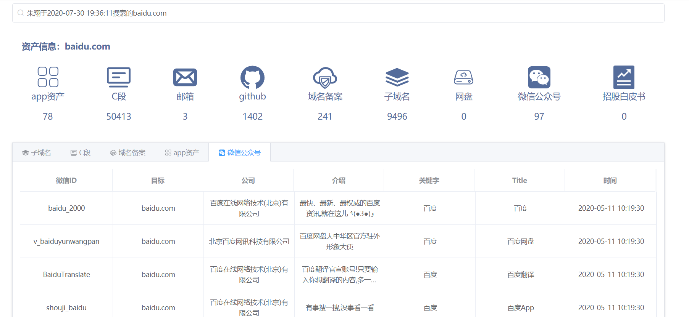


### 4.4 潮汐指纹识别

http://finger.tidesec.net/


### 4.5 whatweb


whatweb对国外cms，如：wordpress，joomla等国外cms识别效果还是不错的。但是遇到国内的cms，如tp框架，dz等cms效果就不好了...


## 4.6 cms信息的利用

识别了cms，快速找出对应cms的爆发过的漏洞，进行验证

快速找出cms漏洞方法有：

* 零组知识库查找
* cnvd 国家信息安全共享平台查找
* cve搜索
* 知识库搜索


### 4.6.1零组知识库信息

基本所有公开的cms漏洞，利用方式都能从这里找到。

网站：https://wiki.0-sec.org/#/md（需要邀请码，我还有一枚...）


### 

### 4.6.2 cnvd查找cms漏洞

https://www.cnvd.org.cn/flaw/list.htm?flag=true

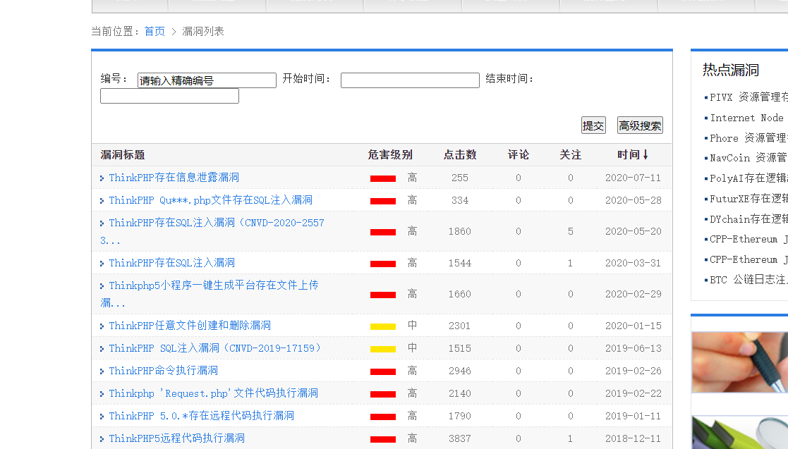


### 4.6.3 相关cve搜索

https://cve.mitre.org/cve/search_cve_list.html


### 4.6.4 安恒知识库搜索

大佬们写了几千篇文章，基本什么类型的cms，都有：

http://greatagain.dbappsecurity.com.cn/#/book?id=1072&type_id=1


# 5. 路径敏感信息收集

路径扫描主要靠工具收集。常用的有工具有：

* awvs13 爬虫，爬取路径
* dirbuster
* dirsearch (后面课程会讲到这个工具)
* 御剑
* javascript文件中的链接提取（真的好用）


### 5.1 awvs13爬虫探测


### 5.2 dirbuster

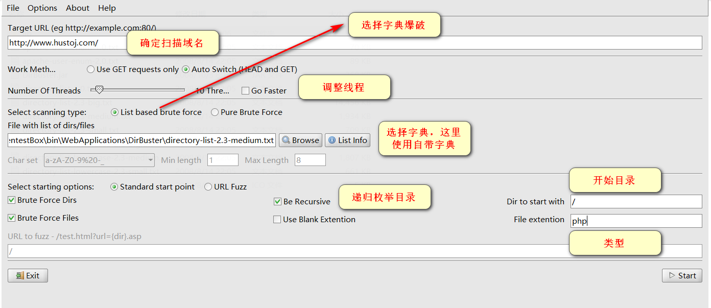


dirbuster比较好的点就是能够可视化的看到，爆破出来的路径，还可以自由勾选要枚举的路径，还有设置代理之类的功能，总体还是蛮好用的。

爆破结果：

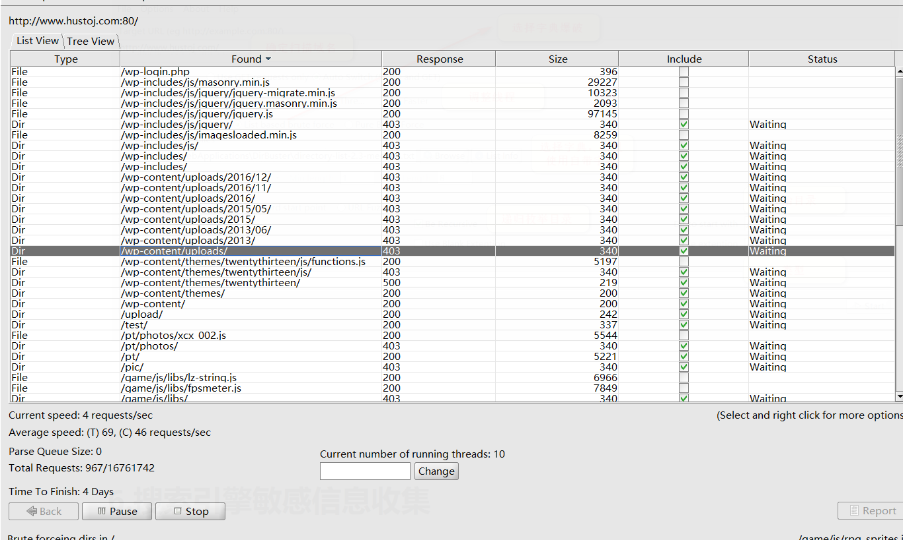


### 5.3 dirsearch(后面课程要用...)

因为是国外的工具，自带的字典在国内都不太好用，可以根据该文章修改一下字典：https://dfkan.com/1469.html


简单爆破一下路径:

```shell
dirsearch -u http://www.hustoj.com/ -e php
```


### 5.4 御剑（上古级神器了，线程一开大，就容易卡死...)


也不支持代理，简单了解即可...


### 5.5 javascript文件中的链接提取（真的好用）

**jsfinder提取url:**

https://github.com/Threezh1/JSFinder

该工具能够爬取指定网站中所有的js文件，并查找其中的路径


**LinkFinder 提取节点**

https://github.com/GerbenJavado/LinkFinder

```
 python3 linkfinder.py -i http://www.hustoj.com/ -d -o test.html
```

提取效果还是不错的。

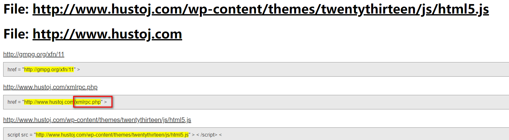


# 6.搜索引擎敏感信息收集

搜索引擎在使用特定语法时能够，收集到很多敏感信息


### 6.1 googlehacking

这里因为篇幅问题主要记录google搜索语法。在很多时候使用 百度，必应也有意想不到的效果。

#### 6.1.1site: 限制域名的搜索范围

```she
site:baidu.com
```


#### 6.1.2inurl：用于搜索含有特定值的url

在搜索一些通用cms漏洞时特别好用。cms通用漏洞，url都是固定的，直接搜索很容易找到。

```shell
inurl:/phpinfo.php
```

也可用来发现后台：

```
site:域名 inurl:login|admin|manage|member|admin_login|login_admin|system|login|user|main|cms
```


#### 6.1.3 intext：搜索网页中包含的文字（忽略，title，url等）

intext主要用来配合site，搜索指定网站中存在的敏感信息。

```shell
site:域名 intext:管理|后台|登陆|用户名|密码|验证码|系统|帐号|admin|login|sys|managetem|password|username
```


#### 6.1.4 filetype：搜索文件的后缀或者扩展名

filetype常用来和site组合使用，通过添加

```
site:cuz.edu.cn filetype:xls
```

收获一堆学号用户名....淦，可怜的文学院。

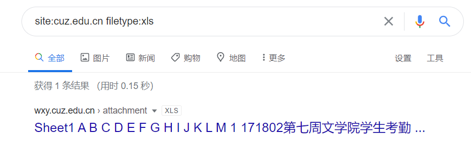

常搜索的后缀：

```
xls|txt|docx|pptx|pdf|sql|mdb|zip|rar
```


#### 6.1.5intitle：搜索指定的title标题

intitle常用来搜索诸如，后台|login|管理 之类的关键字，可用来快速发现后台系统。

常用关键字：

```
管理|login|后台|登陆|注册|register|admin|等
```


#### 6.1.6 link：搜索包含了某个指定url的页面列表

link可以用来收集子域名，如：

```
site:baidu.com link:baidu.com -www
```


#### 6.1.7 常用搜索组合：

```
查找后台地址：site:域名 inurl:login|admin|manage|member|admin_login|login_admin|system|login|user|main|cms

查找文本内容：site:域名 intext:管理|后台|登陆|用户名|密码|验证码|系统|帐号|admin|login|sys|managetem|password|username

查找可注入点：site:域名 inurl:aspx|jsp|php|asp

查找上传漏洞：site:域名 inurl:file|load|editor|Files

找eweb编辑器：site:域名 inurl:ewebeditor|editor|uploadfile|eweb|edit

存在的数据库：site:域名 filetype:mdb|asp|#

查看脚本类型：site:域名 filetype:asp/aspx/php/jsp

迂回策略入侵：inurl:cms/data/templates/images/index/
```


------

#### 6.1.8 各种敏感数据收集：

```
filetyle:xls inurl:gov username password

inurl:phpmyadmin/main.php intitle:phpmyadmin

filetype:inc inurl:config.inc host

filetype:sql cdb_members inurl:forumdata

filetype:txt inurl:"新建文本文档.txt"密码

inurl:phpinfo.php intitle:"phpinfo()""PHP Version"+"Server API"

filetype:log inurl:log mdb
```


### 6.2 网盘信息搜索

因为某度网盘的广泛使用，网盘中可能会存储很多敏感信息。


这里主要使用凌风云搜索：https://www.lingfengyun.com/

成堆的学号，用户名....恐怖如斯好吧...

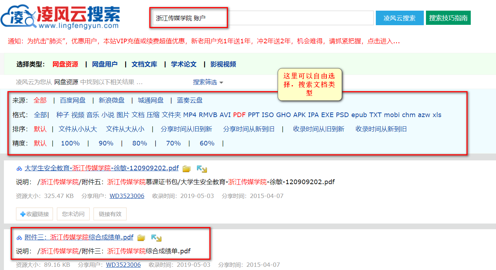


其他的网盘搜索 引擎：https://www.chaonengsou.com/。这个搜索引擎也就是iframe嵌套了其他搜索引擎，也可以尝试一下。反正凌风云🐮🍺。


# 7. github信息收集

很多程序员，会将自己为企业开发的代码直接上传到github。代码中的，敏感信息，配置文件等都没有更改。攻击者很容易就可以通过，域名，作者id等信息在github搜索到源码。

### 7.1 github常用语法

```
in:name  test              #仓库标题搜索含有关键字 test
in:descripton test         #仓库描述搜索含有关键字
in:readme test             #Readme文件搜素含有关键字
```

尝试搜索一下赵师傅的项目：

in:name glzjin


```
user:ccjpp       #搜索指定用户名的所有代码
```

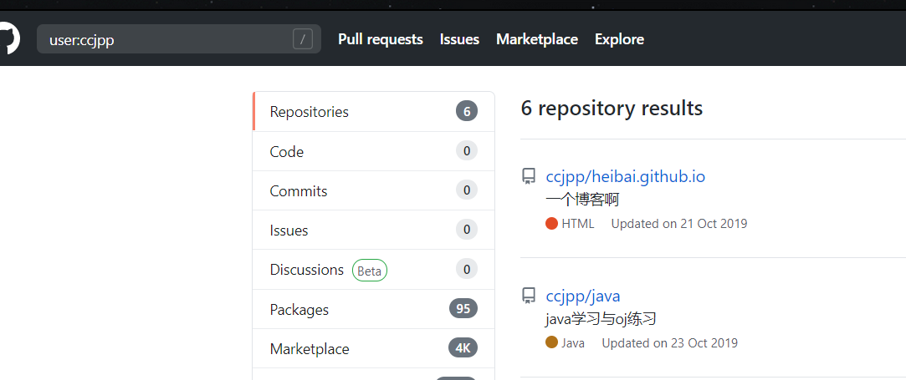

写过的所有渣代码暴露....


### 7.2 搜索敏感信息

这篇文章总结的很好：[信息收集之Github搜索语法](https://www.onebug.org/websafe/75924.html)

简单演示：

随便尝试一下:

```
site:qq.com String password smtp
```

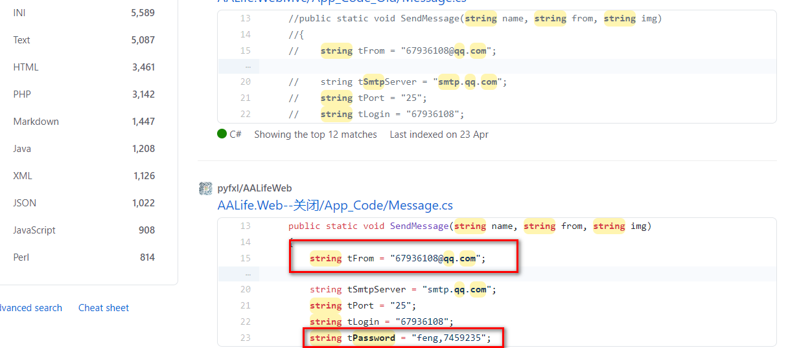


一个信息收集工具：[GitHub敏感信息采集工具GSIL](https://xz.aliyun.com/t/7229)

# 8. dns信息收集

没试过dns信息收集，不会

## TODO

可以参考链接：

[渗透时常用的DNS信息收集](https://www.jianshu.com/p/70ecbbcb52ac)

https://zhuanlan.zhihu.com/p/110404620


# 9. 邮件信息收集

找邮件，目前只知道whois查询，网页中提取含有邮箱格式（xxx@xxx格式）的参数，或者google，github信息收集也许也能收集到。


参考链接：

[收集的一些谷歌黑客语法](https://www.jianshu.com/p/83b2fdf71e4c)


