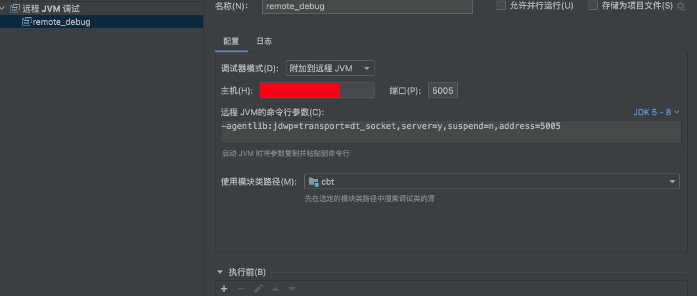
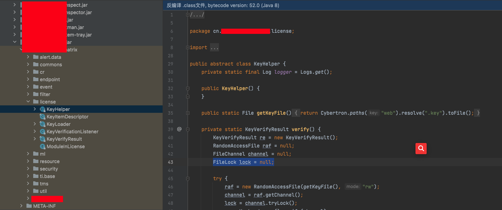
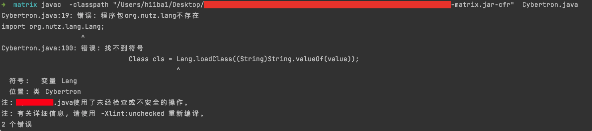
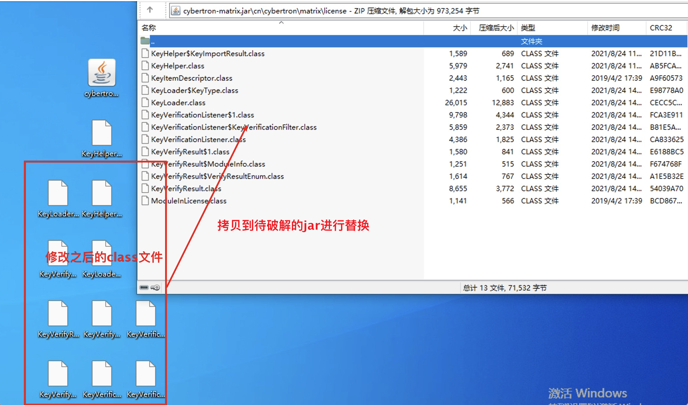

最近做的一个项目领导要求破解一个系统。不经感到🍐山大，我那会这啊。

硬着头皮分析一波。

## 搭建环境远程debug。

因为该项目基于tomcat搭建，找到catalina.sh

添加如下配置，重启。

```shell
CATALINA_OPTS="-server -Xdebug -Xnoagent -Djava.compiler=NONE -Xrunjdwp:transport=dt_socket,server=y,suspend=n,address=5005"
```

ieda配置远程jvm调试即可：



## 定位关键验证代码

通过反编译所有jar包搜索关键字+debug跟踪定位到关键代码如下。



## 验证绕过分析

通过简单查看license验证代码，大概确定两个方法。

1.license.key采用ras算法验证，可以尝试根据代码写一个license.key生成器。

翻看了一下代码只找到rsa的公钥，license.key是根据机器码生成。推测是机器码+rsa私钥生成license.key。上传license.key之后，系统采用公钥解密验证。这个方法感觉没啥希望。

2.更改license验证jar包中的关键代码，再重新编译回去，尝试绕过。

查看代码发现KeyVerifyResult.java中存在一个result参数且是VerifyResultEnum类型，构造函数初始化为`KeyVerifyResult.VerifyResultEnum.missing`.

```java
    private KeyVerifyResult.VerifyResultEnum result;

    public KeyVerifyResult() {
        this.result = KeyVerifyResult.VerifyResultEnum.missing;
        this.items = new HashMap();
    
```

VerifyResultEnum方法如下；

```java
    public static enum VerifyResultEnum {
        ok,
        missing,
        invalid,
        badformat,
        expired,
        mismatch,
        malicious,
        ignore;

        private VerifyResultEnum() {
        }
    }
```

那么大概可以确实 `result = KeyVerifyResult.VerifyResultEnum.missing;`控制着license验证结果。

想到破解方法，修改代码中所有的`result = KeyVerifyResult.VerifyResultEnum`结果为ok。那么不管我们的license咋样验证结果都是ok。就达到了破解的目的。

## 修改jar包

确定破解方法之后就是修改代码了，因为都编译成了jar。一开始想的办法是

### 反编译jar文件，修改代码再生成jar

反编译采用该项目：
https://github.com/eikendev/java-decompiler

多个工具编译代码之后，相互对照着解决报错。修改代码发现生成的jar包特别大，重新添加到项目中，项目无法运行。

感觉无法运行的原因有这么几种情况。

1.反编译之后函数名可能会改变

2.编译的环境和开发环境相差巨大。

......

那么是不是就没办法了呢，通过简单的搜索，发现一些修改jar包代码的方法。

1.winrar解码预览jar包，把需要修改之后的java文件编译成class文件，替换jar包中的class文件。

2.010editor直接修改二进制。（这个方法先不考虑，工作量有点大...

https://www.daguanren.cc/post/ru-he-xiu-gai-JAR-bao-nei-de-dai-ma.html

https://www.cnblogs.com/firstdream/p/9332672.html

###  winrar修改jar文件

winrar直接打开需要修改的jar包。


然后修改项目包中所有的`result = VerifyResultEnum.ok;`为ok。


### 编译java文件为class文件

将修改后的java文件编译为class文件这里踩了一些坑，java编译为class，我们首先想到的肯定是javac ，但是这里使用javac却不行，需要修改java文件依赖很多的外部jar包，尝试了添加-classpath/-p等参数也没有完成这一类java文件的编译



这里卡了一会儿没有解决，想到在一开始的时候生成过jar包。

那么就想到了另外一个办法，修改java文件生成jar包之后再利用winrar解压拷贝出来，再拷贝到需要破解的jar包。



重新将jar到导入系统，重启系统。license验证就消失了，至此破解结束。


