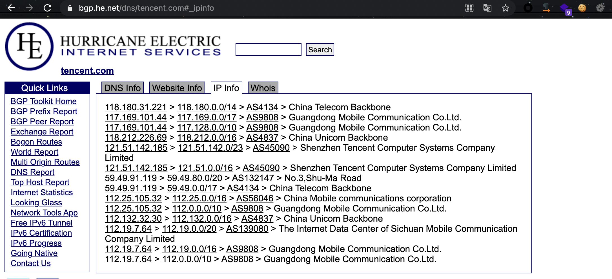
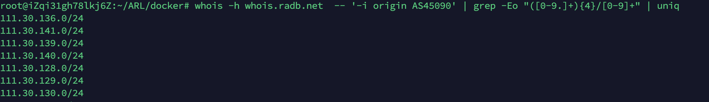
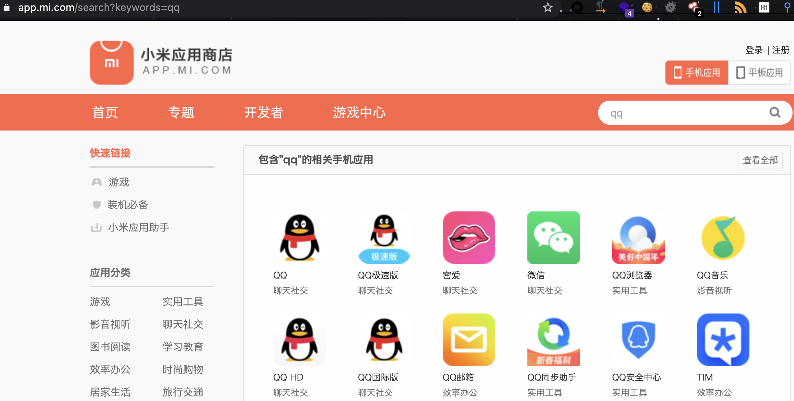
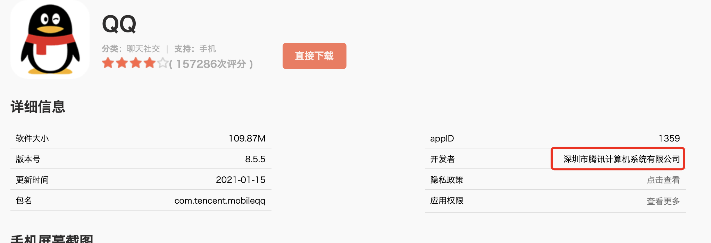
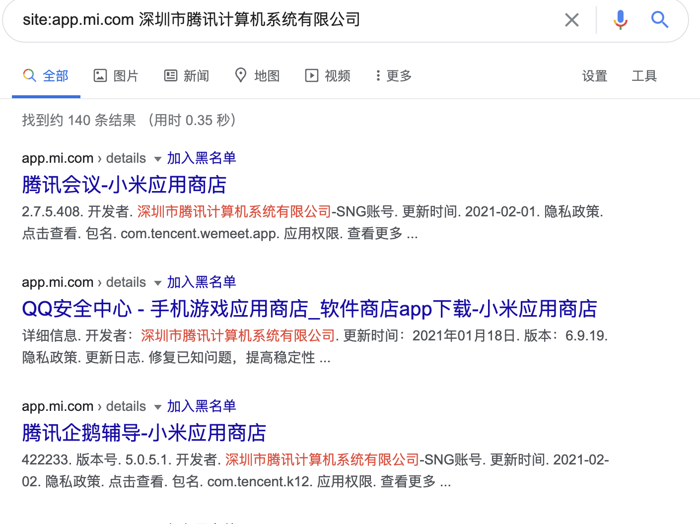

在进行src挖掘时，信息收集，很多时候认真梳理一遍企业资产就能发现漏洞。src一般资产很多，手工收集不够完善且费时费力，使用自动化工具每天进行资产监控是一个很好的方法。

企业资产主要包括以下几个方面：

子域名，ip段，ip开放端口，app，客户端，公众号，小程序...

一下主要记录各方面资产信息收集方式。

# 1.自动化工具

## LangSrcCurise子域名监控系统

地址：https://github.com/LangziFun/LangSrcCurise

该系统使用docker搭建更为方便，搭建方式可以参考：https://www.vulner.me/docs/langsrccurise/

踩坑：

启动扫描时可能会报：

```
UnicodeEncodeError: 'ascii' codec can't encode characters in position 2-3: ordinal not in range(128)
```

这是因为ubuntu系统python 默认编码不是utf-8。

可在启动命令前加一个：

```
PYTHONIOENCODING=utf-8
```

变成：

```
PYTHONIOENCODING=utf-8 python3 manage.py startscan
```

此时就可以正常执行。

想要持续运行监控，只需要加&后台运行即可。

## [ARL](https://github.com/TophantTechnology/ARL)资产侦察灯塔系统

地址：https://github.com/TophantTechnology/ARL

该系统docker搭建后，提供域名即可进行子域名收集，端口爆破，指纹识别，url爬取，文件泄露扫描...

运行的同时即可发现一些文件泄露之类的垃圾漏洞，还是蛮好用的。

## [linglong](https://github.com/awake1t/linglong) 端口扫描系统

地址：https://github.com/awake1t/linglong

该系统可以对收集的ip段进行全端口的循环扫描。针对ip的端口扫描可能发现一些，临时开放的系统。更加全面的针对目标进行渗透。

## [Autoscanner](https://github.com/zongdeiqianxing/Autoscanner) 自动化扫描系统

地址：https://github.com/zongdeiqianxing/Autoscanner

该系统可将收集到的子域名,url进行dirsearch、xray、awvs、whatweb集合扫描。可以对收集资产进行初步渗透识别，发现薄弱点。


# 2.手工子域名收集

Ct log多级域名收集：

```
curl -fsSL -H "User-Agent: Mozilla/5.0 (Macintosh; Intel Mac OS X 10.14; rv:69.0) Gecko/20100101 Firefox/69.0" "https://crt.sh/?CN=%25.qq.com" | sort -n | uniq -c | grep -o -P '(?<=\<TD\>).*(?=\<\/TD\>)' | sed -e '/white-space:normal/d'
```


## 3.ip段收集

https://bgp.he.net/dns/tencent.com#_ipinfo

该网站可以查询目标域名所属ASN,利用查询得到的asn可以查询目标起的ip段



```
whois -h whois.radb.net  -- '-i origin AS36459' | grep -Eo "([0-9.]+){4}/[0-9]+" | uniq
```




## 4.app收集

小米应用商店搜索公司名称：



然后查看app开发者信息，根据开发者收集更多开发者：


google语法：

```
site:app.mi.com 深圳市腾讯计算机系统有限公司
```



## 6.公众号

采用现成脚本：

```
import requests
import re

def app_recon_baidu():
	header = {
		"User-Agent": "Mozilla/5.0 (Windows NT 10.0; Win64; x64; rv:56.0) Gecko/20100101 Firefox/56.0",
	}
	apps = []
	for pn in range(0,6):
		pn = pn * 10
		url = 'https://www.baidu.com/s?ie=utf-8&wd=site%3Aapp.mi.com%20%E6%B7%B1%E5%9C%B3%E5%B8%82%E8%85%BE%E8%AE%AF%E8%AE%A1%E7%AE%97%E6%9C%BA%E7%B3%BB%E7%BB%9F%E6%9C%89%E9%99%90%E5%85%AC%E5%8F%B8&pn={}'.format(pn)
		res = requests.get(url,headers=header).text
		pattern = re.compile(r'data-tools=\'{\"title\":\"(.*?)-')
		app = re.findall(pattern,res)
		apps += set(app)
	return apps

def subscription_recon_sougou():
	header = {
		"User-Agent": "Mozilla/5.0 (Windows NT 10.0; Win64; x64; rv:56.0) Gecko/20100101 Firefox/56.0",
	}
	subscriptions = []
	for pn in range(0,6):
		url = 'https://weixin.sogou.com/weixin?query=58&ie=utf8&page={}'.format(pn)
		res = requests.get(url,headers=header).text
		pattern = re.compile(r'beg-->(.*?)</a>')
		subscription = re.findall(pattern,res)
		subscriptions += set(subscription)
	return subscriptions

def mini_program_recon():
	url = "https://mp.weixin.qq.com/wxa-cgi/innersearch/subsearch"
	data = r'' # 搜索抓包，替换为你的请求内容，index_step参数控制结果中小程序的数量
	pattern = re.compile(r'nickName":"(.*?)","path')
	mini_program = re.findall(pattern,res)
	return mini_program

if __name__ == '__main__':
	app_recon = app_recon_baidu()
	print("APP资产：","\n",app_recon)
	subscription_recon = subscription_recon_sougou()
	print("微信订阅号资产：","\n",subscription_recon)
	mini_program_recon = mini_program_recon()
	print("微信小程序资产：","\n",mini_program_recon)

```


## 7.小程序


## 8.客户端收集


# 自动化漏洞挖掘

在收集到足够域名时，就可以对资产进行批量扫描即是发现薄弱点。


dirsearch批量文件扫描：

```
nohup python3 dirsearch.py -e php,html,js,jsp,action,py,asp -l url.txt  -r -R 3 -i 200,204,400,403 -x 500,502,429 --plain-text-report report.txt > dirsearch.log 2>&1 &
```


