最近看了司里一大佬的社工技术分享，深有感触。也正值七夕前后，想起自己七夕夜晚独自值班，一时间悲从中来。为了了解一妹子特展开了一次信息收集。这里主要浅显讨论一下信息收集过程，也让大家知道信息泄露的危害。本文是本着科普的目的，真实的社工远比这个复杂，方式更是多种多样，收集到的信息也比这个多很多。

因为对妹子的了解只有一个qq号，所以从qq号入手。

# 1.qq方面的信息泄露

## 1.1.通过qq个人资料来确定个人信息，如出生年月，生日，所在地，就读学校等

个人资料有可能不准确，需要记录下来和后面的信息相互比对，已确定真伪。

还有qq头像和昵称也需要重点关注。很多人各大社交平台昵称和头像都用同一个，记录头像和昵称有助于找到其他平台的账号。

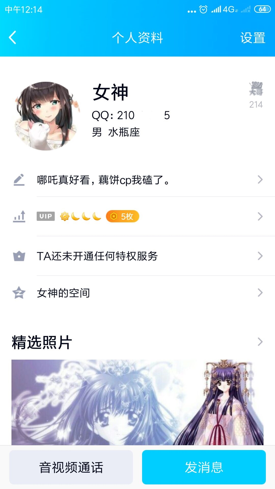

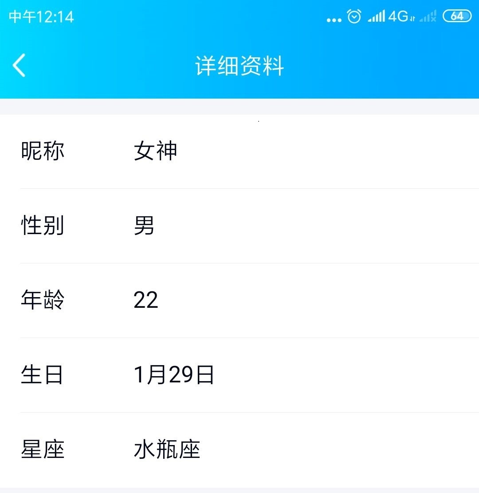

这里通过个人资料和个性签名可以大致确定女神出生日期为（1997年1月29日），最近看了娜吒。

# 1.2.通过qq空间来确定

qq空间是泄露信息的头号重灾区，可通过qq空间的生日祝福，确定出生日期。定位说说，标志建筑物确定常驻地。

也可以很容易的通过qq空间确定目标身边的关系图，通过身边人的空间也可以收集到目标信息，这里不做过多讨论。

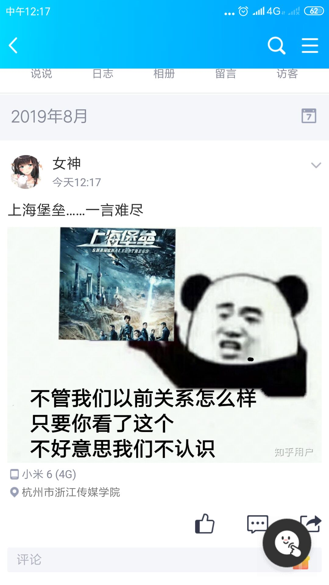

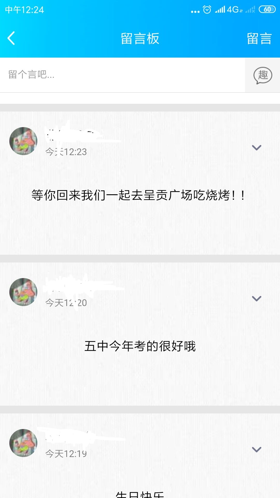

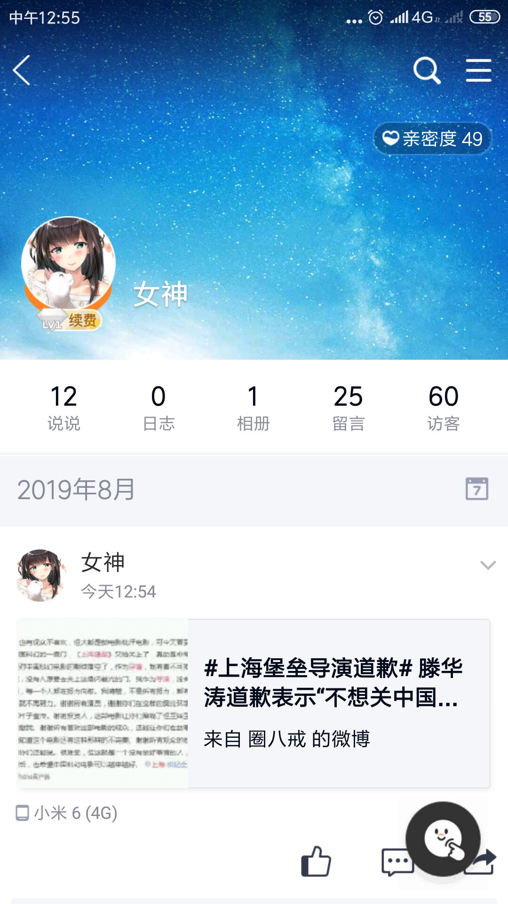

这里的定位说说可以很容易确定学校所在地，留言很容易确定家乡所在地。呈贡广场一艘不就是昆明某区嘛（滑稽）。微博转载也为后面找到女神微博埋下伏笔。

# 2.微博方面的信息泄露。

前面已经通过空间收集到了很多信息，这里开始针对微博，前面女神已经转载了一个微博，所以去到该微博下面查找信息。

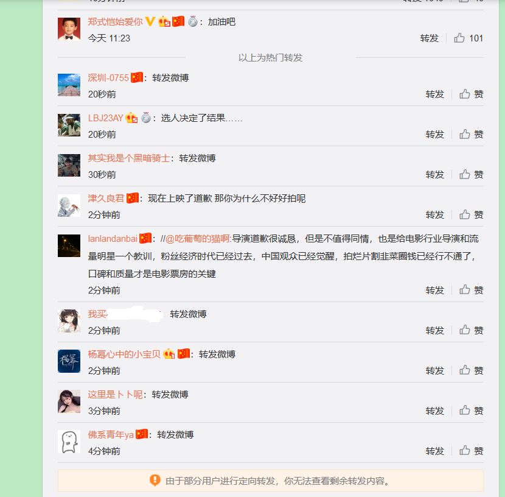

看到一个一样的头像，而且转载时间，也一样。基本可以确定。进入主页

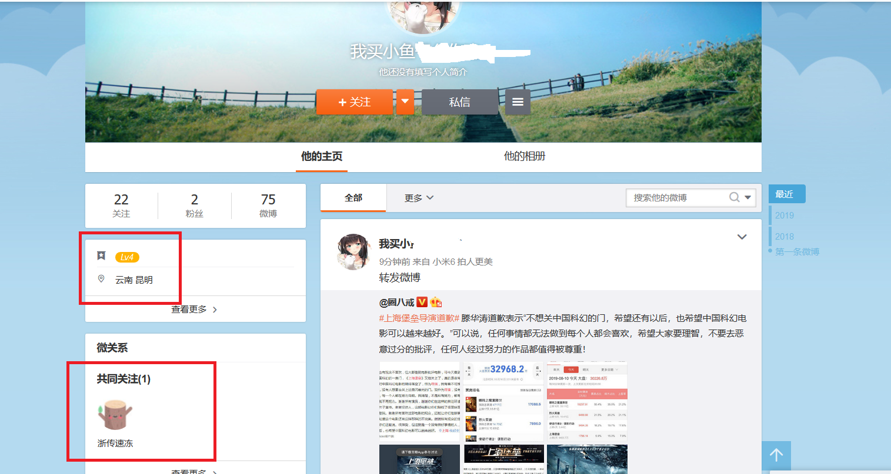

和我一样关注了某速冻，而且所在地也和前面符合.....所以确定就是女神微博。

微博的信息泄露更多的关于兴趣爱好，而且这种展示平台对个人隐私没有一点防护，很容易就可以找到很多信息。也是一个信息泄露的重灾区。

# 3.其他社交平台

知乎，B站，甚至steam。各个游戏。都能通过各种类似的方式找到。比如最简单的搜索id.....

百度贴吧也是一个信息泄露很严重的平台，直接搜索qq号就有很大可能性找到，比如搜索一下浙传信安某会长qq(狗头）

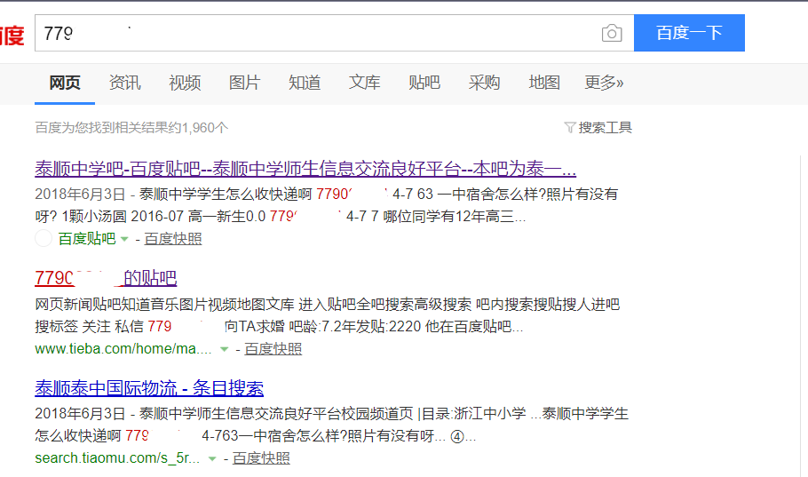

泄露的信息不止能用在人肉搜索上面，还能用在账号安全方面，很多人的密码都和自己的信息之间有一定规律，比如最简单的（姓名拼音+出生日期的组合）可以很容易猜出来。更何况黑客还有字典生成工具，社工库等...

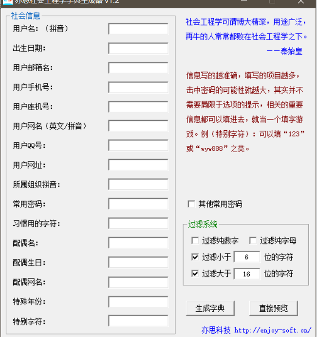

一些防护建议：

1.各个社交平台头像,id尽量还是不要一样，特别是一些很重要的平台如:支付宝，淘宝，还有不想让被别人知道的私密社交平台。

2.也可以采用反社工，在贴吧，微博，故意暴露自己的信息，但是全是假的...

3.关于密码问题，尽量还是使用一些强密码，八位数以上，包含三种符号和自己的信息没有关联。

关于网络的一些感悟，网络降低了人与人之间交流的成本，在网络上面展示自己也有助于别人了解自己。可是带来的信息泄露弊端也很明显。也希望本文能让大家对信息泄露有个了解。

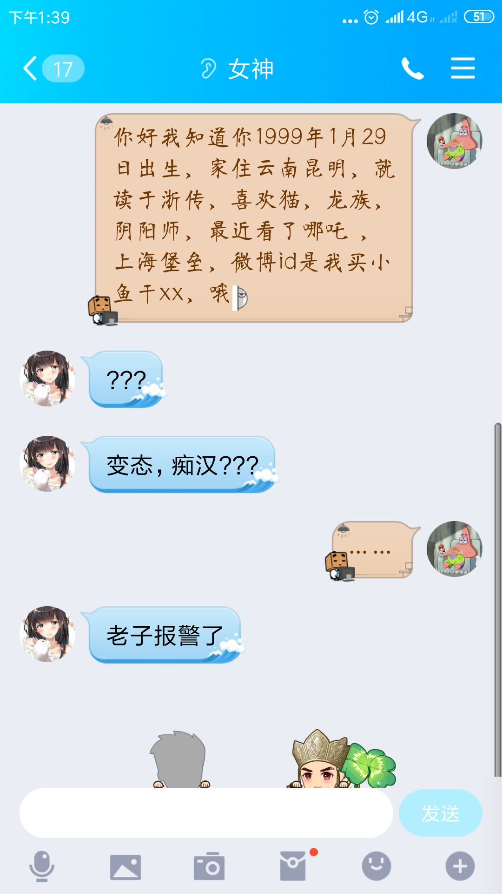

唉，果然：

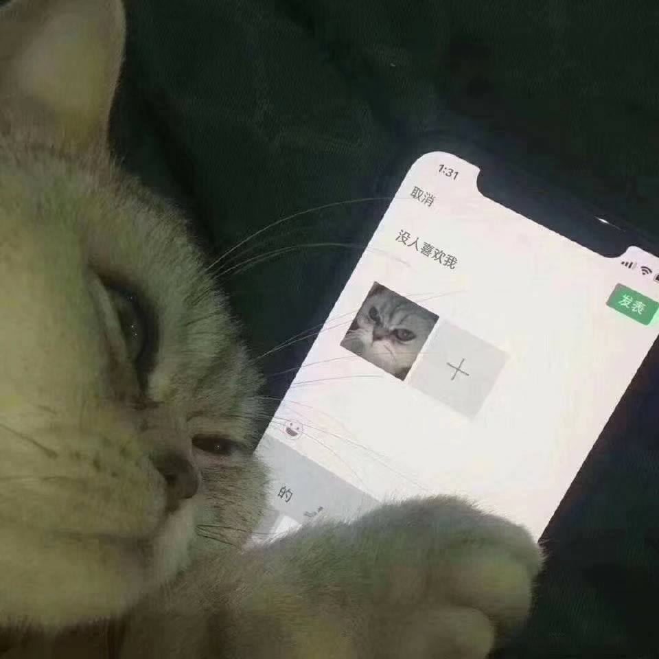

感谢我的小号友情出演篇中女主，又是自（精）娱（分）自（现）乐（场）的一天。。。。

也希望大家能够关注浙传信息安全协会。几张图片拉了这么多篇幅，本想在写一下某高校弱密码的问题，等下一期吧。